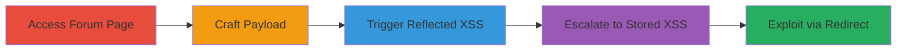

# Reflected XSS in Ubiquiti Forum Comment Preview with Stored XSS Escalation

Multi-stage attack chain demonstrating exploitation of a reflected XSS vulnerability in the 'New Discussion' page on Ubiquiti's Spanish and Portuguese forums, escalating to stored XSS via draft saving for broader impact including session hijacking and phishing.

## Chain Metrics Dashboard

| Metric | Value |
|--------|-------|
| Chain Status | Unverified |
| Total Steps | 4 |
| Execution Time | ~5 minutes |
| Skill Level | Intermediate |
| Complexity | Medium |
| Impact Level | High |

## Attack Flow Visualization

## Prerequisites & Requirements

### Required Tools

- Web browser with developer tools (e.g., Chrome DevTools for payload testing)

### Target Environment

- Web platform
- Access to Ubiquiti forums (*.ubnt.com), specifically Spanish or Portuguese sections
- No specific ports or services required beyond standard HTTPS (443)

### Initial Access Requirements

- No credentials needed for initial access; attack targets logged-in users via social engineering or links
- Ability to craft and share URLs
- Network access to the internet

## Detailed Attack Procedures

### Step 1: Access New Discussion Page
procedure: [[procedures/Access-Ubiquiti-Forum-New-Discussion]]

**Objective**: Navigate to the vulnerable 'New Discussion' page on the target forum to prepare for payload injection.

**Instructions**: Open a web browser and navigate to the Spanish or Portuguese forum's new discussion creation page, such as https://community.ubnt.com/t5/forums/postpage/board-id/es (adjust for Portuguese as needed). Ensure the HTML comment field is available.

**Expected Output**: The form loads with the comment preview feature accessible.

**Success Indicators**:
- Page loads without errors
- Comment input field and preview button are visible

### Step 2: Craft Malicious Payload
procedure: [[procedures/Craft-Reflected-XSS-Payload]]

**Objective**: Create a JavaScript payload that will be reflected unsanitized in the preview, enabling arbitrary code execution.

**Instructions**: In the comment field, enter a payload like `` or more advanced like ``. The payload is passed via GET parameters when previewing.

**Expected Output**: Payload appears in the URL as a GET parameter (e.g., ?comment=<script>...).

**Success Indicators**:
- Payload is accepted without immediate sanitization
- Preview URL is crafted with unsanitized input

### Step 3: Trigger XSS Execution
procedure: [[procedures/Trigger-XSS-Execution]]

**Objective**: Execute the reflected XSS by previewing the comment or luring a victim to the malicious URL, potentially hijacking their session.

**Instructions**: Click the preview button to render the comment, triggering JS execution in your browser. For victim targeting, share the crafted URL (e.g., via email or link) to a logged-in user. Test execution by observing alert popups or network requests to attacker server.

**Expected Output**: JavaScript executes, such as an alert or cookie exfiltration to attacker-controlled domain.

**Success Indicators**:
- JS code runs in the browser console
- Victim's session data is captured if targeted

### Step 4: Escalate to Stored XSS
procedure: [[procedures/Escalate-to-Stored-XSS-via-Draft]]

**Objective**: Save the payload as a draft to convert the reflected XSS into a persistent stored variant, allowing repeated execution for any viewer.

**Instructions**: After crafting the payload, save it as a draft instead of posting. The unsanitized payload persists in the draft. Share the draft link or trigger via a trusted redirect on *.ubnt.com (e.g., post-login redirect) to deliver to victims indirectly.

**Expected Output**: Draft saves with payload; viewing the draft executes the XSS for any user.

**Success Indicators**:
- Draft is saved without sanitization
- XSS triggers on draft view, confirming persistence

## Attack Chain Summary

### Key Achievements

1. Successful reflected XSS execution via preview, enabling immediate JS in victim browsers
2. Escalation to stored XSS through draft saving, persisting the attack beyond single visits
3. Potential for session hijacking, phishing, or account takeover on logged-in Ubiquiti users

## Technique & Tactic Coverage

### MITRE ATT&CK Techniques

- [[Exploit Public-Facing Application]]
- [[JavaScript]]

### MITRE ATT&CK Tactics

- [[Initial Access]]
- [[Execution]]

---

*Last updated: 2024-10-01T00:00:00Z*
