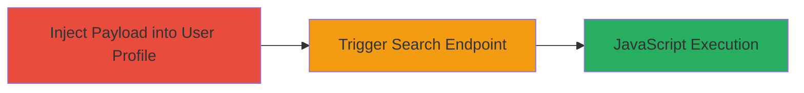

---
tags:
  - xss
  - reflected-xss
  - web
  - udemy
  - autocomplete
  - search-injection
type: attack_chain
tools: []
tactics:
  - '[[Initial Access]]'
commands:
  - '[[commands/curl-udemy-autocomplete-search]]'
platforms:
  - Web
complexity: low
procedures:
  - '[[procedures/Inject-XSS-Payload-into-User-Profile]]'
  - '[[procedures/Trigger-Reflected-XSS-via-Search-Endpoint]]'
step_count: 2
techniques:
  - '[[JavaScript]]'
description: >-
  A multi-step attack exploiting reflected XSS in Udemy's autocomplete search
  endpoint by injecting a malicious payload into a user's firstname field and
  triggering it via search, leading to arbitrary JavaScript execution.
skill_level: intermediate
impact_level: high
id: 8e735433-b75b-4f64-b52d-9e1e0a9dc342
created_at: '2025-12-14T03:15:27.006Z'
updated_at: '2025-12-14T03:15:27.006Z'
verified: false
validated: true
submitted: true
mitre_tactics:
  - '[[Initial Access]]'
mitre_techniques:
  - '[[JavaScript]]'
---
# Reflected XSS in Udemy Autocomplete Search via User Profile Injection

Multi-stage attack chain demonstrating a complete attack workflow exploiting a reflected Cross-Site Scripting (XSS) vulnerability in Udemy's autocomplete search endpoint.

## Chain Metrics Dashboard

| Metric | Value |
|--------|-------|
| Chain Status | Unverified |
| Total Steps | 2 |
| Execution Time | ~5 minutes |
| Skill Level | Intermediate |
| Complexity | Low |
| Impact Level | High |

## Attack Flow Visualization



## Prerequisites & Requirements

### Required Tools

- Web browser (e.g., Chrome with developer tools)
- Optional: [[commands/curl-udemy-autocomplete-search]] for automated triggering

### Target Environment

- Web platform
- Access to Udemy website (https://www.udemy.com)
- No specific services/ports required beyond standard HTTPS (443)

### Initial Access Requirements

- Valid Udemy user account with ability to edit profile
- Network access to Udemy's public-facing web application
- No prior elevated access needed

## Detailed Attack Procedures

### Step 1: Inject Payload into User Profile
procedure: [[procedures/Inject-XSS-Payload-into-User-Profile]]

**Objective**: Modify the user's firstname field to include a malicious XSS payload, making it injectable into the autocomplete search functionality.

**Instructions**: Log in to your Udemy account, navigate to account settings, and update the firstname field with the payload `">`. Save the changes to persist the injection in user-searchable data.

**Expected Output**: Profile updated successfully; the payload is now stored in the firstname field.

**Success Indicators**:
- Profile firstname reflects the injected payload when viewed in edit mode
- No errors during profile update

### Step 2: Trigger Reflected XSS via Search Endpoint
procedure: [[procedures/Trigger-Reflected-XSS-via-Search-Endpoint]]

**Objective**: Invoke the autocomplete search endpoint with a term that matches the injected payload, causing the XSS to reflect and execute in the response.

**Instructions**: Use a web browser or curl to access the search endpoint with the term parameter set to search for the injected username. For example, encode the term to trigger the payload reflection in the JSON response.

Execute [[commands/curl-udemy-autocomplete-search]] to simulate the request:

```bash
curl "https://www.udemy.com/autocomplete/search/?cl=EyNkHjsRED4T&displayType=json&cf=ExRONTsRED5COkUCGxAHKV8HaTMPDBFu&count=4&term=%22%3E%3Cimg+src%3D%3E"
```

**Expected Output**: JSON response containing the reflected payload, triggering JavaScript execution (e.g., image tag onload or similar alert if payload is alert-based).

**Success Indicators**:
- Arbitrary JavaScript executes in the viewer's browser context
- Browser console shows script execution or popup (if payload includes alert)
- Potential cookie theft or session hijacking if payload is extended

## Attack Chain Summary

### Key Achievements

1. Successful injection of XSS payload into user profile without detection
2. Reflection and execution of JavaScript via public search endpoint
3. Demonstration of client-side impact including session hijacking potential

## Technique & Tactic Coverage

### MITRE ATT&CK Techniques

- [[JavaScript]]

### MITRE ATT&CK Tactics

- [[Initial Access]]

---
*Last updated: 2023-10-01*
