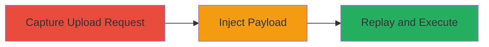

---
tags:
  - xss
  - reflected-xss
  - file-upload
  - web-vulnerability
type: attack_chain
tools:
  - '[[tools/LiveHTTPHeaders]]'
tactics:
  - '[[Initial Access]]'
  - '[[Execution]]'
verified: false
platforms:
  - Web
submitted: true
complexity: medium
created_at: '2023-10-01T00:00:00Z'
procedures:
  - '[[procedures/Capture-File-Upload-Request-Using-LiveHTTPHeaders]]'
  - '[[procedures/Inject-XSS-Payload-into-Filename]]'
  - '[[procedures/Replay-Modified-Request-to-Trigger-XSS]]'
step_count: 3
techniques:
  - '[[Exploit Public-Facing Application]]'
  - '[[JavaScript]]'
updated_at: '2025-12-14T03:15:41.580Z'
description: >-
  A multi-step attack exploiting a reflected XSS vulnerability in Udemy's file
  upload endpoint by injecting a JavaScript payload into the filename, leading
  to arbitrary code execution in the browser upon error response display.
skill_level: intermediate
impact_level: high
id: 1108726d-6746-4217-8e9e-356772554cd8
validated: true
mitre_tactics:
  - '[[Initial Access]]'
  - '[[Execution]]'
mitre_techniques:
  - '[[Exploit Public-Facing Application]]'
  - '[[JavaScript]]'
---
# Reflected XSS in Udemy File Upload via Malicious Filename

Multi-stage attack chain demonstrating a complete attack workflow.

## Chain Metrics Dashboard

| Metric | Value |
|--------|-------|
| Chain Status | Unverified |
| Total Steps | 3 |
| Execution Time | ~5 minutes |
| Skill Level | Intermediate |
| Complexity | Medium |
| Impact Level | High |

## Attack Flow Visualization

## Prerequisites & Requirements

### Required Tools

- [[tools/LiveHTTPHeaders]]

### Target Environment

- Web platform (Udemy file upload endpoint)
- Required services/ports: HTTP/HTTPS on standard ports (80/443)
- Network access requirements: Direct access to Udemy website as a logged-in user

### Initial Access Requirements

- Credential requirements: Valid Udemy account for file upload
- Network position: User browser context
- Prior access needed: Ability to initiate file uploads on the target site

## Detailed Attack Procedures

### Step 1: Capture File Upload Request
procedure: [[procedures/Capture-File-Upload-Request-Using-LiveHTTPHeaders]]

**Objective**: Intercept the legitimate file upload HTTP request to understand the structure and parameters.

**Instructions**: Install and enable [[tools/LiveHTTPHeaders]] in Firefox. Navigate to Udemy's file upload interface, select a benign file like '2015-08-24_162829.png', and initiate the upload while monitoring traffic.

**Expected Output**: Captured POST request showing the filename parameter in the multipart form data.

**Success Indicators**:
- Request intercepted successfully
- Filename parameter visible in the request body

### Step 2: Inject XSS Payload into Filename
procedure: [[procedures/Inject-XSS-Payload-into-Filename]]

**Objective**: Modify the filename parameter to include a JavaScript payload that will be reflected unescaped in the JSON error response.

**Instructions**: In the captured request within [[tools/LiveHTTPHeaders]], edit the filename field to include the payload `'>`. Ensure the rest of the request remains intact.

**Expected Output**: Modified request ready for replay, with the malicious filename injected.

**Success Indicators**:
- Payload successfully inserted into the filename parameter
- No syntax errors in the request structure

### Step 3: Replay Modified Request to Trigger XSS
procedure: [[procedures/Replay-Modified-Request-to-Trigger-XSS]]

**Objective**: Send the tampered request to trigger the server error and observe the reflected XSS execution.

**Instructions**: Use [[tools/LiveHTTPHeaders]] to forward the modified request to the Udemy file upload endpoint. Monitor the response for the JSON error message containing the unescaped payload.

**Expected Output**: JSON response with reflected payload, triggering an alert(1) popup in the browser.

**Success Indicators**:
- Error response received
- JavaScript alert executes, confirming XSS

## Attack Chain Summary

### Key Achievements

1. Successful interception and modification of file upload request
2. Injection of XSS payload via filename parameter
3. Execution of arbitrary JavaScript due to unescaped reflection in JSON error response

## Technique & Tactic Coverage

### MITRE ATT&CK Techniques

- [[Exploit Public-Facing Application]]
- [[JavaScript]]

### MITRE ATT&CK Tactics

- [[Initial Access]]
- [[Execution]]

---

*Last updated: 2023-10-01T00:00:00Z*
