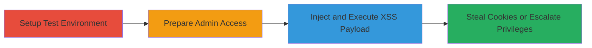

---
tags:
  - xss
  - reflected-xss
  - api-vulnerability
  - php
  - cookie-theft
  - privilege-escalation
type: attack_chain
tools:
  - '[[tools/Burp-Suite]]'
tactics:
  - '[[Execution]]'
  - '[[Collection]]'
verified: false
platforms:
  - Web
submitted: true
created_at: '2023-10-01T00:00:00Z'
procedures:
  - '[[procedures/Deploy-RATELIMITED-API-to-Test-Instance]]'
  - '[[procedures/Create-Admin-User-with-API-Key]]'
  - '[[procedures/Inject-XSS-Payload-into-Tier-Parameter]]'
step_count: 3
techniques:
  - '[[JavaScript]]'
  - '[[Steal Web Session Cookie]]'
updated_at: '2025-12-14T03:46:37.407Z'
description: >-
  A multi-stage attack exploiting a reflected XSS vulnerability in the
  RATELIMITED API v3's /users/[id]/set_tier endpoint due to missing Content-Type
  header, allowing JavaScript execution to steal cookies or escalate privileges.
id: f2d88ed9-faf3-4fb1-a49e-988caea4bfa3
validated: true
mitre_tactics:
  - '[[Execution]]'
  - '[[Collection]]'
mitre_techniques:
  - '[[JavaScript]]'
  - '[[Steal Web Session Cookie]]'
---
# Reflected XSS in User Tier Setting Endpoint for Cookie Theft and Privilege Escalation

Multi-stage attack chain demonstrating exploitation of a reflected XSS vulnerability in the RATELIMITED API v3, where the /users/[id]/set_tier endpoint fails to set a Content-Type: application/json header, causing the browser to parse JSON responses as HTML and execute injected JavaScript.

## Chain Metrics Dashboard

| Metric | Value |
|--------|-------|
| Chain Status | Unverified |
| Total Steps | 3 |
| Execution Time | ~15 minutes |
| Skill Level | Intermediate |
| Complexity | Medium |
| Impact Level | High |

## Attack Flow Visualization

## Prerequisites & Requirements

### Required Tools

- [[tools/Burp-Suite]]

### Target Environment

- Web platform with PHP-based API (RATELIMITED API v3)
- Required services/ports: HTTP/HTTPS on port 80/443, Database service (e.g., MySQL)
- Network access requirements: Local or test instance access for setup

### Initial Access Requirements

- Access to GitHub repository for codebase (RLAPI-v3-OOP)
- Database access for user creation
- No prior credentials needed beyond test setup

## Detailed Attack Procedures

### Step 1: Setup Test Environment
procedure: [[procedures/Deploy-RATELIMITED-API-to-Test-Instance]]

**Objective**: Establish a controlled test instance of the vulnerable application to safely replicate the environment.

**Instructions**: Clone the RLAPI-v3-OOP codebase from GitHub and deploy it locally or on a test server. Configure the web server (e.g., Apache or Nginx with PHP) and initialize the database.

**Expected Output**: Running API instance accessible via browser or curl, with endpoints responding.

**Success Indicators**:
- Application loads without errors
- /users endpoint is reachable

### Step 2: Prepare Admin Access
procedure: [[procedures/Create-Admin-User-with-API-Key]]

**Objective**: Create an authenticated admin user to access protected endpoints like /users/[id]/set_tier.

**Instructions**: Access the database directly and insert an admin user record, including a valid API key for authentication.

**Expected Output**: New admin user entry in the database, verifiable by querying the users table.

**Success Indicators**:
- Admin user authenticates successfully with the API key
- API requests to protected endpoints return 200 OK

### Step 3: Exploit XSS Vulnerability
procedure: [[procedures/Inject-XSS-Payload-into-Tier-Parameter]]

**Objective**: Inject a malicious JavaScript payload into the 'tier' parameter to trigger reflected XSS execution in the browser.

**Instructions**: Use [[tools/Burp-Suite]] to intercept and modify a POST request to /users/[id]/set_tier, injecting a payload like `` in the 'tier' field. The response will echo the payload as text/html, executing the script.

**Expected Output**: Browser alert or executed JavaScript, confirming XSS; potential cookie theft via payload like `document.cookie` exfiltration.

**Success Indicators**:
- JavaScript executes in the browser
- Cookies or session data can be stolen

## Attack Chain Summary

### Key Achievements

1. Successful deployment of vulnerable API instance
2. Creation of admin access for authenticated testing
3. Execution of reflected XSS leading to client-side script injection and data theft

## Technique & Tactic Coverage

### MITRE ATT&CK Techniques

- [[JavaScript]]
- [[Steal Web Session Cookie]]

### MITRE ATT&CK Tactics

- [[Execution]]
- [[Collection]]

---
*Last updated: 2023-10-01T00:00:00Z*
