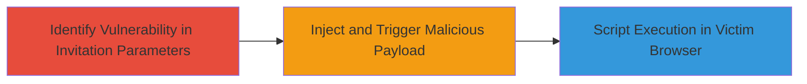

---
tags:
  - xss
  - reflected-xss
  - web
  - javascript
  - session-hijacking
type: attack_chain
tools: []
tactics:
  - '[[Execution]]'
  - '[[Collection]]'
verified: false
platforms:
  - Web
submitted: true
complexity: medium
created_at: '2023-10-05T12:00:00Z'
procedures:
  - '[[procedures/Identify-Reflected-XSS-in-Group-Invitation]]'
  - '[[procedures/Inject-Malicious-Payload-via-Invitation-URL]]'
step_count: 2
techniques:
  - '[[JavaScript]]'
updated_at: '2025-12-14T03:46:37.691Z'
description: >-
  A multi-step attack exploiting a reflected XSS vulnerability in VK.com's group
  invitation feature to inject and execute arbitrary JavaScript in victims'
  browsers.
skill_level: intermediate
impact_level: high
id: deda5ad4-837a-49bd-97bc-4352aedea842
validated: true
mitre_tactics:
  - '[[Execution]]'
  - '[[Collection]]'
mitre_techniques:
  - '[[JavaScript]]'
---
# Reflected XSS in VK.com Group Invitation for Arbitrary Script Execution

Multi-stage attack chain demonstrating a complete attack workflow exploiting a reflected Cross-site Scripting (XSS) vulnerability in VK.com's group invitation feature. The attack allows an adversary to inject arbitrary JavaScript code via unsanitized URL parameters, which executes in the browser context of users viewing the invitation link. This can lead to session hijacking, data theft, phishing, or other client-side attacks, with high severity impact on user accounts.

## Chain Metrics Dashboard

| Metric | Value |
|--------|-------|
| Chain Status | Unverified |
| Total Steps | 2 |
| Execution Time | ~5 minutes |
| Skill Level | Intermediate |
| Complexity | Medium |
| Impact Level | High |

## Attack Flow Visualization

## Prerequisites & Requirements

### Required Tools

- Web browser with developer tools (e.g., Chrome DevTools)
- Access to a VK.com account with group creation privileges

### Target Environment

- VK.com web platform
- Group management features enabled
- No specific ports or services beyond standard HTTPS (443)

### Initial Access Requirements

- Valid VK.com user account
- Ability to create or access a group
- Network access to vk.com (no prior privileged access needed)

## Detailed Attack Procedures

### Step 1: Identify Lack of Input Filtering
procedure: [[procedures/Identify-Reflected-XSS-in-Group-Invitation]]

**Objective**: Examine the group invitation feature to detect unsanitized URL parameters that allow code injection.

**Instructions**: Log in to VK.com, navigate to a group's settings, and access the friends invitation menu. Use browser developer tools to inspect the generated invitation URLs and test for reflection of input parameters without sanitization.

**Expected Output**: Confirmation that parameters in the invitation URL are reflected back into the page without filtering, such as echoing user-supplied strings in HTML or JavaScript contexts.

**Success Indicators**:
- Input parameters appear unsanitized in the response
- Basic test strings (e.g., ) reflect without escaping

### Step 2: Inject Malicious Payload
procedure: [[procedures/Inject-Malicious-Payload-via-Invitation-URL]]

**Objective**: Craft and deliver a malicious URL that triggers XSS execution when a victim views the group invitation.

**Instructions**: Modify the invitation URL by appending a JavaScript payload to a vulnerable parameter (e.g., ?param=). Share the link with a target user via messaging or email. When the victim accesses the link, the payload executes in their browser.

**Expected Output**: Alert box or other script effects appear in the victim's browser session, confirming execution.

**Success Indicators**:
- Malicious script runs in the context of the victim's VK.com session
- Potential for cookie theft or further exploitation observed (e.g., via network tab in dev tools)

## Attack Chain Summary

### Key Achievements

1. Successful identification of reflected XSS in group invitation parameters
2. Injection and execution of arbitrary JavaScript in victim browsers
3. Demonstration of high-impact risks like session hijacking and data theft

## Technique & Tactic Coverage

### MITRE ATT&CK Techniques

- [[JavaScript]]

### MITRE ATT&CK Tactics

- [[Execution]]
- [[Collection]]

---
*Last updated: 2023-10-05T12:00:00Z*
