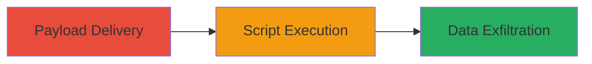

# Reflected XSS in VK.com Mobile Wall Feature for Script Injection and Session Hijacking

Multi-stage attack chain demonstrating a complete attack workflow.

## Chain Metrics Dashboard

| Metric | Value |
|--------|-------|
| Chain Status | Unverified |
| Total Steps | 1 |
| Execution Time | ~1 minutes |
| Skill Level | Intermediate |
| Complexity | Low |
| Impact Level | High |

## Attack Flow Visualization



## Prerequisites & Requirements

### Required Tools

- Browser developer tools for payload testing
- Proxy tool like Burp Suite for interception (optional)

### Target Environment

- Web platform
- Mobile version of VK.com (m.vk.com)
- Access to wall feature parameters

### Initial Access Requirements

- No prior credentials needed; social engineering to trick victim into clicking malicious link
- Network access to m.vk.com

## Detailed Attack Procedures

### Step 1: Payload Delivery and Execution
procedure: [[procedures/Inject-Malicious-Script-via-Reflected-Parameter-in-VK-Wall]]

**Objective**: Inject a malicious JavaScript payload into a reflected parameter on the VK.com mobile wall feature to execute arbitrary code in the victim's browser.

**Instructions**: Construct a malicious URL targeting the wall feature with a reflected input parameter (e.g., a search or post parameter). Use a payload like `<script>alert('XSS')</script>` or more advanced ones for session theft, such as capturing cookies. Send the link via phishing or social engineering to the victim. Upon clicking, the payload reflects and executes in the browser context.

For testing, open the crafted URL in a browser:

```bash
# No specific command; use browser URL bar or curl to fetch and inspect
curl "https://m.vk.com/wall?param=<script>alert(document.cookie)</script>" -v
```

Verify execution by checking for alert popups or network requests exfiltrating data.

**Expected Output**: JavaScript execution, such as an alert box or stolen session data sent to attacker-controlled server.

**Success Indicators**:
- Payload reflects without sanitization
- JavaScript executes in victim's browser
- Cookies or session data captured

## Attack Chain Summary

### Key Achievements

1. Successful injection of arbitrary JavaScript via reflected input
2. Potential for session hijacking by stealing cookies
3. Enablement of phishing or data theft attacks

## Technique & Tactic Coverage

### MITRE ATT&CK Techniques

- [[JavaScript]]

### MITRE ATT&CK Tactics

- [[Execution]]
- [[Collection]]

---
*Last updated: 2023-10-01T00:00:00Z*
