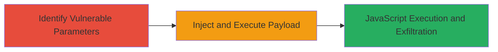

---
tags:
  - xss
  - reflected-xss
  - web-vulnerability
  - javascript-injection
type: attack_chain
tools:
  - '[[tools/Burp-Suite]]'
tactics:
  - '[[Execution]]'
commands: []
platforms:
  - Web
complexity: medium
procedures:
  - '[[procedures/Test-VK-Video-Search-Parameters-for-XSS]]'
  - '[[procedures/Exploit-Reflected-XSS-in-VK-Video-Search]]'
step_count: 2
techniques:
  - '[[JavaScript]]'
description: >-
  A multi-stage process to identify and exploit a reflected XSS vulnerability in
  VK.com's video search functionality, allowing arbitrary JavaScript execution
  for potential session hijacking or data theft.
skill_level: intermediate
impact_level: high
id: b1b3fef2-8d04-4c1e-9bdb-7a36977ed243
created_at: '2025-12-13T23:55:20.616Z'
updated_at: '2025-12-13T23:55:20.616Z'
verified: false
validated: true
submitted: true
mitre_tactics:
  - '[[Execution]]'
mitre_techniques:
  - '[[JavaScript]]'
---
# Reflected XSS in VK.com Video Search Parameters

## Overview

This attack chain demonstrates the discovery and exploitation of a reflected cross-site scripting (XSS) vulnerability in VK.com's video search endpoint at /video. By injecting malicious payloads into the 'date', 'len', and 'order' parameters, unsanitized user input is reflected back in the response, enabling arbitrary JavaScript execution in the victim's browser. This can lead to session hijacking, data theft, or phishing attacks. The vulnerability was reported via HackerOne and resolved with medium severity. The chain focuses on testing and exploitation phases, assuming access to a web browser or proxy tool for payload delivery.

## Chain Metrics Dashboard

| Metric | Value |
|--------|-------|
| Chain Status | Unverified |
| Total Steps | 2 |
| Execution Time | ~5 minutes |
| Skill Level | Intermediate |
| Complexity | Medium |
| Impact Level | High |

## Attack Flow Visualization

## Prerequisites & Requirements

### Required Tools

- [[tools/Burp-Suite]]
- Web browser with developer tools

### Target Environment

- Web platform
- Access to VK.com /video endpoint
- No specific ports or services required beyond standard HTTPS (443)

### Initial Access Requirements

- Public access to VK.com (no credentials needed for testing)
- Ability to craft and send HTTP requests with parameters
- Network position: External/internet access

## Detailed Attack Procedures

### Step 1: Identify Vulnerable Parameters
procedure: [[procedures/Test-VK-Video-Search-Parameters-for-XSS]]

**Objective**: Test the 'date', 'len', and 'order' parameters in the /video search query for improper input sanitization to confirm reflected XSS susceptibility.

**Instructions**: Use a web proxy like Burp Suite to intercept and modify requests to the /video endpoint. Craft search queries appending payloads such as `` to the parameters. Send the request and inspect the response for reflection without escaping.

For example, modify the request URL to: `https://vk.com/video?date=&len=&order=`.

**Expected Output**: The payload appears unescaped in the HTML response, and an alert box pops up in the browser upon loading the page.

**Success Indicators**:
- Payload reflected in response source
- JavaScript alert executes in browser

### Step 2: Exploit Reflected XSS
procedure: [[procedures/Exploit-Reflected-XSS-in-VK-Video-Search]]

**Objective**: Inject a malicious payload to execute arbitrary JavaScript, such as stealing session cookies or redirecting to a phishing site.

**Instructions**: Once vulnerability is confirmed, craft a phishing link with a payload like `` appended to the vulnerable parameters. Distribute this link to victims via email or social engineering. When the victim clicks and loads the search page, the script executes in their browser context.

Intercept with Burp Suite if needed to fine-tune the payload for evasion.

**Expected Output**: Victim's browser executes the script, sending session data to attacker's server or performing other malicious actions.

**Success Indicators**:
- Script execution confirmed via alert or network request to attacker domain
- Potential session hijacking if cookies are exfiltrated

## Attack Chain Summary

### Key Achievements

1. Identified unsanitized reflection in 'date', 'len', and 'order' parameters
2. Demonstrated arbitrary JavaScript execution leading to browser compromise
3. Highlighted risks of session hijacking and data theft in social media platforms

## Technique & Tactic Coverage

### MITRE ATT&CK Techniques

- [[JavaScript]]

### MITRE ATT&CK Tactics

- [[Execution]]

---
*Last updated: [TIMESTAMP]*
