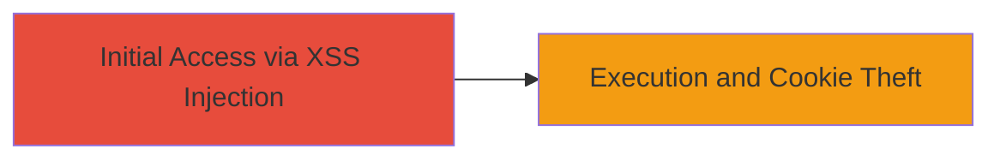

---
id: ac-uuid-reflected-xss-grouplogic
name: Reflected XSS in Video Parameter Leading to Cookie Theft
type: attack_chain
description: A single-stage attack exploiting a reflected XSS vulnerability in the 'v' parameter of the video.asp endpoint to execute JavaScript and steal user cookies.
verified: false
submitted: false
step_count: 1
created_at: 2023-10-01T00:00:00Z
updated_at: 2023-10-01T00:00:00Z
procedures: [[procedures/Exploit-Reflected-XSS-in-Video-Parameter]]
techniques: [[Exploit Public-Facing Application]], [[JavaScript]]
tactics: [[Initial Access]], [[Execution]], [[Collection]]
tags: xss, reflected-xss, javascript, cookie-theft
platforms: Web
tools: []
---

# Reflected XSS in Video Parameter Leading to Cookie Theft

Multi-stage attack chain demonstrating a complete attack workflow.

## Chain Metrics Dashboard

| Metric | Value |
|--------|-------|
| Chain Status | Unverified |
| Total Steps | 1 |
| Execution Time | ~1 minutes |
| Skill Level | Beginner |
| Complexity | Low |
| Impact Level | Medium |

## Attack Flow Visualization



## Prerequisites & Requirements

### Required Tools

- Web browser or [[tools/curl]]

### Target Environment

- Web platform
- ASP-based web application
- Accessible video.asp endpoint

### Initial Access Requirements

- No credentials required
- Direct network access to www.grouplogic.com
- No prior access needed

## Detailed Attack Procedures

### Step 1: Inject XSS Payload
procedure: [[procedures/Exploit-Reflected-XSS-in-Video-Parameter]]

**Objective**: Inject a malicious JavaScript payload into the 'v' parameter to trigger reflected XSS and execute arbitrary code in the victim's browser.

**Instructions**: Construct a URL with the XSS payload in the 'v' parameter and access it via a browser or curl to test execution. The payload "<script>alert(document.cookie)</script>" is reflected unsanitized, leading to script execution.

Use a browser to visit the crafted URL:

```bash
# Equivalent curl command for testing
curl "http://www.grouplogic.com/video.asp?v=Acroxx1%22%3C/script%3E%3Cscript%3Ealert(document.cookie)%3C/script%3Es_aE&e=mp4&width=560&height=315"
```

In a real attack, send this URL to a victim via phishing or social engineering to execute in their browser context.

**Expected Output**: An alert box displaying the victim's document.cookie, confirming XSS execution.

**Success Indicators**:
- JavaScript alert pops up with cookie contents
- Payload reflected in the page source without escaping

## Attack Chain Summary

### Key Achievements

1. Successful injection and execution of arbitrary JavaScript
2. Theft of session cookies for potential hijacking
3. Demonstration of impact on user privacy and session security

## Technique & Tactic Coverage

### MITRE ATT&CK Techniques

- [[Exploit Public-Facing Application]]
- [[JavaScript]]

### MITRE ATT&CK Tactics

- [[Initial Access]]
- [[Execution]]
- [[Collection]]

---
*Last updated: 2023-10-01T00:00:00Z*
