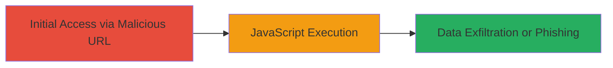

---
tags:
  - xss
  - reflected-xss
  - javascript-injection
  - web-vulnerability
  - dod
type: attack_chain
tools:
  - '[[tools/Firefox]]'
  - '[[tools/Google-Chrome]]'
tactics:
  - '[[Initial Access]]'
  - '[[Execution]]'
  - '[[Collection]]'
verified: false
platforms:
  - Web
submitted: true
complexity: low
created_at: '2023-10-01T00:00:00Z'
procedures:
  - '[[procedures/Trigger-Reflected-XSS-with-SVG-Payload]]'
step_count: 1
techniques:
  - '[[Exploit Public-Facing Application]]'
  - '[[JavaScript]]'
updated_at: '2025-12-14T00:11:25.129Z'
description: >-
  A multi-stage attack chain exploiting a reflected XSS vulnerability in the
  'i=' parameter of a U.S. Department of Defense web application to execute
  arbitrary JavaScript in the victim's browser.
skill_level: beginner
impact_level: high
id: b8bbca2a-7ab3-438e-8eb6-2b1e8e802255
validated: true
mitre_tactics:
  - '[[Initial Access]]'
  - '[[Execution]]'
  - '[[Collection]]'
mitre_techniques:
  - '[[Exploit Public-Facing Application]]'
  - '[[JavaScript]]'
---
---
id: 123e4567-e89b-12d3-a456-426614174000
name: Reflected XSS in ViewContent.aspx Parameter Leading to Arbitrary JavaScript Execution
type: attack_chain
description: "A multi-stage attack chain exploiting a reflected XSS vulnerability in the 'i=' parameter of a U.S. Department of Defense web application to execute arbitrary JavaScript in the victim's browser."
verified: false
submitted: false
step_count: 1
created_at: 2023-10-01T00:00:00Z
updated_at: 2023-10-01T00:00:00Z
procedures: [[procedures/Trigger-Reflected-XSS-with-SVG-Payload]]
techniques: [[Exploit Public-Facing Application]], [[JavaScript]]
tactics: [[Initial Access]], [[Execution]], [[Collection]]
tags: xss, reflected-xss, javascript-injection, web-vulnerability, dod
platforms: Web
tools: [[tools/Firefox]], [[tools/Google-Chrome]]
---

# Reflected XSS in ViewContent.aspx Parameter Leading to Arbitrary JavaScript Execution

Multi-stage attack chain demonstrating a complete attack workflow exploiting a reflected cross-site scripting vulnerability in a U.S. Department of Defense website's ViewContent.aspx endpoint.

## Chain Metrics Dashboard

| Metric | Value |
|--------|-------|
| Chain Status | Unverified |
| Total Steps | 1 |
| Execution Time | ~1 minute |
| Skill Level | Beginner |
| Complexity | Low |
| Impact Level | High |

## Attack Flow Visualization

## Prerequisites & Requirements

### Required Tools

- [[tools/Firefox]]
- [[tools/Google-Chrome]]

### Target Environment

- Web platform
- ASP.NET-based web application
- Publicly accessible DoD website endpoint

### Initial Access Requirements

- No credentials required
- Victim must visit the malicious URL (e.g., via phishing or direct link)
- Network access to the target website

## Detailed Attack Procedures

### Step 1: Trigger XSS via Malicious Parameter
procedure: [[procedures/Trigger-Reflected-XSS-with-SVG-Payload]]

**Objective**: Inject and execute arbitrary JavaScript in the victim's browser by crafting a malicious URL targeting the vulnerable 'i=' parameter.

**Instructions**: Construct a URL with a URL-encoded payload in the 'i=' parameter that bypasses escaping and injects JavaScript via an SVG onload handler. Visit the URL in a browser to trigger the payload, which executes a simple alert (confirm(1)) for demonstration. In a real attack, replace with code to steal session cookies or perform unauthorized actions.

The payload example injects an SVG element that triggers JavaScript on load.

**Expected Output**: A confirmation dialog (or equivalent JavaScript execution) appears in the browser, confirming the XSS vulnerability.

**Success Indicators**:
- JavaScript alert or confirm dialog triggers
- Browser console shows executed script
- No server-side errors; payload reflects without sanitization

## Attack Chain Summary

### Key Achievements

1. Successful injection of JavaScript payload via URL parameter
2. Arbitrary code execution in victim browser context
3. Potential for session hijacking or phishing attacks

## Technique & Tactic Coverage

### MITRE ATT&CK Techniques

- [[Exploit Public-Facing Application]] Exploit Public-Facing Application
- [[JavaScript]] JavaScript

### MITRE ATT&CK Tactics

- [[Initial Access]] Initial Access
- [[Execution]] Execution
- [[Collection]] Collection

---
*Last updated: 2023-10-01T00:00:00Z*
