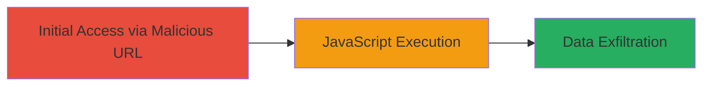

---
tags:
  - xss
  - reflected-xss
  - vimeo
  - javascript-execution
type: attack_chain
tools:
  - '[[tools/Web-Browser]]'
tactics:
  - '[[Initial Access]]'
  - '[[Execution]]'
  - '[[Collection]]'
verified: false
platforms:
  - Web
submitted: true
complexity: low
created_at: '2024-01-01T00:00:00Z'
procedures:
  - '[[procedures/Exploit-Reflected-XSS-in-Vimeo-Enhancer]]'
step_count: 1
techniques:
  - '[[JavaScript]]'
updated_at: '2025-12-14T03:15:30.709Z'
description: >-
  A single-stage attack exploiting a reflected XSS vulnerability in the Vimeo
  enhancer page to execute arbitrary JavaScript in victims' browsers.
skill_level: beginner
impact_level: high
id: 1078f89d-0223-40d5-a36e-483a93ae3e2f
validated: true
mitre_tactics:
  - '[[Initial Access]]'
  - '[[Execution]]'
  - '[[Collection]]'
mitre_techniques:
  - '[[JavaScript]]'
---
---
id: attack-chain-uuid-1
name: Reflected XSS in Vimeo Enhancer via section_type Parameter
type: attack_chain
description: A single-stage attack exploiting a reflected XSS vulnerability in the Vimeo enhancer page to execute arbitrary JavaScript in victims' browsers.
verified: false
submitted: false
step_count: 1
created_at: 2024-01-01T00:00:00Z
updated_at: 2024-01-01T00:00:00Z
procedures: [[procedures/Exploit-Reflected-XSS-in-Vimeo-Enhancer]]
techniques: [[JavaScript]]
tactics: [[Initial Access]], [[Execution]], [[Collection]]
tags: xss, reflected-xss, vimeo, javascript-execution
platforms: Web
tools: [[tools/Web-Browser]]
---

# Reflected XSS in Vimeo Enhancer via section_type Parameter

Multi-stage attack chain demonstrating a complete attack workflow.

## Chain Metrics Dashboard

| Metric | Value |
|--------|-------|
| Chain Status | Unverified |
| Total Steps | 1 |
| Execution Time | ~1 minute |
| Skill Level | Beginner |
| Complexity | Low |
| Impact Level | High |

## Attack Flow Visualization

## Prerequisites & Requirements

### Required Tools

- [[tools/Web-Browser]]

### Target Environment

- Target Platform: Web (Vimeo.com)
- Required Services/Ports: HTTP/HTTPS on port 80/443
- Network Access Requirements: Internet access to vimeo.com

### Initial Access Requirements

- Credential Requirements: None (public-facing endpoint)
- Network Position: External attacker
- Prior Access Needed: None

## Detailed Attack Procedures

### Step 1: Inject and Execute XSS Payload
procedure: [[procedures/Exploit-Reflected-XSS-in-Vimeo-Enhancer]]

**Objective**: Deliver a malicious URL to the victim that triggers JavaScript execution upon access, allowing theft of sensitive browser data like cookies or session tokens.

**Instructions**: Construct a malicious URL by appending a JavaScript payload to the 'section_type' GET parameter in the Vimeo enhancer endpoint. For example, use a simple alert or prompt to verify execution, then escalate to data exfiltration. Open the URL in a web browser to simulate victim interaction.

The payload example: `http://vimeo.com/enhancer?section_type=xss'%3bprompt(1)%3b'` (URL-encoded to `xss'%2bprompt(1)%2b'`).

**Expected Output**: Upon loading the page, a JavaScript prompt or alert box appears, confirming execution. In a real attack, this could log data to an attacker-controlled server.

**Success Indicators**:
- JavaScript code executes (e.g., prompt dialog appears)
- Page source shows unsanitized reflection of the payload in HTML

## Attack Chain Summary

### Key Achievements

1. Successful injection of arbitrary JavaScript via reflected XSS
2. Demonstration of potential for session hijacking or data theft
3. Exploitation of a public-facing web application without authentication

## Technique & Tactic Coverage

### MITRE ATT&CK Techniques

- [[JavaScript]]

### MITRE ATT&CK Tactics

- [[Initial Access]]
- [[Execution]]
- [[Collection]]

---
*Last updated: 2024-01-01T00:00:00Z*
