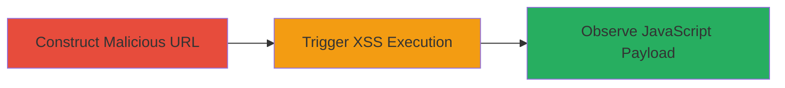

---
tags:
  - xss
  - reflected-xss
  - javascript
  - web
  - vimeo
type: attack_chain
tools: []
tactics:
  - '[[Execution]]'
  - '[[Collection]]'
verified: false
platforms:
  - Web
submitted: true
complexity: low
created_at: '2023-10-01T00:00:00Z'
procedures:
  - '[[procedures/Exploit-Reflected-XSS-in-Vimeo-Musicstore]]'
step_count: 2
techniques:
  - '[[Exploit Public-Facing Application]]'
  - '[[JavaScript]]'
updated_at: '2025-12-14T03:16:14.332Z'
description: >-
  A multi-stage attack chain exploiting a reflected XSS vulnerability in the
  'section' parameter of vimeo.com/musicstore, allowing arbitrary JavaScript
  execution in the victim's browser for potential session hijacking or data
  theft.
skill_level: beginner
impact_level: high
id: 145304b0-abe4-42c9-ad07-a13f1d85ff53
validated: true
mitre_tactics:
  - '[[Execution]]'
  - '[[Collection]]'
mitre_techniques:
  - '[[Exploit Public-Facing Application]]'
  - '[[JavaScript]]'
---
# Reflected XSS in Vimeo Musicstore Section Parameter Leading to Arbitrary JavaScript Execution

Multi-stage attack chain demonstrating a complete attack workflow for exploiting reflected XSS on vimeo.com/musicstore.

## Chain Metrics Dashboard

| Metric | Value |
|--------|-------|
| Chain Status | Unverified |
| Total Steps | 2 |
| Execution Time | ~1 minute |
| Skill Level | Beginner |
| Complexity | Low |
| Impact Level | High |

## Attack Flow Visualization



## Prerequisites & Requirements

### Required Tools

- Web browser (Chrome, Safari, or Firefox)

### Target Environment

- Target Platform: Web
- Required Services/Ports: HTTPS (443)
- Network Access Requirements: Internet access to vimeo.com

### Initial Access Requirements

- No credentials required
- Victim must visit the malicious URL (e.g., via phishing or direct link)
- No prior access needed

## Detailed Attack Procedures

### Step 1: Construct and Visit Malicious URL
procedure: [[procedures/Exploit-Reflected-XSS-in-Vimeo-Musicstore]]

**Objective**: Inject a malicious payload into the 'section' parameter to trigger reflected XSS in the MusicStoreCommon.initialize() JavaScript function.

**Instructions**: Manually construct the URL by appending the encoded payload to the base URL. Use a browser to navigate to the page, simulating how a victim would access it via a crafted link.

Example URL construction:

```url
https://vimeo.com/musicstore?section=%27-alert(document.domain)-%27
```

The payload `%27-alert(document.domain)-%27` (URL-encoded single quote, alert call, and closing quote) is reflected unescaped into the JavaScript, breaking out of the string context.

**Expected Output**: The page loads, and the JavaScript payload is inserted directly into the MusicStoreCommon.initialize() function call.

**Success Indicators**:
- Page loads without errors
- Payload appears in the browser's developer tools (View Source or Inspect Element) within the JavaScript code

### Step 2: Observe Execution of Injected JavaScript
procedure: [[procedures/Exploit-Reflected-XSS-in-Vimeo-Musicstore]]

**Objective**: Confirm arbitrary JavaScript execution by observing the payload's effect in the victim's browser context.

**Instructions**: After visiting the URL, monitor for the execution of the injected code. In a real attack, replace the alert with malicious code like cookie theft (e.g., `document.cookie` exfiltration).

For testing, the alert payload executes automatically upon page load.

**Expected Output**: An alert box pops up displaying the document domain (vimeo.com), confirming execution in the browser.

**Success Indicators**:
- Alert dialog appears showing "vimeo.com"
- No CSP or other protections block the execution (reproducible on Chrome, Safari, Firefox)

## Attack Chain Summary

### Key Achievements

1. Successful injection and reflection of JavaScript payload without sanitization
2. Arbitrary code execution in the context of vimeo.com, enabling client-side attacks
3. Demonstration of high-impact potential for session hijacking or data theft

## Technique & Tactic Coverage

### MITRE ATT&CK Techniques

- [[Exploit Public-Facing Application]] Exploit Public-Facing Application
- [[JavaScript]] JavaScript

### MITRE ATT&CK Tactics

- [[Execution]] Execution
- [[Collection]] Collection

---
*Last updated: 2023-10-01T00:00:00Z*
