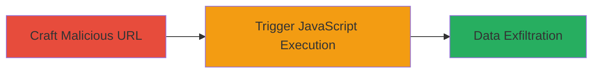

---
tags:
  - xss
  - reflected-xss
  - javascript-injection
  - vimeo
type: attack_chain
tools: []
tactics:
  - '[[Initial Access]]'
  - '[[Execution]]'
commands: []
platforms:
  - Web
complexity: low
procedures:
  - '[[procedures/Craft-Malicious-URL-for-Vimeo-Reflected-XSS]]'
  - '[[procedures/Trigger-XSS-Payload-via-Mouse-Interaction]]'
step_count: 2
techniques:
  - '[[Exploit Public-Facing Application]]'
  - '[[JavaScript]]'
description: >-
  A multi-stage attack exploiting a reflected XSS vulnerability in
  player.vimeo.com by injecting JavaScript via the 'user' GET parameter and
  triggering it with mouse movement to execute arbitrary code in the victim's
  browser.
skill_level: beginner
impact_level: high
id: 1bed33b0-5b3f-4a88-b3ed-65522a137001
created_at: '2025-12-14T03:15:35.683Z'
updated_at: '2025-12-14T03:15:35.683Z'
verified: false
validated: true
submitted: true
mitre_tactics:
  - '[[Initial Access]]'
  - '[[Execution]]'
mitre_techniques:
  - '[[Exploit Public-Facing Application]]'
  - '[[JavaScript]]'
---
# Reflected XSS in Vimeo Player via User Parameter

## Overview

This attack chain demonstrates a reflected cross-site scripting (XSS) vulnerability in the Vimeo player at player.vimeo.com. The 'user' GET parameter is reflected into the HTML without proper encoding, allowing attackers to inject JavaScript event handlers. By crafting a malicious URL and tricking a victim into visiting it, an attacker can execute arbitrary JavaScript in the victim's browser context. This enables theft of sensitive data like cookies or session tokens. The chain involves two steps: constructing the payload URL and triggering the execution via user interaction.

## Chain Metrics Dashboard

| Metric | Value |
|--------|-------|
| Chain Status | Unverified |
| Total Steps | 2 |
| Execution Time | ~1 minute |
| Skill Level | Beginner |
| Complexity | Low |
| Impact Level | High |

## Attack Flow Visualization

## Prerequisites & Requirements

### Required Tools

- Web browser (e.g., Firefox for testing)

### Target Environment

- Web platform
- Access to player.vimeo.com (publicly accessible)
- No authentication required

### Initial Access Requirements

- Ability to send URLs to victims (e.g., via phishing)
- Victim must visit the crafted URL in their browser
- No prior access or credentials needed

## Detailed Attack Procedures

### Step 1: Craft Malicious URL
procedure: [[procedures/Craft-Malicious-URL-for-Vimeo-Reflected-XSS]]

**Objective**: Create a URL that injects a JavaScript event handler into the reflected 'user' parameter to set up XSS payload.

**Instructions**: Construct the URL by appending the encoded payload to the base endpoint. The payload uses double quotes to break out of the attribute and inject an onmousemove event that alerts on mouse movement.

Example URL: `http://player.vimeo.com/hubnut/channel/830190?user=%22onmousemove=%22alert(1)%22`

This is the URL-encoded version of `?user="onmousemove="alert(1)"`.

**Expected Output**: A valid URL that, when loaded, reflects the payload in the page source without execution yet.

**Success Indicators**:
- Page loads without errors
- Inspect page source to confirm 'user' parameter reflection (e.g., search for "onmousemove="alert(1)" in HTML)

### Step 2: Trigger XSS Payload
procedure: [[procedures/Trigger-XSS-Payload-via-Mouse-Interaction]]

**Objective**: Activate the injected JavaScript by simulating victim interaction, leading to code execution.

**Instructions**: Load the crafted URL in a browser. Move the mouse cursor over the page background to fire the onmousemove event, executing the alert(1) payload. In a real attack, this could be adapted to steal data like `document.cookie`.

**Expected Output**: JavaScript alert box pops up displaying '1', confirming execution.

**Success Indicators**:
- Alert triggers on mouse movement
- Browser console shows no blocking errors; payload executes in victim context

## Attack Chain Summary

### Key Achievements

1. Successful injection of JavaScript via reflected parameter
2. Arbitrary code execution in browser without authentication
3. Potential for session hijacking or data theft

## Technique & Tactic Coverage

### MITRE ATT&CK Techniques

- [[Exploit Public-Facing Application]]
- [[JavaScript]]

### MITRE ATT&CK Tactics

- [[Initial Access]]
- [[Execution]]

---
*Last updated: 2023-10-01T00:00:00Z*
