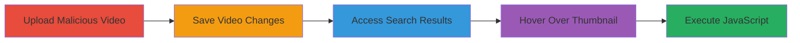

---
tags:
  - xss
  - reflected-xss
  - vimeo
  - javascript
  - web
type: attack_chain
tools: []
tactics:
  - '[[Execution]]'
verified: false
platforms:
  - Web
submitted: true
complexity: medium
created_at: '2024-01-01T00:00:00Z'
procedures:
  - '[[procedures/Upload-Malicious-Video-Title]]'
  - '[[procedures/Trigger-XSS-via-Search-Hover]]'
step_count: 5
techniques:
  - '[[JavaScript]]'
updated_at: '2025-12-14T03:16:30.727Z'
description: >-
  A multi-step attack exploiting a reflected XSS vulnerability in Vimeo's user
  or category video search feature by injecting malicious attributes into video
  titles, leading to JavaScript execution on hover.
skill_level: intermediate
impact_level: medium
id: 1affea79-da7d-4e38-9324-4048c4fec391
validated: true
mitre_tactics:
  - '[[Execution]]'
mitre_techniques:
  - '[[JavaScript]]'
---
# Reflected XSS in Vimeo Search via Malicious Video Title

Multi-stage attack chain demonstrating a complete attack workflow exploiting unescaped search queries in Vimeo's video search results.

## Chain Metrics Dashboard

| Metric | Value |
|--------|-------|
| Chain Status | Unverified |
| Total Steps | 5 |
| Execution Time | ~5 minutes |
| Skill Level | Intermediate |
| Complexity | Medium |
| Impact Level | Medium |

## Attack Flow Visualization

## Prerequisites & Requirements

### Required Tools

- Web browser (Firefox recommended for reliable execution due to XSS auditor differences)

### Target Environment

- Vimeo platform (web application)
- Access to upload videos (attacker account with video upload privileges)
- Victim account to view search results

### Initial Access Requirements

- Attacker must have a Vimeo account capable of uploading or editing videos
- No special credentials for victim; relies on public search access
- Network access to vimeo.com

## Detailed Attack Procedures

### Step 1: Upload Malicious Video Title
procedure: [[procedures/Upload-Malicious-Video-Title]]

**Objective**: Create a video with a title containing a malicious payload to inject attributes into search results.

**Instructions**: Log into your Vimeo account, upload a new video or edit an existing one, and set the title to the payload '"onmouseover="alert(document.domain)&#x2f;"'. The &#x2f; encodes '/' to prevent URL issues.

**Expected Output**: Video saved with the malicious title.

**Success Indicators**:
- Video title updated successfully without errors
- No immediate sanitization flags

### Step 2: Save Video Changes
procedure: [[procedures/Upload-Malicious-Video-Title]]

**Objective**: Persist the malicious title in Vimeo's database.

**Instructions**: After setting the title, click 'Save Changes' in the upload or settings interface.

**Expected Output**: Confirmation of saved video.

**Success Indicators**:
- Video details updated and visible in account dashboard
- Title reflects the payload when viewed

### Step 3: Access Search Results
procedure: [[procedures/Trigger-XSS-via-Search-Hover]]

**Objective**: Trigger the reflected insertion of the unescaped query into the search page.

**Instructions**: Using a separate account or incognito mode, navigate to the search URL: https://vimeo.com/[user]/videos/search:%22onmouseover%3D%22alert%28document.domain%29%26%23x2f%3B/. The query is URL-encoded to preserve the payload.

**Expected Output**: Search results page loads with the video as the primary (or only) result, query reflected in 'data-start-page' attribute.

**Success Indicators**:
- Page loads without errors
- Malicious video appears in results
- Inspect element shows unescaped query in <li data-start-page="...">

### Step 4: Hover Over Thumbnail
procedure: [[procedures/Trigger-XSS-via-Search-Hover]]

**Objective**: Activate the injected onmouseover event.

**Instructions**: Position the mouse cursor over the video thumbnail in the search results.

**Expected Output**: JavaScript payload executes if not blocked.

**Success Indicators**:
- No browser blocking (e.g., on Firefox)
- Event fires on hover

### Step 5: Observe Execution
procedure: [[procedures/Trigger-XSS-via-Search-Hover]]

**Objective**: Confirm XSS success and potential impact.

**Instructions**: Watch for the alert popup displaying the document domain.

**Expected Output**: Alert box with domain (e.g., vimeo.com).

**Success Indicators**:
- Alert triggers on hover
- Reproducible on Firefox; note blocks on other browsers via XSS Auditor

## Attack Chain Summary

### Key Achievements

1. Successful injection of malicious attributes via video title
2. Reflection of unescaped query in search results HTML
3. JavaScript execution on user interaction, demonstrating client-side compromise potential

## Technique & Tactic Coverage

### MITRE ATT&CK Techniques

- [[JavaScript]]

### MITRE ATT&CK Tactics

- [[Execution]]

---

*Last updated: 2024-01-01T00:00:00Z*
