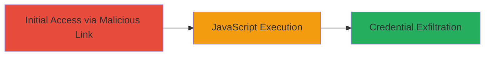

# Reflected XSS in WSO2 Parameter Leading to Credential Theft on DoD Website

Multi-stage attack chain demonstrating a complete attack workflow.

The vulnerability stems from a reflected Cross-Site Scripting (XSS) flaw in a parameter of a web component on the U.S. Department of Defense website, caused by the use of vulnerable WSO2 software (CVE-2017-14651). By injecting a malicious JavaScript payload into the URL parameter, the input is reflected unsanitized, allowing arbitrary code execution in the victim's browser. This can lead to stealing session cookies, performing drive-by downloads, or redirecting users to malicious sites, compromising sensitive DoD-related credentials.

## Chain Metrics Dashboard

| Metric | Value |
|--------|-------|
| Chain Status | Unverified |
| Total Steps | 1 |
| Execution Time | ~1 minute |
| Skill Level | Intermediate |
| Complexity | Low |
| Impact Level | High |

## Attack Flow Visualization



## Prerequisites & Requirements

### Required Tools

- Web browser (e.g., Chrome, Firefox)

### Target Environment

- Web platform
- Vulnerable WSO2 product (as per CVE-2017-14651)
- Access to the public-facing DoD website

### Initial Access Requirements

- Victim must click a link or navigate to the crafted URL
- No prior credentials or network position required; social engineering may be used to lure the victim

## Detailed Attack Procedures

### Step 1: Deliver and Execute Malicious Payload
procedure: [[procedures/Exploit-Reflected-XSS-via-WSO2-Parameter]]

**Objective**: Inject and trigger a reflected XSS payload in the vulnerable parameter to execute JavaScript that exfiltrates the victim's cookies to an attacker-controlled server.

**Instructions**: Craft a URL with the malicious payload targeting the vulnerable parameter on the DoD website. The payload uses an HTML image tag with an onerror event to encode and send the document.cookie via a new window to the attacker's server.

Example payload integration:

```url
https://www.███████/██████████?██████████=
```

Send this URL to the victim via email, phishing, or embed in a malicious site. When the victim browses to it, the parameter reflects the payload, triggering the JavaScript.

**Expected Output**: A new browser window opens to the attacker's server with the base64-encoded cookies appended to the URL, allowing retrieval of session data.

**Success Indicators**:
- Payload reflection visible in the page source without sanitization
- JavaScript executes, opening a new window to the attacker's domain
- Attacker receives the exfiltrated cookie data on their server

## Attack Chain Summary

### Key Achievements

1. Successful reflection of unsanitized user input in the WSO2 parameter
2. Arbitrary JavaScript execution in the victim's browser context
3. Exfiltration of sensitive cookies for potential session hijacking

## Technique & Tactic Coverage

### MITRE ATT&CK Techniques

- [[JavaScript]]
- [[Drive-by Compromise]]

### MITRE ATT&CK Tactics

- [[Initial Access]]
- [[Execution]]
- [[Collection]]

---

*Last updated: 2023-10-01T12:00:00Z*
