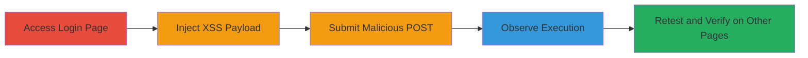

# Reflected XSS in Wallet Login Form for Cookie Theft and Session Hijacking

Multi-stage attack chain demonstrating exploitation of a reflected Cross-Site Scripting (XSS) vulnerability in the login form of the Romit wallet application at https://wallet.romit.io/login. The email parameter in POST requests is not sanitized, allowing injection of HTML and JavaScript payloads that reflect in error pages, executing in the victim's browser to steal sensitive data like cookies for session hijacking.

## Chain Metrics Dashboard

| Metric | Value |
|--------|-------|
| Chain Status | Unverified |
| Total Steps | 5 |
| Execution Time | ~5 minutes |
| Skill Level | Beginner |
| Complexity | Low |
| Impact Level | High |

## Attack Flow Visualization



## Prerequisites & Requirements

### Required Tools

- Browser developer tools or proxy like Burp Suite for request modification
- No specialized tools required; standard web browser suffices

### Target Environment

- Web application at https://wallet.romit.io
- Vulnerable endpoints: /login, /forgot, /enroll pages
- HTTP/HTTPS access to the login form

### Initial Access Requirements

- Public access to the website (no authentication needed)
- Ability to submit POST requests to the login endpoint
- Social engineering capability to lure victims (e.g., phishing link mimicking the login form)

## Detailed Attack Procedures

### Step 1: Access Login Page and Prepare Malicious POST
procedure: [[procedures/Access-Login-Page-and-Prepare-Malicious-POST]]

**Objective**: Navigate to the vulnerable login page and craft a POST request with an XSS payload in the email field to test for reflection.

**Instructions**: Open the login page in a browser and use developer tools or a proxy to intercept and modify the login form submission. Prepare the email parameter with a payload like a malicious HTML link that triggers on mouseover.

**Expected Output**: Modified POST request ready for submission, targeting the /login endpoint.

**Success Indicators**:
- Login page loads successfully
- Request interception confirms email parameter is modifiable

### Step 2: Submit POST Request with Injected Payload
procedure: [[procedures/Submit-POST-Request-with-XSS-Payload]]

**Objective**: Send the crafted POST request to the server, injecting the XSS payload to reflect it in the error response.

**Instructions**: Use a tool like curl or a browser proxy to submit the POST data. Include the CSRF token if captured from the form. Execute [[commands/submit-xss-login-payload]] to inject the payload:

```bash
curl -X POST https://wallet.romit.io/login \
  -d "email[]=<a onmouseover=alert(document.cookie)>xxs link</a>&password=g00dPa%24%24w0rD&_csrf=5afeda5f-e604-4ba0-bd60-d83f975853c5" \
  -H "Content-Type: application/x-www-form-urlencoded"
```

Then, load the resulting error page in a browser.

**Expected Output**: Server returns an error page reflecting the unsanitized email payload.

**Success Indicators**:
- Payload appears unencoded in the HTML response
- No server-side validation blocks the submission

### Step 3: Observe Execution of the Payload
procedure: [[procedures/Observe-XSS-Payload-Execution]]

**Objective**: Interact with the reflected error page to trigger JavaScript execution, demonstrating arbitrary code run in the browser context.

**Instructions**: Load the error page and perform the trigger action, such as hovering over the injected link. This executes the alert to display document cookies.

**Expected Output**: JavaScript alert pops up showing cookie data, confirming XSS execution.

**Success Indicators**:
- Alert dialog appears with cookie contents
- No browser security features (e.g., CSP) block the script

### Step 4: Retest with Simpler Payload After Initial Fix Attempt
procedure: [[procedures/Retest-XSS-with-Simpler-Payload-After-Fix]]

**Objective**: After a purported fix, test with a direct script tag payload to check if the vulnerability persists without interaction requirements.

**Instructions**: Repeat the submission process using a simpler payload. Execute [[commands/retest-xss-script-payload]]:

```bash
curl -X POST https://wallet.romit.io/login \
  -d "email[]=<script>alert(document.cookie)</script>&password=test&_csrf=example-token" \
  -H "Content-Type: application/x-www-form-urlencoded"
```

Load the error page to observe automatic execution.

**Expected Output**: Error page loads and immediately executes the script, alerting cookies without user interaction.

**Success Indicators**:
- Script executes on page load
- Vulnerability confirmed as unfixed

### Step 5: Verify Vulnerability on Additional Endpoints
procedure: [[procedures/Verify-XSS-on-Additional-Endpoints]]

**Objective**: Extend the test to other pages like /forgot and /enroll to assess the scope of the sanitization failure.

**Instructions**: Navigate to /forgot and /enroll endpoints, inject similar payloads in input fields, and submit. Use the same curl approach adapted for each form.

**Expected Output**: Payloads reflect and execute on error pages for all tested endpoints.

**Success Indicators**:
- XSS confirmed across multiple pages
- Consistent lack of output encoding

## Attack Chain Summary

### Key Achievements

1. Successful injection and reflection of XSS payloads in login error pages
2. Demonstration of cookie theft via JavaScript execution
3. Confirmation of vulnerability persistence post-fix and on additional endpoints

## Technique & Tactic Coverage

### MITRE ATT&CK Techniques

- [[JavaScript]] JavaScript
- [[LLMNR-NBT-NS Poisoning and SMB Relay]] Adversary-in-the-Middle (for session hijacking via stolen cookies)

### MITRE ATT&CK Tactics

- [[Initial Access]] Initial Access (phishing to lure to malicious form)
- [[Execution]] Execution (JavaScript in browser)
- [[Collection]] Collection (stealing cookies)

---
*Last updated: 2023-10-01T00:00:00Z*
