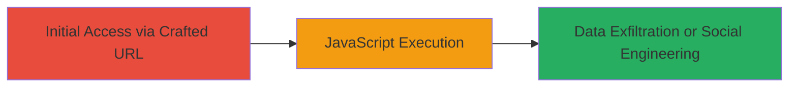

# Reflected XSS in WebPuff5.4 Login Page via Unsanitized URL Parameter

Multi-stage attack chain demonstrating a complete attack workflow.

## Chain Metrics Dashboard

| Metric | Value |
|--------|-------|
| Chain Status | Unverified |
| Total Steps | 1 |
| Execution Time | ~1 minute |
| Skill Level | Beginner |
| Complexity | Low |
| Impact Level | High |

## Attack Flow Visualization



## Prerequisites & Requirements

### Required Tools

- Browser or [[commands/curl-access-payload-url]]

### Target Environment

- Web application running WebPuff5.4 on JSP
- Accessible login endpoint at /WebPuff5.4/Login
- No authentication required for initial access

### Initial Access Requirements

- Publicly accessible web server
- Ability to send HTTP requests (browser or curl)
- No prior credentials needed

## Detailed Attack Procedures

### Step 1: Inject Payload into URL Parameter
procedure: [[procedures/Inject-Malicious-Payload-into-Login-URL-Parameter]]

**Objective**: Deliver a malicious URL to the victim, causing the reflection of unsanitized input in the login page, resulting in JavaScript execution.

**Instructions**: Construct a URL with the encoded payload targeting the 'url' parameter. For example, use a browser to navigate to the crafted URL or simulate with curl:

```bash
curl "http://target/WebPuff5.4/Login?url=login.jsp%27%22()%26%25%3Cacx%3E%3CScRiPt%20%3Ealert(9868)%3C/ScRiPt%3E" -v
```

This decodes to inject '<script>alert(9868)</script>' into the page, executing on load.

**Expected Output**: The page loads with the JavaScript executing, such as an alert box popping up displaying '9868'.

**Success Indicators**:
- Alert or other payload effect visible in browser
- Browser developer tools show injected script in DOM
- No server errors; payload reflects directly

## Attack Chain Summary

### Key Achievements

1. Successful injection and execution of arbitrary JavaScript via reflected XSS
2. Demonstration of potential for cookie theft or phishing redirection
3. Exploitation of DoD system login without authentication

## Technique & Tactic Coverage

### MITRE ATT&CK Techniques

- [[JavaScript]]

### MITRE ATT&CK Tactics

- [[Execution]]
- [[Collection]]

---
*Last updated: 2024-10-01T00:00:00Z*
