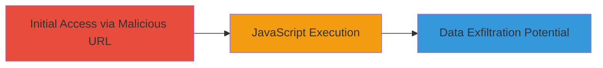

# Reflected XSS in WordPress Chat Logs via Channel Parameter

Multi-stage attack chain demonstrating a complete attack workflow.

## Chain Metrics Dashboard

| Metric | Value |
|--------|-------|
| Chain Status | Unverified |
| Total Steps | 1 |
| Execution Time | ~1 minute |
| Skill Level | Beginner |
| Complexity | Low |
| Impact Level | Medium |

## Attack Flow Visualization



## Prerequisites & Requirements

### Required Tools

- [[tools/Firefox]]

### Target Environment

- Web platform
- WordPress-based chat logs service
- No specific ports required (HTTPS on port 443)

### Initial Access Requirements

- Internet access to make.wordpress.org
- No credentials needed
- Victim must visit the crafted URL

## Detailed Attack Procedures

### Step 1: Inject and Execute XSS Payload
procedure: [[procedures/Exploiting-Reflected-XSS-in-WordPress-Chat-Logs]]

**Objective**: Deliver a malicious URL to a victim, causing JavaScript execution in their browser when they access the chat logs page.

**Instructions**: Craft a URL with the XSS payload in the 'channel' parameter and have the victim visit it using [[tools/Firefox]]. The payload "" is URL-encoded and injected.

Example crafted URL:

```url
https://make.wordpress.org/chat/logs?channel=16%22%3E%3Cimg%20src=x%20onerror=alert(document.domain)%3E&date=2019-07-21&no_bots=1
```

Visit the URL in [[tools/Firefox]]. The payload reflects unsanitized in the page, triggering the onerror event to execute alert(document.domain).

**Expected Output**: An alert popup displaying the domain "make.wordpress.org".

**Success Indicators**:
- JavaScript alert triggers
- Browser console shows execution errors or alerts
- Potential for further payloads to steal cookies via document.cookie

## Attack Chain Summary

### Key Achievements

1. Successful reflection and execution of JavaScript payload
2. Demonstration of client-side script injection
3. Highlighted risks of session hijacking and cookie theft

## Technique & Tactic Coverage

### MITRE ATT&CK Techniques

- [[JavaScript]]

### MITRE ATT&CK Tactics

- [[Execution]]
- [[Collection]]

---

*Last updated: 2023-10-01T12:00:00Z*
