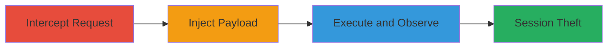

# Reflected XSS in WordPress Checkout via Unsanitized Billing Address

Multi-stage attack chain demonstrating exploitation of a reflected Cross-Site Scripting (XSS) vulnerability in the billing address parameter during the WordPress checkout process on a site like masterplan.wordpress.net. The attack intercepts a legitimate POST request, injects a JavaScript payload, and executes it to steal session cookies, highlighting insufficient input sanitization.

## Chain Metrics Dashboard

| Metric | Value |
|--------|-------|
| Chain Status | Unverified |
| Total Steps | 3 |
| Execution Time | ~5 minutes |
| Skill Level | Intermediate |
| Complexity | Medium |
| Impact Level | Low |

## Attack Flow Visualization

## Prerequisites & Requirements

### Required Tools

- [[tools/Burp-Repeater]]

### Target Environment

- Web platform with WordPress and PHP
- Access to /store/checkout/ endpoint
- No specific ports required beyond standard HTTP/HTTPS (80/443)

### Initial Access Requirements

- Network access to the target site (e.g., masterplan.wordpress.net)
- Burp Suite proxy configured in the browser
- Legitimate checkout flow to capture initial request

## Detailed Attack Procedures

### Step 1: Intercept or Craft Checkout POST Request
procedure: [[procedures/Intercept-Craft-Checkout-POST-Request]]

**Objective**: Capture a legitimate POST request to the /store/checkout/ endpoint to understand the structure for payload injection.

**Instructions**: Configure your browser to proxy traffic through Burp Suite. Navigate to the checkout page on the target WordPress site and submit a test checkout form. In Burp Repeater, capture the POST request including parameters like billing[address], shipping details, and payment info.

**Expected Output**: A raw HTTP POST request body visible in Burp Repeater, e.g., containing 'billing[address]=1 Main Street' and other form data.

**Success Indicators**:
- Request intercepted successfully
- All parameters, including billing[address], are visible and editable

### Step 2: Modify Billing Address with Malicious Payload
procedure: [[procedures/Inject-Malicious-Payload-into-Billing-Address]]

**Objective**: Inject a JavaScript payload into the billing[address] parameter to test for reflected XSS.

**Instructions**: In Burp Repeater, locate the billing[address] parameter in the request body. Replace its value with a payload like '1 Main Streetzbn0b">k8ez0', ensuring URL-encoding for special characters (e.g., '1%20Main%20Streetzbn0b%22%3e%3cscript%3ealert(document.cookie)%3c%2fscript%3ek8ez0'). Keep other parameters intact.

**Expected Output**: Modified request body with the encoded payload in Burp Repeater.

**Success Indicators**:
- Payload correctly inserted and encoded
- Request ready for forwarding without syntax errors

### Step 3: Send Modified Request and Observe Response
procedure: [[procedures/Send-Modified-Request-and-Observe-XSS-Execution]]

**Objective**: Forward the tampered request to trigger XSS execution and verify impact.

**Instructions**: From Burp Repeater, forward the modified POST request to the server. Open the response in a browser or inspect it for reflection. The payload should execute, displaying an alert with the session cookie (e.g., PHPSESSID).

**Expected Output**: Browser alert box showing document.cookie contents, confirming JavaScript execution.

**Success Indicators**:
- JavaScript alert pops up with cookie data
- Response HTML reflects the unsanitized input

## Attack Chain Summary

### Key Achievements

1. Successful interception and modification of checkout request
2. Injection and execution of JavaScript payload for XSS
3. Demonstration of session cookie theft potential

## Technique & Tactic Coverage

### MITRE ATT&CK Techniques

- [[JavaScript]]

### MITRE ATT&CK Tactics

- [[Execution]]
- [[Collection]]

---
*Last updated: 2023-10-01T12:00:00Z*
