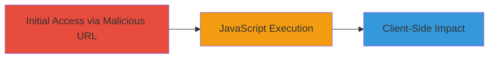

# Reflected XSS in WordPress Codex Thumbnail Endpoint

Multi-stage attack chain demonstrating a complete attack workflow.

## Chain Metrics Dashboard

| Metric | Value |
|--------|-------|
| Chain Status | Unverified |
| Total Steps | 1 |
| Execution Time | ~1 minute |
| Skill Level | Beginner |
| Complexity | Low |
| Impact Level | Medium |

## Attack Flow Visualization



## Prerequisites & Requirements

### Required Tools

- Web browser (e.g., Chrome, Firefox)

### Target Environment

- Target Platform: Web application on codex.wordpress.org
- Required Services/Ports: HTTP/HTTPS on port 80/443
- Network Access Requirements: Public internet access to codex.wordpress.org

### Initial Access Requirements

- No credentials required
- Direct public access to the site
- No prior access needed

## Detailed Attack Procedures

### Step 1: Construct and Access Malicious URL
procedure: [[procedures/Exploit-Reflected-XSS-in-Thumb-Endpoint]]

**Objective**: Craft a URL with a malicious payload in the 'f' parameter to inject and execute JavaScript in the victim's browser context.

**Instructions**: Construct the malicious URL by URL-encoding a payload that includes HTML and JavaScript. The payload exploits the insufficient sanitization in the thumb.php endpoint. Use a browser to access the URL, which will reflect the payload and trigger execution.

Example payload construction:

```url
https://codex.wordpress.org/thumb.php?f=xss%23%3Cbody%09onload=confirm%28String.fromCharCode%2888,83,83%29%29%3E
```

This decodes to a filename like 'xss#<body onload=confirm(String.fromCharCode(88,83,83))>', injecting the onload event that executes confirm('XSS').

**Expected Output**: A confirm dialog in the browser displaying 'XSS', confirming JavaScript execution.

**Success Indicators**:
- JavaScript alert or confirm dialog appears
- No thumbnail image loads; instead, injected HTML renders
- Browser console shows no errors related to the injection

## Attack Chain Summary

### Key Achievements

1. Successful reflection of unsanitized input in thumb.php response
2. Arbitrary JavaScript execution in the context of codex.wordpress.org
3. Demonstration of potential for session hijacking or phishing via client-side attacks

## Technique & Tactic Coverage

### MITRE ATT&CK Techniques

- [[JavaScript]]
- [[Exploit Public-Facing Application]]

### MITRE ATT&CK Tactics

- [[Execution]]
- [[Collection]]

---
*Last updated: 2023-10-01T00:00:00Z*
