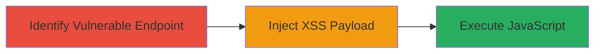

# Reflected XSS in WordPress Flash Media Element via Unsanitized jsinitfunctio Parameter

Multi-stage attack chain demonstrating a complete attack workflow exploiting a reflected XSS vulnerability in the flashmediaelement.swf file on a WordPress site.

## Chain Metrics Dashboard

| Metric | Value |
|--------|-------|
| Chain Status | Unverified |
| Total Steps | 2 |
| Execution Time | ~5 minutes |
| Skill Level | Intermediate |
| Complexity | Low |
| Impact Level | Medium |

## Attack Flow Visualization



## Prerequisites & Requirements

### Required Tools

- Web browser (e.g., Chrome with developer tools)
- [[curl]] for URL testing

### Target Environment

- WordPress installation with MediaElement plugin or similar
- Publicly accessible web server
- No specific ports beyond standard HTTP/HTTPS (80/443)

### Initial Access Requirements

- No credentials required
- Direct network access to the target domain (e.g., www.veris.in)
- No prior access needed; exploitable via unauthenticated URL access

## Detailed Attack Procedures

### Step 1: Identify Vulnerable Endpoint

procedure: [[procedures/Identify-Vulnerable-Flash-Media-Element-Endpoint-in-WordPress]]

**Objective**: Locate the flashmediaelement.swf file in the WordPress installation and confirm it processes URL parameters insecurely.

**Instructions**: Navigate to the WordPress media includes directory and inspect the SWF file. Use [[commands/curl-fetch-swf]] to download and examine the file:

```bash
curl -s https://www.veris.in/wp-includes/js/mediaelement/flashmediaelement.swf -o flash.swf
```

Open the file in a hex editor or decompiler to verify parameter handling, or test basic parameter injection in a browser.

**Expected Output**: The SWF file is retrieved, and initial parameter tests show no sanitization errors.

**Success Indicators**:
- SWF file accessible at /wp-includes/js/mediaelement/flashmediaelement.swf
- Parameters like 'jsinitfunctio' are accepted without rejection

### Step 2: Inject and Test XSS Payload

procedure: [[procedures/Craft-and-Test-XSS-Payload-in-jsinitfunctio-Parameter]]

**Objective**: Inject a JavaScript payload into the 'jsinitfunctio' parameter to execute arbitrary code in the victim's browser context.

**Instructions**: Construct a malicious URL with an encoded payload. Use [[commands/curl-test-xss-payload]] to simulate the request:

```bash
curl "https://www.veris.in/wp-includes/js/mediaelement/flashmediaelement.swf?jsinitfunctio=%25gn=alert%601%60" -v
```

Access the URL in a browser to trigger the payload. If the SWF embeds in a page, the alert(1) should pop up, confirming XSS.

**Expected Output**: JavaScript execution, such as an alert box displaying '1'.

**Success Indicators**:
- Alert or console log executes
- No sanitization blocks the payload, allowing reflection

## Attack Chain Summary

### Key Achievements

1. Identified insecure SWF endpoint in WordPress media library
2. Bypassed sanitization with URL-encoded JavaScript payload
3. Achieved arbitrary code execution, enabling potential session hijacking or phishing

## Technique & Tactic Coverage

### MITRE ATT&CK Techniques

- [[Exploit Public-Facing Application]]
- [[JavaScript]]

### MITRE ATT&CK Tactics

- [[Initial Access]]
- [[Execution]]
- [[Collection]]

---
*Last updated: 2023-10-01T00:00:00Z*
