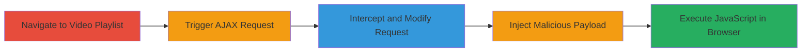

# Reflected XSS in WordPress Video Player via Admin-AJAX video_id Parameter

Multi-stage attack chain demonstrating a complete reflected XSS exploitation workflow on a WordPress site.

## Chain Metrics Dashboard

| Metric | Value |
|--------|-------|
| Chain Status | Unverified |
| Total Steps | 5 |
| Execution Time | ~5 minutes |
| Skill Level | Intermediate |
| Complexity | Medium |
| Impact Level | High |

## Attack Flow Visualization

## Prerequisites & Requirements

### Required Tools

- [[tools/Burp-Suite]]
- Browser (e.g., Chrome or Firefox)

### Target Environment

- WordPress-based web application
- Accessible video playlists page
- No authentication required for public playlists

### Initial Access Requirements

- Direct network access to the target site (https://theacademy.upserve.com)
- No prior credentials needed; exploits public-facing endpoint
- Burp Suite proxy configured in browser

## Detailed Attack Procedures

### Step 1: Navigate to Video Playlist Page
procedure: [[procedures/Exploit-Reflected-XSS-in-WordPress-Video-Player]]

**Objective**: Access the target page to load video links and prepare for request interception.

**Instructions**: Open a browser and navigate to the all-videos playlist page at https://theacademy.upserve.com/playlists/all-videos/. Ensure Burp Suite is running and the browser is proxied through it to capture traffic.

**Expected Output**: The page loads displaying a list of video links.

**Success Indicators**:
- Video playlist page is accessible
- No errors or redirects occur

### Step 2: Trigger Video Load Request
procedure: [[procedures/Exploit-Reflected-XSS-in-WordPress-Video-Player]]

**Objective**: Initiate an AJAX request by selecting a video, allowing interception.

**Instructions**: Click on any video link from the playlist to trigger the load_player AJAX request. In Burp Suite, capture the outgoing GET request to https://theacademy.upserve.com/wp-admin/admin-ajax.php?action=load_player&video_id=5742677405001&player_id=B14h0D4OM&type=pc&post_id=2712.

**Expected Output**: Intercepted request visible in Burp Suite Proxy > HTTP history or Interceptor.

**Success Indicators**:
- AJAX request is captured
- Request parameters include video_id

### Step 3: Inspect and Confirm Request
procedure: [[procedures/Exploit-Reflected-XSS-in-WordPress-Video-Player]]

**Objective**: Verify the request format to ensure the video_id parameter is present and modifiable.

**Instructions**: In Burp Suite, inspect the intercepted request and confirm it matches the expected format: https://theacademy.upserve.com/wp-admin/admin-ajax.php?action=load_player&video_id=5742677405001&player_id=B14h0D4OM&type=pc&post_id=2712. Do not forward yet.

**Expected Output**: Request details show unsanitized video_id parameter.

**Success Indicators**:
- Parameter structure confirmed
- Endpoint is admin-ajax.php with load_player action

### Step 4: Inject Malicious Payload
procedure: [[procedures/Exploit-Reflected-XSS-in-WordPress-Video-Player]]

**Objective**: Modify the video_id to include a reflected XSS payload for JavaScript execution.

**Instructions**: In Burp Suite Repeater or Interceptor, replace the video_id value with the URL-encoded payload r%22%3E%3CBODY%20ONLOAD%3Dalert(1)%3E (decodes to r"><BODY ONLOAD=alert(1)>). Forward the modified request to the server.

**Expected Output**: Server responds with the reflected payload in the HTML body without sanitization.

**Success Indicators**:
- Payload appears unescaped in response
- No server-side errors

### Step 5: Observe Execution
procedure: [[procedures/Exploit-Reflected-XSS-in-WordPress-Video-Player]]

**Objective**: Confirm JavaScript execution in the browser context.

**Instructions**: Allow the response to load in the browser. The onload event should trigger the alert(1) popup.

**Expected Output**: Browser displays an alert box with '1', indicating successful XSS execution.

**Success Indicators**:
- JavaScript alert executes
- No CSP or other protections block the payload

## Attack Chain Summary

### Key Achievements

1. Successful reflection of unsanitized user input in WordPress AJAX response
2. Arbitrary JavaScript execution in victim browser context
3. Potential for cookie theft, phishing, or malware distribution

## Technique & Tactic Coverage

### MITRE ATT&CK Techniques

- [[JavaScript]]
- [[Drive-by Compromise]]

### MITRE ATT&CK Tactics

- [[Initial Access]]
- [[Collection]]

---
*Last updated: 2023-10-01T12:00:00Z*
