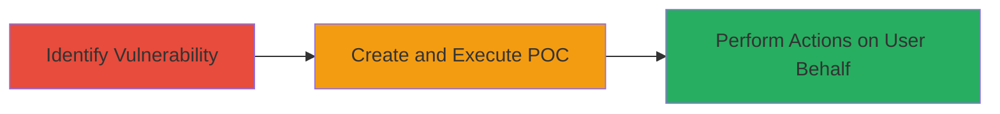

---
tags:
  - xss
  - reflected-xss
  - wordpress
  - php
type: attack_chain
tools:
  - '[[tools/Firefox]]'
tactics:
  - '[[Execution]]'
verified: false
platforms:
  - Web
submitted: true
complexity: medium
created_at: '2023-10-01T00:00:00Z'
procedures:
  - '[[procedures/Identify-Reflected-XSS-in-ajax-quote-php]]'
  - '[[procedures/Demonstrate-XSS-with-POC-HTML]]'
step_count: 2
techniques:
  - '[[JavaScript]]'
updated_at: '2025-12-14T03:16:37.196Z'
description: >-
  A multi-step attack exploiting a reflected XSS vulnerability in the WordPress
  support.wordcamp.org ajax-quote.php endpoint to execute JavaScript on behalf
  of authenticated users.
skill_level: intermediate
impact_level: high
id: 88cc1e5a-67d7-40d7-89f6-1ad1a757afc2
validated: true
mitre_tactics:
  - '[[Execution]]'
mitre_techniques:
  - '[[JavaScript]]'
---
# Reflected XSS in WordPress ajax-quote.php for User Session Actions

Multi-stage attack chain demonstrating exploitation of a reflected Cross-Site Scripting (XSS) vulnerability in the ajax-quote.php file on support.wordcamp.org, allowing attackers to execute arbitrary JavaScript in the context of authenticated users.

## Chain Metrics Dashboard

| Metric | Value |
|--------|-------|
| Chain Status | Unverified |
| Total Steps | 2 |
| Execution Time | ~5 minutes |
| Skill Level | Intermediate |
| Complexity | Medium |
| Impact Level | High |

## Attack Flow Visualization

## Prerequisites & Requirements

### Required Tools

- [[tools/Firefox]]

### Target Environment

- Web platform with WordPress
- PHP backend
- Access to support.wordcamp.org
- Authenticated user session (tricked victim)

### Initial Access Requirements

- Ability to trick authenticated users into visiting malicious links
- No direct credentials needed, but social engineering for link clicks
- Network access to the internet

## Detailed Attack Procedures

### Step 1: Identify Vulnerability
procedure: [[procedures/Identify-Reflected-XSS-in-ajax-quote-php]]

**Objective**: Locate and confirm the reflected XSS vulnerability in the ajax-quote.php endpoint by analyzing input handling.

**Instructions**: Review the ajax-quote.php file on support.wordcamp.org to identify unsanitized parameters in AJAX requests. Test inputs for reflection without escaping, such as quote parameters that allow JavaScript injection.

**Expected Output**: Confirmation of reflected input in the response, vulnerable to script tags.

**Success Indicators**:
- Input parameters reflect back unsanitized in the HTML response
- Basic payload like `` triggers an alert

### Step 2: Demonstrate XSS with POC
procedure: [[procedures/Demonstrate-XSS-with-POC-HTML]]

**Objective**: Create a proof-of-concept HTML file to trigger the XSS and execute JavaScript, simulating actions like session manipulation.

**Instructions**: Develop an HTML file (e.g., testpost.html) that sends a malicious AJAX request to the vulnerable endpoint using a payload in the quote parameter. Load the file in [[tools/Firefox]] to execute the script, bypassing potential auditors with crafted payloads.

**Expected Output**: JavaScript execution in the victim's browser context, such as alerts or DOM manipulations.

**Success Indicators**:
- Alert or console log from injected script
- Ability to perform actions on behalf of the user, limited by HTTPOnly cookies

## Attack Chain Summary

### Key Achievements

1. Identified improper input sanitization in ajax-quote.php leading to reflected XSS
2. Demonstrated exploitation via POC HTML file executable in Firefox
3. Enabled potential session hijacking or data manipulation for authenticated users

## Technique & Tactic Coverage

### MITRE ATT&CK Techniques

- [[JavaScript]]

### MITRE ATT&CK Tactics

- [[Execution]]

---
*Last updated: 2023-10-01T00:00:00Z*
