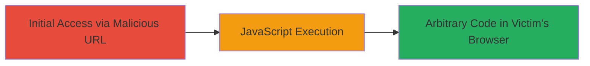

---
tags:
  - xss
  - wordpress
  - javascript
  - web
  - reflected-xss
type: attack_chain
tools:
  - '[[tools/Firefox]]'
tactics:
  - '[[Execution]]'
  - '[[Collection]]'
commands: []
platforms:
  - Web
complexity: low
procedures:
  - '[[procedures/Exploit-Reflected-XSS-in-WordPress-Themes-Filter]]'
step_count: 1
techniques:
  - '[[JavaScript]]'
description: >-
  A single-stage attack exploiting a reflected XSS vulnerability in the
  WordPress.com themes filter endpoint to execute arbitrary JavaScript in the
  victim's browser.
skill_level: beginner
impact_level: high
id: 3b85715a-24b0-4a4e-a629-b3ce454095fb
created_at: '2025-12-14T03:15:26.974Z'
updated_at: '2025-12-14T03:15:26.974Z'
verified: false
validated: true
submitted: true
mitre_tactics:
  - '[[Execution]]'
  - '[[Collection]]'
mitre_techniques:
  - '[[JavaScript]]'
---
# Reflected XSS in WordPress.com Themes Filter for Arbitrary JavaScript Execution

## Overview

This attack chain demonstrates a reflected Cross-Site Scripting (XSS) vulnerability in the WordPress.com themes filter endpoint. By crafting a malicious URL with a JavaScript payload in the 'type' parameter and visiting it in a browser like Firefox, an attacker can execute arbitrary JavaScript in the victim's browser context. This leads to potential session hijacking, data theft, or phishing attacks. The vulnerability stems from insufficient input validation and output encoding, allowing the payload to break out of HTML attributes and inject executable code.

## Chain Metrics Dashboard

| Metric | Value |
|--------|-------|
| Chain Status | Unverified |
| Total Steps | 1 |
| Execution Time | ~1 minute |
| Skill Level | Beginner |
| Complexity | Low |
| Impact Level | High |

## Attack Flow Visualization

## Prerequisites & Requirements

### Required Tools

- [[tools/Firefox]]

### Target Environment

- Web platform
- WordPress.com themes filter endpoint accessible
- No specific services/ports required beyond standard HTTPS (443)

### Initial Access Requirements

- No credentials needed
- Direct network access to https://wordpress.com
- Victim must visit the crafted URL (e.g., via phishing or direct access)

## Detailed Attack Procedures

### Step 1: Trigger XSS Payload
procedure: [[procedures/Exploit-Reflected-XSS-in-WordPress-Themes-Filter]]

**Objective**: Craft and visit a malicious URL to inject and execute JavaScript in the browser, demonstrating arbitrary code execution.

**Instructions**: Construct the malicious URL by appending the encoded XSS payload to the 'type' parameter in the themes filter endpoint. Use a browser like [[tools/Firefox]] to load the page, which will reflect and execute the payload.

The crafted URL is: https://wordpress.com/themes/filter/blog/type/%22%3E%3Cimg%20src=a%20onerror=alert%28document.domain%29%3E

This encodes the payload ">%3E%3Cimg src=a onerror=alert(document.domain)%3E, which breaks out of the attribute context and injects an  tag with an onerror handler to pop an alert showing the document domain (wordpress.com).

**Expected Output**: Upon loading the page, an alert box displays "wordpress.com", confirming JavaScript execution in the site's context.

**Success Indicators**:
- Alert box pops up with the document domain
- Browser console shows no errors, and payload executes without blocking
- Potential for further payloads to steal cookies or redirect to phishing sites
