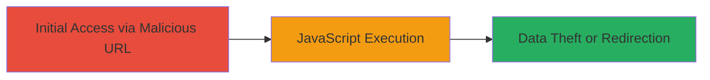

---
tags:
  - xss
  - reflected-xss
  - oauth
  - javascript-injection
  - zomato
type: attack_chain
tools: []
tactics:
  - '[[Initial Access]]'
  - '[[Execution]]'
  - '[[Collection]]'
verified: false
platforms:
  - Web
submitted: true
complexity: medium
created_at: '2023-10-01T00:00:00Z'
procedures:
  - '[[procedures/Exploit-Reflected-XSS-in-OAuth2-State-Parameter]]'
step_count: 1
techniques:
  - '[[Exploit Public-Facing Application]]'
  - '[[JavaScript]]'
updated_at: '2025-12-14T03:46:37.591Z'
description: >-
  A single-stage attack exploiting a reflected XSS vulnerability in the Zomato
  Google OAuth2 callback endpoint by using a backslash to escape quotes in the
  state parameter, allowing JavaScript injection on authenticated users.
skill_level: intermediate
impact_level: high
id: c3b6f4ce-da8d-4180-871f-b502ced45d8b
validated: true
mitre_tactics:
  - '[[Initial Access]]'
  - '[[Execution]]'
  - '[[Collection]]'
mitre_techniques:
  - '[[Exploit Public-Facing Application]]'
  - '[[JavaScript]]'
---
# Reflected XSS in Zomato Google OAuth2 Callback via Backslash Escape in State Parameter

Multi-stage attack chain demonstrating a complete attack workflow.

## Chain Metrics Dashboard

| Metric | Value |
|--------|-------|
| Chain Status | Unverified |
| Total Steps | 1 |
| Execution Time | ~1 minutes |
| Skill Level | Intermediate |
| Complexity | Medium |
| Impact Level | High |

## Attack Flow Visualization



## Prerequisites & Requirements

### Required Tools

- Browser (e.g., Chrome or Firefox) for accessing the crafted URL

### Target Environment

- Web platform
- Google OAuth2 service integration
- Access to Zomato.com as an authenticated user

### Initial Access Requirements

- Valid user session on Zomato.com (authentication required for impact)
- Network access to https://www.zomato.com
- No prior access needed beyond public internet

## Detailed Attack Procedures

### Step 1: Craft and Access Malicious OAuth2 Callback
procedure: [[procedures/Exploit-Reflected-XSS-in-OAuth2-State-Parameter]]

**Objective**: Inject and execute arbitrary JavaScript by exploiting improper escaping of backslashes in the state parameter, leading to reflected XSS in a script context.

**Instructions**: Construct a malicious URL targeting the googleOAuth2Callback endpoint with a payload that uses a backslash to escape the closing quote in the reflected script tag. Access the URL in a browser while authenticated to Zomato to trigger the payload.

Use a browser to navigate to the following crafted URL:

```url
https://www.zomato.com/googleOAuth2Callback?)%7D(alert)(location);%7B%3C!--&state=%5C
```

This payload decodes to inject `'(alert)(location);{<!--` after escaping the quote with `\` in the state parameter.

**Expected Output**: An alert box pops up displaying the current location (e.g., alert with URL), confirming JavaScript execution.

**Success Indicators**:
- Alert dialog appears in the browser
- JavaScript executes, potentially stealing session data or redirecting to a phishing site

## Attack Chain Summary

### Key Achievements

1. Successful injection of JavaScript via reflected XSS in OAuth2 callback
2. Execution of arbitrary code on victim browsers, enabling session hijacking or data theft
3. Demonstration of vulnerability in state parameter handling during OAuth flow

## Technique & Tactic Coverage

### MITRE ATT&CK Techniques

- [[Exploit Public-Facing Application]]
- [[JavaScript]]

### MITRE ATT&CK Tactics

- [[Initial Access]]
- [[Execution]]
- [[Collection]]

---
*Last updated: 2023-10-01T00:00:00Z*
