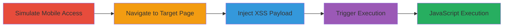

# Reflected XSS in Zomato Mobile Site via Category Parameter

Multi-stage attack chain demonstrating a complete attack workflow exploiting a reflected Cross-Site Scripting (XSS) vulnerability in Zomato's mobile website. The attack targets the 'category' parameter on restaurant photos pages, allowing attackers to inject malicious JavaScript that executes in the context of visiting mobile users' browsers. This can lead to session cookie theft, phishing, or other client-side attacks, specifically affecting mobile visitors.

## Chain Metrics Dashboard

| Metric | Value |
|--------|-------|
| Chain Status | Unverified |
| Total Steps | 4 |
| Execution Time | ~5 minutes |
| Skill Level | Intermediate |
| Complexity | Medium |
| Impact Level | High |

## Attack Flow Visualization

## Prerequisites & Requirements

### Required Tools

- Web browser with developer tools (e.g., Chrome DevTools for user agent switching)

### Target Environment

- Zomato mobile website (triggered by mobile user agent)
- Publicly accessible web application
- No specific ports or services required beyond standard HTTPS (443)

### Initial Access Requirements

- No credentials needed
- Direct network access to Zomato.com
- Ability to craft and share malicious URLs

## Detailed Attack Procedures

### Step 1: Simulate Mobile User Agent Access
procedure: [[procedures/Simulate-Mobile-User-Agent-Access]]

**Objective**: Mimic a mobile device to load Zomato's mobile-optimized site, which contains the vulnerable endpoint.

**Instructions**: Use browser developer tools to change the user agent string to a mobile device like iPhone or Android. This ensures the mobile version of the site is served, exposing the vulnerable 'category' parameter handling.

**Expected Output**: The website redirects or loads the mobile interface, confirming the user agent switch.

**Success Indicators**:
- Mobile layout and elements appear (e.g., touch-optimized UI)
- No desktop version loads

### Step 2: Navigate to Restaurant Photos Page
procedure: [[procedures/Navigate-to-Restaurant-Photos-Page]]

**Objective**: Reach the photos endpoint where the 'category' parameter is processed, setting up for payload injection.

**Instructions**: Enter a URL like `https://www.zomato.com/manila/artsy-cafe-diliman-quezon-city/photos?category=ambience` in the browser. This loads a legitimate photos page with a valid category filter.

**Expected Output**: Restaurant photos page displays with filtered content based on the category.

**Success Indicators**:
- Photos section loads without errors
- URL includes the 'category' parameter

### Step 3: Inject XSS Payload into Category Parameter
procedure: [[procedures/Inject-XSS-Payload-into-Category-Parameter]]

**Objective**: Craft and insert a payload that breaks out of the script context and injects executable SVG code to trigger JavaScript.

**Instructions**: Modify the 'category' parameter in the URL to include the payload `--></script><svg/onload=';alert(document.domain);'>`. URL-encode it as `%22--%3E%3C%2Fscript%3E%3Csvg%2Fonload%3D%27%3Balert%28document.domain%29%3B%27%3E`. The full URL becomes `https://www.zomato.com/manila/artsy-cafe-diliman-quezon-city/photos?category=%22--%3E%3C%2Fscript%3E%3Csvg%2Fonload%3D%27%3Balert%28document.domain%29%3B%27%3E`.

**Expected Output**: The modified URL is ready for loading, with the payload embedded.

**Success Indicators**:
- Payload is correctly URL-encoded and appended
- No immediate syntax errors in URL

### Step 4: Trigger XSS Execution on Modified URL
procedure: [[procedures/Trigger-XSS-Execution-on-Modified-URL]]

**Objective**: Load the tampered URL to execute the injected JavaScript in the victim's browser context.

**Instructions**: Visit the modified URL in a browser simulating a mobile user agent. The payload closes an existing script tag and injects an SVG element with an onload handler that executes `alert(document.domain)`, confirming XSS.

**Expected Output**: An alert box pops up displaying the document domain (e.g., www.zomato.com), indicating successful JavaScript execution.

**Success Indicators**:
- Alert triggers with domain name
- Browser console shows no blocking errors
- Potential for further payloads like cookie theft

## Attack Chain Summary

### Key Achievements

1. Successful simulation of mobile access to expose vulnerable mobile site
2. Injection of XSS payload via unsanitized 'category' parameter
3. Arbitrary JavaScript execution, enabling session hijacking or data theft for mobile users
4. Demonstration of client-side attack impact without server compromise

## Technique & Tactic Coverage

### MITRE ATT&CK Techniques

- [[JavaScript]]
- [[Drive-by Compromise]]

### MITRE ATT&CK Tactics

- [[Execution]]
- [[Collection]]

---
*Last updated: 2023-11-01T00:00:00Z*
