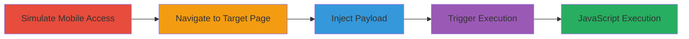

---
tags:
  - xss
  - reflected-xss
  - web
  - mobile
  - javascript-injection
type: attack_chain
tools: []
tactics:
  - '[[Execution]]'
verified: false
platforms:
  - Web
submitted: true
complexity: medium
created_at: '2024-10-01T00:00:00Z'
procedures:
  - '[[procedures/Simulate-Mobile-User-Agent-for-Zomato]]'
  - '[[procedures/Navigate-to-Zomato-Restaurant-Photos-Page]]'
  - '[[procedures/Inject-XSS-Payload-into-Category-Parameter]]'
  - '[[procedures/Trigger-Reflected-XSS-by-Loading-URL]]'
step_count: 4
techniques:
  - '[[JavaScript]]'
updated_at: '2025-12-14T03:16:14.418Z'
description: >-
  A multi-step attack exploiting a reflected XSS vulnerability in the category
  parameter on Zomato's mobile website, allowing arbitrary JavaScript execution
  in the victim's browser.
skill_level: intermediate
impact_level: high
id: 4f797f5f-3c07-48d5-93e4-4720f0f024b7
validated: true
mitre_tactics:
  - '[[Execution]]'
mitre_techniques:
  - '[[JavaScript]]'
---
# Reflected XSS in Zomato Mobile Site via Unsanitized Category Parameter

Multi-stage attack chain demonstrating a complete client-side JavaScript injection workflow on Zomato's mobile website.

## Chain Metrics Dashboard

| Metric | Value |
|--------|-------|
| Chain Status | Unverified |
| Total Steps | 4 |
| Execution Time | ~5 minutes |
| Skill Level | Intermediate |
| Complexity | Medium |
| Impact Level | High |

## Attack Flow Visualization

## Prerequisites & Requirements

### Required Tools

- Web browser with developer tools (e.g., Chrome DevTools for user agent switching)

### Target Environment

- Zomato mobile website (accessed via simulated mobile user agent)
- Publicly accessible web application

### Initial Access Requirements

- No credentials required
- Direct network access to Zomato.com
- No prior access needed

## Detailed Attack Procedures

### Step 1: Simulate Mobile Browser Access
procedure: [[procedures/Simulate-Mobile-User-Agent-for-Zomato]]

**Objective**: Mimic a mobile device to access the vulnerable mobile version of Zomato's website.

**Instructions**: Use browser developer tools to change the user agent string to a mobile device profile, such as an iPhone or Android browser.

**Expected Output**: The website redirects or loads the mobile-optimized interface.

**Success Indicators**:
- Mobile layout and features are visible
- Desktop version elements are hidden

### Step 2: Navigate to Restaurant Photos Page
procedure: [[procedures/Navigate-to-Zomato-Restaurant-Photos-Page]]

**Objective**: Reach the specific endpoint where the category parameter is reflected without sanitization.

**Instructions**: Enter a URL for a restaurant's photos page, such as https://www.zomato.com/manila/artsy-cafe-diliman-quezon-city/photos?category=ambience, ensuring the mobile user agent is active.

**Expected Output**: The photos page loads with category-filtered content.

**Success Indicators**:
- Page displays restaurant photos
- Category parameter is visible in the URL

### Step 3: Craft and Inject XSS Payload
procedure: [[procedures/Inject-XSS-Payload-into-Category-Parameter]]

**Objective**: Modify the category parameter to include a payload that breaks out of the script context and executes JavaScript.

**Instructions**: Append or replace the category value with a crafted payload like "--></script><svg/onload=';alert(document.domain);'>", ensuring proper URL encoding.

**Expected Output**: The modified URL is ready for loading, with the payload encoded.

**Success Indicators**:
- Payload is correctly URL-encoded
- No immediate errors in URL formation

### Step 4: Load URL to Trigger XSS
procedure: [[procedures/Trigger-Reflected-XSS-by-Loading-URL]]

**Objective**: Execute the injected JavaScript in the browser context, demonstrating arbitrary code execution.

**Instructions**: Load the full modified URL in the browser with the mobile user agent active.

**Expected Output**: An alert box pops up displaying the document domain, confirming XSS execution.

**Success Indicators**:
- JavaScript alert triggers
- No sanitization blocks the payload

## Attack Chain Summary

### Key Achievements

1. Successful simulation of mobile access to bypass desktop protections
2. Identification and exploitation of reflected parameter without escaping
3. Arbitrary JavaScript execution leading to potential session hijacking or data theft

## Technique & Tactic Coverage

### MITRE ATT&CK Techniques

- [[JavaScript]]

### MITRE ATT&CK Tactics

- [[Execution]]

---
*Last updated: 2024-10-01T00:00:00Z*
