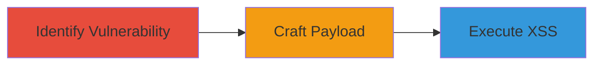

---
tags:
  - xss
  - reflected-xss
  - oauth
  - session-hijacking
  - cookie-theft
type: attack_chain
tools:
  - '[[tools/Firefox-Browser]]'
tactics:
  - '[[Execution]]'
  - '[[Collection]]'
commands: []
platforms:
  - Web
complexity: medium
procedures:
  - '[[procedures/Identify-Reflected-XSS-Vulnerability-in-OAuth-Endpoint]]'
  - '[[procedures/Craft-and-Inject-XSS-Payload-into-Query-Parameters]]'
  - '[[procedures/Execute-Reflected-XSS-via-Browser-to-Steal-Cookies]]'
step_count: 3
techniques:
  - '[[JavaScript]]'
description: >-
  Multi-stage attack exploiting a reflected XSS vulnerability in Zomato's OAuth
  2.0 error endpoint to execute arbitrary JavaScript and steal session cookies.
skill_level: intermediate
impact_level: high
id: 1d92a03e-b4cb-4a26-b8d9-860954351833
created_at: '2025-12-13T09:01:26.575Z'
updated_at: '2025-12-13T09:01:26.575Z'
verified: false
validated: true
submitted: true
mitre_tactics:
  - '[[Execution]]'
  - '[[Collection]]'
mitre_techniques:
  - '[[JavaScript]]'
---
# Reflected XSS in Zomato OAuth Error Endpoint for Session Hijacking

Multi-stage attack chain demonstrating a complete attack workflow exploiting a reflected XSS vulnerability in the OAuth 2.0 error fallback endpoint of auth2.zomato.com. This allows arbitrary JavaScript execution via unsanitized query parameters, potentially leading to session hijacking by stealing cookies from logged-in users.

## Chain Metrics Dashboard

| Metric | Value |
|--------|-------|
| Chain Status | Unverified |
| Total Steps | 3 |
| Execution Time | ~5 minutes |
| Skill Level | Intermediate |
| Complexity | Medium |
| Impact Level | High |

## Attack Flow Visualization

## Prerequisites & Requirements

### Required Tools

- [[tools/Firefox-Browser]]

### Target Environment

- Platform: Web
- Services: OAuth 2.0 Provider (ORY Hydra)
- Network access: Public internet access to https://auth2.zomato.com

### Initial Access Requirements

- No credentials required
- Ability to visit URLs in a browser
- Target must be a logged-in user tricked into visiting the malicious URL

## Detailed Attack Procedures

### Step 1: Identify Vulnerable Endpoint and Parameters
procedure: [[procedures/Identify-Reflected-XSS-Vulnerability-in-OAuth-Endpoint]]

**Objective**: Discover the vulnerable OAuth error endpoint and confirm that query parameters are reflected without sanitization.

**Instructions**: Use [[tools/Firefox-Browser]] to test the endpoint by appending query parameters like error, error_description, and error_hint to https://auth2.zomato.com/oauth2/fallbacks/error and observe if their values are reflected in the page output without proper HTML encoding.

**Expected Output**: Confirmation that parameters are reflected unsanitized, allowing potential injection of HTML/JavaScript.

**Success Indicators**:
- Parameters appear in the page source without encoding
- No input sanitization detected

### Step 2: Craft and Inject XSS Payload
procedure: [[procedures/Craft-and-Inject-XSS-Payload-into-Query-Parameters]]

**Objective**: Create a malicious payload and inject it into the vulnerable query parameter to enable JavaScript execution.

**Instructions**: Craft the payload '<marquee loop=1 width=0 onfinish=co\u006efirm(document.cookie)>XSS</marquee>' and URL-encode it as %3Cmarquee%20loop%3d1%20width%3d0%20onfinish%3dco%5Cu006efirm(document.cookie)%3EXSS%3C%2fmarquee%3E. Append it to the error_hint parameter with placeholders in error and error_description, forming a URL like https://auth2.zomato.com/oauth2/fallbacks/error?error=xss&error_description=xsssy&error_hint=%3Cmarquee%20loop%3d1%20width%3d0%20onfinish%3dco%5Cu006efirm(document.cookie)%3EXSS%3C%2fmarquee%3E.

**Expected Output**: A crafted malicious URL ready for delivery.

**Success Indicators**:
- Payload is properly encoded and injected into the URL
- URL structure matches the vulnerable endpoint

### Step 3: Execute Reflected XSS via Browser
procedure: [[procedures/Execute-Reflected-XSS-via-Browser-to-Steal-Cookies]]

**Objective**: Load the crafted URL in a browser to trigger the XSS and demonstrate cookie theft.

**Instructions**: Use [[tools/Firefox-Browser]] to visit the crafted URL https://auth2.zomato.com/oauth2/fallbacks/error?error=xss&error_description=xsssy&error_hint=%3Cmarquee%20loop%3d1%20width%3d0%20onfinish%3dco%5Cu006efirm(document.cookie)%3EXSS%3C%2fmarquee%3E. The marquee tag will loop and trigger the onfinish event, executing confirm(document.cookie) to display a popup with cookie data.

**Expected Output**: A popup dialog showing the document.cookie contents, confirming successful XSS execution.

**Success Indicators**:
- JavaScript executes in the browser
- Cookie data is displayed in the popup
- Potential for session hijacking if victim is logged in

## Attack Chain Summary

### Key Achievements

1. Identification of unsanitized parameter reflection in OAuth endpoint
2. Successful crafting and injection of XSS payload
3. Execution of arbitrary JavaScript leading to cookie theft

## Technique & Tactic Coverage

### MITRE ATT&CK Techniques

- [[JavaScript]]

### MITRE ATT&CK Tactics

- [[Execution]]
- [[Collection]]

*Last updated: 2023-10-01*
