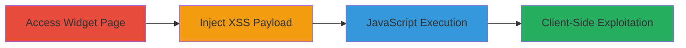

---
tags:
  - xss
  - reflected-xss
  - javascript
  - web
  - php
type: attack_chain
tools: []
tactics:
  - '[[Execution]]'
  - '[[Initial Access]]'
verified: false
platforms:
  - Web
submitted: true
complexity: medium
created_at: '2024-10-01T00:00:00Z'
procedures:
  - '[[procedures/Inject-Reflected-XSS-Payload-in-Zomato-Search-Widget]]'
step_count: 2
techniques:
  - '[[JavaScript]]'
  - '[[Exploit Public-Facing Application]]'
updated_at: '2025-12-14T17:32:01.609Z'
description: >-
  A multi-stage attack exploiting a reflected XSS vulnerability in Zomato's
  res_search_widget API to execute arbitrary JavaScript in the victim's browser,
  bypassing Same-Origin Policy and enabling client-side attacks like session
  hijacking.
skill_level: intermediate
impact_level: high
id: f49325ba-acbd-4a64-80a7-6d7dbd24bf2e
validated: true
mitre_tactics:
  - '[[Execution]]'
  - '[[Initial Access]]'
mitre_techniques:
  - '[[JavaScript]]'
  - '[[Exploit Public-Facing Application]]'
---
# Reflected XSS in Zomato Restaurant Search Widget for Arbitrary JavaScript Execution

Multi-stage attack chain demonstrating a complete attack workflow exploiting a reflected Cross-Site Scripting (XSS) vulnerability in Zomato's restaurant search widget API.

## Chain Metrics Dashboard

| Metric | Value |
|--------|-------|
| Chain Status | Unverified |
| Total Steps | 2 |
| Execution Time | ~2 minutes |
| Skill Level | Intermediate |
| Complexity | Medium |
| Impact Level | High |

## Attack Flow Visualization

## Prerequisites & Requirements

### Required Tools

- Browser with developer tools (e.g., Chrome DevTools for payload testing)

### Target Environment

- Web platform
- PHP-based web application
- Access to public-facing Zomato widget URL

### Initial Access Requirements

- No credentials required
- Direct internet access to https://www.zomato.com/widgets/res_search_widget.php
- Victim must interact with the malicious link or widget

## Detailed Attack Procedures

### Step 1: Access the Zomato Restaurant Search Widget

procedure: [[procedures/Access-Zomato-Search-Widget-Page]]

**Objective**: Navigate to the vulnerable widget page to prepare for payload injection.

**Instructions**: Open a web browser and directly access the Zomato restaurant search widget URL. This page hosts the res_search_widget API, which includes an input field for restaurant searches that is susceptible to reflected XSS.

**Expected Output**: The widget page loads, displaying a search input field where user input is reflected without proper sanitization.

**Success Indicators**:
- Page loads successfully without errors
- Search input field is visible and interactive

### Step 2: Inject Reflected XSS Payload

procedure: [[procedures/Inject-Reflected-XSS-Payload-in-Zomato-Search-Widget]]

**Objective**: Inject a crafted XSS payload into the search input to trigger JavaScript execution, demonstrating arbitrary code execution and SOP bypass.

**Instructions**: In the search input field of the widget, enter the following payload: `'-->">'>'";' f0r=TRUE`. This payload uses quote evasion, HTML comment closure, and script tags to bypass filters and execute JavaScript. Submit the search to reflect the input and trigger the alert.

**Expected Output**: An alert box pops up displaying the document.domain (e.g., "www.zomato.com"), confirming JavaScript execution in the browser context.

**Success Indicators**:
- JavaScript alert executes
- No sanitization errors; payload reflects and runs
- Potential for further payloads to steal cookies or hijack sessions

## Attack Chain Summary

### Key Achievements

1. Successful access to the vulnerable widget API endpoint
2. Injection and execution of reflected XSS payload bypassing input validation
3. Demonstration of arbitrary JavaScript execution, enabling client-side attacks like cookie theft or phishing

## Technique & Tactic Coverage

### MITRE ATT&CK Techniques

- [[JavaScript]]
- [[Exploit Public-Facing Application]]

### MITRE ATT&CK Tactics

- [[Execution]]
- [[Initial Access]]

---
*Last updated: 2024-10-01T00:00:00Z*
