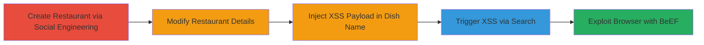

# Reflected XSS in Zomato Search via Malicious Dish Name Injection

Multi-stage attack chain demonstrating exploitation of a reflected Cross-Site Scripting (XSS) vulnerability in Zomato's 'explore-keywords-dropdown' search results. The attack involves social engineering to bypass content moderation, injecting a malicious JavaScript payload into a dish name, and triggering execution via search queries, allowing arbitrary code execution in victims' browsers for potential session hijacking or phishing using tools like BeEF.

## Chain Metrics Dashboard

| Metric | Value |
|--------|-------|
| Chain Status | Unverified |
| Total Steps | 4 |
| Execution Time | ~30 minutes |
| Skill Level | Intermediate |
| Complexity | Medium |
| Impact Level | High |

## Attack Flow Visualization

## Prerequisites & Requirements

### Required Tools

- [[tools/BeEF]]

### Target Environment

- Web platform (Zomato application)
- Required services/ports: HTTPS (443)
- Network access requirements: Internet access to Zomato.com

### Initial Access Requirements

- No prior credentials needed; relies on public-facing restaurant addition feature
- Ability to pass content moderation via social engineering (e.g., legitimate-sounding submissions)
- Browser for testing payloads

## Detailed Attack Procedures

### Step 1: Create Restaurant Entry
procedure: [[procedures/Create-Restaurant-Entry-via-Social-Engineering]]

**Objective**: Establish a controllable restaurant entry in Zomato's database by submitting a new restaurant addition that passes moderation.

**Instructions**: Navigate to the restaurant addition page and submit details that appear legitimate, using social engineering to ensure approval. For example, use real restaurant-like names and addresses from a low-profile location to avoid scrutiny.

**Expected Output**: Confirmation of submission, followed by moderation approval (typically within hours or days).

**Success Indicators**:
- Restaurant entry approved and visible in Zomato's system
- Ability to access edit mode for the restaurant

### Step 2: Modify Approved Restaurant
procedure: [[procedures/Modify-Approved-Restaurant-Details]]

**Objective**: Gain edit access to the newly approved restaurant to prepare for payload injection.

**Instructions**: Once approved, log in to your Zomato account (if required) and navigate to the restaurant's management section to edit details. Verify edit permissions are granted post-approval.

**Expected Output**: Successful entry into edit mode for restaurant details.

**Success Indicators**:
- Edit interface accessible without errors
- Changes to non-sensitive fields (e.g., description) saved successfully

### Step 3: Add Malicious Dish
procedure: [[procedures/Add-Malicious-Dish-with-XSS-Payload]]

**Objective**: Inject an XSS payload into a dish name that will be rendered unescaped in search dropdowns.

**Instructions**: In the restaurant edit section, add a new dish with a name containing the payload, such as 'Test Dish <svg/onload=alert(1);>'. Ensure the name is unique and includes special characters like >, ', ", or encoded variants (%0D%0A) to bypass any basic filters. Submit the update.

**Expected Output**: Dish added successfully to the restaurant profile.

**Success Indicators**:
- Dish visible in restaurant details
- No immediate rejection from moderation for the dish addition

### Step 4: Trigger XSS Execution
procedure: [[procedures/Trigger-XSS-via-Search-for-Malicious-Term]]

**Objective**: Execute the injected payload by searching for the malicious dish name, causing JavaScript to run in the victim's browser.

**Instructions**: Visit a Zomato search page (e.g., https://www.zomato.com/kingman-ks/restaurants) and enter the malicious dish name or special characters (e.g., '>') in the search bar. Observe the dropdown results where the unescaped payload renders and executes.

**Expected Output**: Alert box or scripted behavior (e.g., alert(1)) pops up in the browser.

**Success Indicators**:
- JavaScript execution confirmed (e.g., alert triggered)
- Potential for hooking with BeEF by replacing alert with a hook script

## Attack Chain Summary

### Key Achievements

1. Bypassed content moderation to inject persistent malicious content
2. Exploited unescaped user input in search UI for reflected XSS
3. Enabled arbitrary JS execution for advanced attacks like session theft

## Technique & Tactic Coverage

### MITRE ATT&CK Techniques

- [[Exploit Public-Facing Application]]
- [[JavaScript]]

### MITRE ATT&CK Tactics

- [[Initial Access]]
- [[Execution]]

---
*Last updated: 2023-10-01T00:00:00Z*
