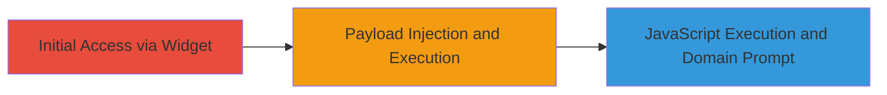

---
tags:
  - xss
  - reflected-xss
  - javascript-injection
  - zomato-api
type: attack_chain
tools: []
tactics:
  - '[[Execution]]'
verified: false
platforms:
  - Web
submitted: true
complexity: medium
created_at: '2023-10-01T00:00:00Z'
procedures:
  - '[[procedures/Exploit-Reflected-XSS-in-Zomato-Widget-API]]'
step_count: 1
techniques:
  - '[[JavaScript]]'
updated_at: '2025-12-14T03:15:31.489Z'
description: >-
  A single-stage attack exploiting a reflected XSS vulnerability in Zomato's
  developer widget API to inject and execute arbitrary JavaScript, potentially
  leading to session hijacking or data theft by bypassing Same-Origin Policy
  elements.
skill_level: intermediate
impact_level: high
id: be0170b1-29e9-4826-ba83-6f32f42f00e2
validated: true
mitre_tactics:
  - '[[Execution]]'
mitre_techniques:
  - '[[JavaScript]]'
---
# Reflected XSS in Zomato Widget API for Arbitrary JavaScript Execution

Multi-stage attack chain demonstrating a complete attack workflow.

## Chain Metrics Dashboard

| Metric | Value |
|--------|-------|
| Chain Status | Unverified |
| Total Steps | 1 |
| Execution Time | ~1 minutes |
| Skill Level | Intermediate |
| Complexity | Medium |
| Impact Level | High |

## Attack Flow Visualization

## Prerequisites & Requirements

### Required Tools

- Web browser (e.g., Chrome or Firefox with developer tools)

### Target Environment

- Web platform
- Access to Zomato's public widget API at https://www.zomato.com/widgets/res_search_widget.php
- No specific services or ports required beyond standard HTTP/HTTPS

### Initial Access Requirements

- Public internet access
- No credentials needed; the widget is publicly accessible
- Victim's browser context for reflected execution

## Detailed Attack Procedures

### Step 1: Payload Injection
procedure: [[procedures/Exploit-Reflected-XSS-in-Zomato-Widget-API]]

**Objective**: Inject a crafted XSS payload into the Zomato widget input field to break out of string contexts and execute arbitrary JavaScript, demonstrating access to the document domain.

**Instructions**: Navigate to the Zomato widget page and enter the payload into the relevant input field (e.g., search or parameter field). The payload uses quote and comment manipulation to escape contexts and inject a script tag.

**Expected Output**: Upon submission, the page executes the JavaScript, prompting the user with the current document.domain value.

**Success Indicators**:
- JavaScript alert or prompt appears showing the domain (e.g., www.zomato.com)
- Browser console logs confirm script execution without errors
- No sanitization blocks the payload injection

## Attack Chain Summary

### Key Achievements

1. Successful breakout from HTML attribute or JavaScript string contexts using special characters.
2. Injection and execution of a <script> tag prompting document.domain to verify domain access.
3. Potential for further exploitation like session hijacking or data theft by leveraging SOP bypass insights.

## Technique & Tactic Coverage

### MITRE ATT&CK Techniques

- [[JavaScript]]

### MITRE ATT&CK Tactics

- [[Execution]]

---
*Last updated: 2023-10-01T00:00:00Z*
