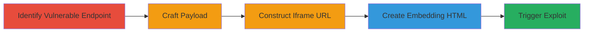

---
tags:
  - xss
  - reflected-xss
  - javascript
  - csrf-token-theft
  - web-exploit
type: attack_chain
tools: []
tactics:
  - '[[Initial Access]]'
  - '[[Execution]]'
  - '[[Collection]]'
verified: false
platforms:
  - Web
submitted: true
complexity: medium
created_at: '2023-10-01T00:00:00Z'
procedures:
  - '[[procedures/Identify-Vulnerable-Zomato-Widget-Endpoint]]'
  - '[[procedures/Craft-Malicious-JavaScript-Payload-for-XSS]]'
  - '[[procedures/Construct-Iframe-URL-with-XSS-Payload]]'
  - '[[procedures/Create-HTML-Page-Embedding-Malicious-Iframe]]'
  - '[[procedures/Trigger-XSS-Exploit-by-Loading-HTML]]'
step_count: 5
techniques:
  - '[[Exploit Public-Facing Application]]'
  - '[[JavaScript]]'
updated_at: '2025-12-14T03:15:10.461Z'
description: >-
  A multi-step attack exploiting a reflected XSS vulnerability in the Zomato
  widget API to execute JavaScript in the victim's session context, enabling
  CSRF token theft and unauthorized actions like inviting friends or posting
  reviews.
skill_level: intermediate
impact_level: high
id: 731ec14e-e1bb-4295-8847-0f3777496001
validated: true
mitre_tactics:
  - '[[Initial Access]]'
  - '[[Execution]]'
  - '[[Collection]]'
mitre_techniques:
  - '[[Exploit Public-Facing Application]]'
  - '[[JavaScript]]'
---
# Reflected XSS in Zomato Widget API for CSRF Token Theft

Multi-stage attack chain demonstrating exploitation of a reflected Cross-Site Scripting (XSS) vulnerability in the Zomato widget API endpoint at https://www.zomato.com/widgets/res_search_widget.php. The attack involves crafting a payload for the 'language_id' parameter, embedding it in an iframe on a controlled page, and tricking a user into loading it, which executes JavaScript in the zomato.com origin. This allows stealing CSRF tokens to perform authenticated actions like inviting friends or posting reviews, with potential for worm-like propagation, though limited by HTTPOnly session cookies.

## Chain Metrics Dashboard

| Metric | Value |
|--------|-------|
| Chain Status | Unverified |
| Total Steps | 5 |
| Execution Time | ~5 minutes |
| Skill Level | Intermediate |
| Complexity | Medium |
| Impact Level | High |

## Attack Flow Visualization

## Prerequisites & Requirements

### Required Tools

- Web browser (e.g., Chrome Developer Tools for testing)
- Text editor for HTML and payload crafting

### Target Environment

- Web platform
- PHP-based web application (Zomato widget API)
- No specific ports or services required beyond HTTP/HTTPS access to zomato.com

### Initial Access Requirements

- No credentials needed; social engineering to get victim to load the malicious page
- Public access to the Zomato widget endpoint
- Controlled domain or local file for hosting the HTML page

## Detailed Attack Procedures

### Step 1: Identify Vulnerable Endpoint
procedure: [[procedures/Identify-Vulnerable-Zomato-Widget-Endpoint]]

**Objective**: Locate the API endpoint and parameter susceptible to XSS by examining how user input is reflected without sanitization.

**Instructions**: Manually inspect the Zomato widget documentation and test the endpoint https://www.zomato.com/widgets/res_search_widget.php, focusing on the 'language_id' parameter. Use browser developer tools to observe reflection in the response.

**Expected Output**: Confirmation that 'language_id' is echoed back in the page source without escaping, e.g., as part of a JavaScript string.

**Success Indicators**:
- Parameter value appears unsanitized in the HTML/JS output
- Basic injection test (e.g., appending quotes) breaks the syntax

### Step 2: Craft Malicious Payload
procedure: [[procedures/Craft-Malicious-JavaScript-Payload-for-XSS]]

**Objective**: Create a JavaScript payload that escapes the string context to execute arbitrary code, such as alerting the domain or logging to console.

**Instructions**: Develop a payload like `'}');alert(document.domain);console.log(''` to close the expected string and inject code. URL-encode it for transmission, e.g., `%22%7D%27)%3Balert(document.domain)%3Bconsole.log(%27`.

**Expected Output**: Encoded payload ready for URL insertion.

**Success Indicators**:
- Payload breaks out of string context when tested
- Alert or console log executes in a proof-of-concept test

### Step 3: Construct Iframe URL
procedure: [[procedures/Construct-Iframe-URL-with-XSS-Payload]]

**Objective**: Build the full malicious URL incorporating the payload into the vulnerable parameter while maintaining widget functionality.

**Instructions**: Assemble the URL: `https://www.zomato.com/widgets/res_search_widget.php?city_id=276&language_id=%22%7D%27)%3Balert(document.domain)%3Bconsole.log(%27&theme=blue&hideCitySearch=on&hideResSearch=on&sort=popularity`. Include required parameters like city_id from widget docs.

**Expected Output**: Valid URL that loads the widget but injects the payload.

**Success Indicators**:
- URL loads without errors
- Payload is accepted in the parameter

### Step 4: Create Embedding HTML
procedure: [[procedures/Create-HTML-Page-Embedding-Malicious-Iframe]]

**Objective**: Embed the malicious URL in an iframe on a controlled HTML page to isolate and deliver the exploit.

**Instructions**: Write an HTML file with `<iframe src="https://www.zomato.com/widgets/res_search_widget.php?city_id=276&language_id=%22%7D%27)%3Balert(document.domain)%3Bconsole.log(%27&theme=blue&hideCitySearch=on&hideResSearch=on&sort=popularity" style="position:relative;width:100%;height:100%;" border="0" frameborder="0"></iframe>`.

**Expected Output**: Local HTML file ready for loading.

**Success Indicators**:
- Iframe renders without CORS issues
- Page loads the Zomato widget content

### Step 5: Trigger the Exploit
procedure: [[procedures/Trigger-XSS-Exploit-by-Loading-HTML]]

**Objective**: Load the page in a browser under a Zomato session to execute the XSS in the victim's context.

**Instructions**: Open the HTML file in a browser where the user is logged into Zomato. Observe the alert popping up with 'zomato.com' and console log.

**Expected Output**: JavaScript execution in zomato.com origin, e.g., alert box and console output.

**Success Indicators**:
- Alert confirms domain
- Code runs with user session privileges
- Potential for further actions like token theft

## Attack Chain Summary

### Key Achievements

1. Successful identification and exploitation of reflected XSS in a third-party widget API.
2. Execution of JavaScript in the target's origin, bypassing SOP via iframe.
3. Demonstration of impact including CSRF token theft for authenticated actions, with worm potential.

## Technique & Tactic Coverage

### MITRE ATT&CK Techniques

- [[Exploit Public-Facing Application]] Exploit Public-Facing Application
- [[JavaScript]] JavaScript

### MITRE ATT&CK Tactics

- [[Initial Access]] Initial Access
- [[Execution]] Execution
- [[Collection]] Collection

---
*Last updated: 2023-10-01T00:00:00Z*
