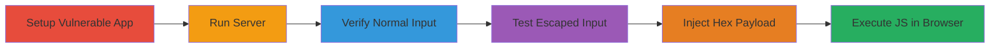

---
tags:
  - xss
  - reflected-xss
  - node.js
  - template-injection
  - javascript
type: attack_chain
tools:
  - '[[tools/npm]]'
  - '[[tools/Node.js]]'
  - '[[tools/Browser]]'
  - '[[tools/bracket-template]]'
tactics:
  - '[[Initial Access]]'
  - '[[Execution]]'
commands:
  - '[[commands/npm-install-bracket-template]]'
  - '[[commands/node-run-app]]'
platforms:
  - Web
  - Node.js
complexity: medium
procedures:
  - '[[procedures/Setup-Vulnerable-bracket-template-Application]]'
  - '[[procedures/Verify-Normal-Template-Rendering]]'
  - '[[procedures/Test-Direct-XSS-Payload]]'
  - '[[procedures/Exploit-Hex-Escaped-XSS]]'
step_count: 6
techniques:
  - '[[Exploit Public-Facing Application]]'
  - '[[JavaScript]]'
description: >-
  Demonstrates a reflected XSS vulnerability in the bracket-template Node.js
  module by injecting hex-escaped JavaScript payloads that bypass HTML escaping,
  leading to arbitrary code execution in the victim's browser.
skill_level: intermediate
impact_level: high
id: 9e4b099a-3e1b-4234-b555-f22e82b53c51
created_at: '2025-12-14T03:16:37.190Z'
updated_at: '2025-12-14T03:16:37.190Z'
verified: false
validated: true
submitted: true
mitre_tactics:
  - '[[Initial Access]]'
  - '[[Execution]]'
mitre_techniques:
  - '[[Exploit Public-Facing Application]]'
  - '[[JavaScript]]'
---
# Reflected XSS in bracket-template via Hex-Escaped Payloads

Multi-stage attack chain demonstrating exploitation of a reflected XSS vulnerability in the bracket-template Node.js module (version 1.1.5), where unsanitized GET parameters are interpolated into templates. Attackers can inject malicious JavaScript using hex-escaped characters (e.g., \x3c for '<') to bypass the module's HTML escaping, evading built-in XSS auditors in browsers like Chrome and Safari. This leads to arbitrary JavaScript execution, enabling session hijacking or data theft in affected applications.

## Chain Metrics Dashboard

| Metric | Value |
|--------|-------|
| Chain Status | Unverified |
| Total Steps | 6 |
| Execution Time | ~10 minutes |
| Skill Level | Intermediate |
| Complexity | Medium |
| Impact Level | High |

## Attack Flow Visualization



## Prerequisites & Requirements

### Required Tools

- [[tools/npm]]
- [[tools/Node.js]]
- [[tools/Browser]]
- [[tools/bracket-template]]

### Target Environment

- Node.js runtime (version 8.9.3 or compatible)
- Local development environment for testing
- No remote services required; runs on localhost

### Initial Access Requirements

- Local machine access for setup
- No credentials needed
- Basic Node.js knowledge

## Detailed Attack Procedures

### Step 1: Install bracket-template Module
procedure: [[procedures/Setup-Vulnerable-bracket-template-Application]]

**Objective**: Install the vulnerable bracket-template module to prepare for application setup.

**Instructions**: Use [[commands/npm-install-bracket-template]] to add the package to your project:

```bash
npm install bracket-template
```

**Expected Output**: Installation logs confirming the package is added to node_modules and package.json.

**Success Indicators**:
- Package installed without errors
- bracket-template directory appears in node_modules

### Step 2: Create and Run Sample Application
procedure: [[procedures/Setup-Vulnerable-bracket-template-Application]]

**Objective**: Develop a simple Node.js HTTP server that uses bracket-template to render unsanitized GET parameters.

**Instructions**: Create app.js with the server code, then start it using [[commands/node-run-app]]:

```bash
node app.js
```

**Expected Output**: Console message: 'server is listening on 8080'.

**Success Indicators**:
- Server starts on port 8080
- No syntax errors in app.js

### Step 3: Verify Normal Parameter Rendering
procedure: [[procedures/Verify-Normal-Template-Rendering]]

**Objective**: Confirm the application renders benign inputs correctly with proper escaping.

**Instructions**: Access the URL in [[tools/Browser]] at http://localhost:8080?name=bl4de.

**Expected Output**: Page displays '<strong>Hello bl4de</strong>' with the name rendered as text.

**Success Indicators**:
- Input displays without HTML interpretation
- No JavaScript errors in console

### Step 4: Test Direct XSS Payload
procedure: [[procedures/Test-Direct-XSS-Payload]]

**Objective**: Demonstrate that standard XSS attempts are escaped by the module.

**Instructions**: In [[tools/Browser]], navigate to http://localhost:8080?name=bl4de<script>console.log('XSS?')</script>.

**Expected Output**: Special characters like < and > are escaped in the HTML output, preventing script execution.

**Success Indicators**:
- No console log appears
- Payload renders as literal text

### Step 5: Inject Hex-Escaped XSS Payload
procedure: [[procedures/Exploit-Hex-Escaped-XSS]]

**Objective**: Bypass escaping using hex notation to inject and execute malicious JavaScript.

**Instructions**: Open http://localhost:8080/?name=bl4de\x3cscript\x3econsole.log(\x22uh\x20oh,\x20XSS...\x20:(\x22)\x3c\x2fscript\x3e in [[tools/Browser]].

**Expected Output**: The page renders '<strong>Hello bl4de<script>console.log("uh oh, XSS... :(")</script></strong>', with 'uh oh, XSS... :(' logged in the browser console.

**Success Indicators**:
- JavaScript executes in console
- XSS auditors in Chrome/Safari are bypassed

### Step 6: Assess Impact
procedure: [[procedures/Exploit-Hex-Escaped-XSS]]

**Objective**: Evaluate the potential for real-world exploitation like session theft.

**Instructions**: In a production-like setup, replace console.log with code to steal cookies (e.g., document.cookie) and exfiltrate via a beacon.

**Expected Output**: Arbitrary JS runs, allowing data access or actions in the victim's context.

**Success Indicators**:
- Sensitive data (e.g., session tokens) can be accessed
- Attack evades browser protections

## Attack Chain Summary

### Key Achievements

1. Successful installation and setup of vulnerable module
2. Confirmation of escaping for standard inputs
3. Bypass via hex-escaped payloads leading to JS execution
4. Demonstration of auditor evasion and high-impact risks

## Technique & Tactic Coverage

### MITRE ATT&CK Techniques

- [[Exploit Public-Facing Application]]
- [[JavaScript]]

### MITRE ATT&CK Tactics

- [[Initial Access]]
- [[Execution]]

---

*Last updated: 2023-10-01*
