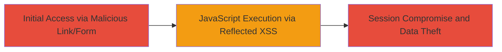

---
tags:
  - xss
  - reflected-xss
  - javascript
  - coldfusion
  - dod
  - web
type: attack_chain
tools: []
tactics:
  - '[[Execution]]'
  - '[[Collection]]'
commands:
  - '[[commands/send-xss-post-via-curl]]'
platforms:
  - Web
complexity: low
procedures:
  - '[[procedures/Exploiting-Reflected-XSS-in-fld_frompor-Parameter]]'
step_count: 1
techniques:
  - '[[JavaScript]]'
description: >-
  A single-stage attack exploiting a reflected XSS vulnerability in a POST
  parameter of a ColdFusion-based DoD web application to execute arbitrary
  JavaScript in the victim's browser.
skill_level: beginner
impact_level: high
id: 71b99021-94d9-40a4-bc10-6b031f0cf61d
created_at: '2025-12-14T00:11:15.843Z'
updated_at: '2025-12-14T00:11:15.843Z'
verified: false
validated: true
submitted: true
mitre_tactics:
  - '[[Execution]]'
  - '[[Collection]]'
mitre_techniques:
  - '[[JavaScript]]'
---
# Reflected XSS in fld_frompor Parameter for JavaScript Execution in DoD WaterControl Application

## Overview

This attack chain demonstrates the exploitation of a reflected Cross-Site Scripting (XSS) vulnerability in the 'fld_frompor' parameter of a POST request to the /WaterControl/shefgraph-historic.cfm?sid=BL110 endpoint on a U.S. Department of Defense web application built with ColdFusion. The vulnerability arises from insufficient input sanitization and output encoding, allowing an attacker to inject a payload that breaks out of an HTML attribute context and executes JavaScript via an SVG onload handler. Successful exploitation leads to arbitrary script execution in the victim's browser, enabling session hijacking, data theft, or actions on behalf of the victim. The attack requires tricking the victim into submitting a malicious form or link that triggers the POST request.

## Chain Metrics Dashboard

| Metric | Value |
|--------|-------|
| Chain Status | Unverified |
| Total Steps | 1 |
| Execution Time | ~1 minute |
| Skill Level | Beginner |
| Complexity | Low |
| Impact Level | High |

## Attack Flow Visualization



## Prerequisites & Requirements

### Required Tools

- Web browser (e.g., Firefox or Chrome developer tools for testing)
- [[commands/send-xss-post-via-curl]] or a tool like Burp Suite for sending POST requests

### Target Environment

- ColdFusion-based web application
- Endpoint: /WaterControl/shefgraph-historic.cfm?sid=BL110
- Required services/ports: HTTP/HTTPS on port 80/443
- Network access requirements: Direct access to the public-facing DoD web app

### Initial Access Requirements

- No credentials required (public-facing application)
- Victim must interact with a malicious link or form (e.g., via phishing)
- Attacker needs ability to craft and deliver the malicious payload

## Detailed Attack Procedures

### Step 1: Submit Malicious POST to Trigger XSS
procedure: [[procedures/Exploiting-Reflected-XSS-in-fld_frompor-Parameter]]

**Objective**: Inject a crafted payload into the 'fld_frompor' parameter to escape the HTML attribute context and execute JavaScript in the reflected response.

**Instructions**: Craft a malicious HTML form or use a command-line tool to send a POST request to the vulnerable endpoint. The payload '1&quot;&lt;!--&gt;&lt;Svg OnLoad=(confirm)(1)&lt;!--' closes the attribute with a quote, comments out remaining content, and injects an SVG element that triggers JavaScript on load. Use [[commands/send-xss-post-via-curl]] to test:

```bash
curl -X POST 'https://target-domain/WaterControl/shefgraph-historic.cfm?sid=BL110' \
  -d 'fld_frompor=1&quot;&lt;!--&gt;&lt;Svg OnLoad=(confirm)(1)&lt;!--' \
  -d 'other_params=values' \
  --cookie 'session_cookie=value'
```

Replace 'target-domain' with the actual DoD application domain, and adjust other parameters as needed based on the form. In a browser, create an HTML page with a form submitting to the endpoint and open it to trigger the payload.

**Expected Output**: The response reflects the payload unsanitized, rendering the SVG and executing the JavaScript (e.g., a confirm dialog with '1' appears).

**Success Indicators**:
- JavaScript alert or confirm dialog pops up in the browser
- Payload reflected in the HTML source without encoding
- No server-side errors blocking the injection

## Attack Chain Summary

### Key Achievements

1. Successful breakout from HTML attribute context using quote escape and comment injection
2. Execution of arbitrary JavaScript via SVG onload handler in a reflected XSS scenario
3. Potential for session cookie theft or further exploitation in a victim's browser session

## Technique & Tactic Coverage

### MITRE ATT&CK Techniques

- [[JavaScript]]

### MITRE ATT&CK Tactics

- [[Execution]]
- [[Collection]]

---
*Last updated: 2023-10-01*
