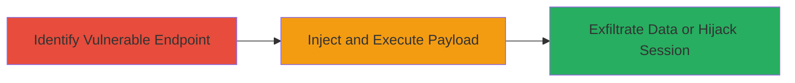

# Reflected XSS in jQuery.base.js for Script Injection and Session Hijacking

Multi-stage attack chain demonstrating exploitation of a reflected Cross-Site Scripting (XSS) vulnerability in the jQuery.base.js file on the Rockstar Games website's The Ballad of Gay Tony section. The vulnerability allows attackers to inject malicious JavaScript payloads via reflected parameters, executing them in users' browsers across multiple site areas. This can lead to session hijacking, cookie theft, or data exfiltration, with a medium severity due to potential user impact without authentication requirements.

## Chain Metrics Dashboard

| Metric | Value |
|--------|-------|
| Chain Status | Unverified |
| Total Steps | 2 |
| Execution Time | ~5 minutes |
| Skill Level | Intermediate |
| Complexity | Medium |
| Impact Level | Medium |

## Attack Flow Visualization

## Prerequisites & Requirements

### Required Tools

- [[tools/Burp-Suite]]
- [[tools/Browser-Developer-Tools]]

### Target Environment

- Web platform
- JavaScript/jQuery-based site
- No specific ports; accessible via HTTP/HTTPS

### Initial Access Requirements

- Public access to the website (no credentials needed)
- Network access to http://www.rockstargames.com/theballadofgaytony/
- Browser or proxy tool for interception

## Detailed Attack Procedures

### Step 1: Identify Vulnerable Endpoint
procedure: [[procedures/Identify-and-Test-Reflected-XSS-in-JavaScript-File]]

**Objective**: Locate the reflected XSS vulnerability in jquery.base.js by testing for unsanitized input reflection in JavaScript contexts.

**Instructions**: Navigate to the target section of the site (http://www.rockstargames.com/theballadofgaytony/) and use a proxy like Burp Suite to intercept requests. Append a test payload like `` to URL parameters that interact with jquery.base.js, such as query strings in page loads. Observe if the payload reflects into the DOM without encoding.

**Expected Output**: Alert box pops up in the browser, confirming script execution.

**Success Indicators**:
- Payload executes as JavaScript in the browser console
- No sanitization errors; reflection occurs in multiple site areas

### Step 2: Exploit XSS for Script Injection and Data Exfiltration
procedure: [[procedures/Exploit-XSS-for-Script-Injection-and-Data-Exfiltration]]

**Objective**: Inject a malicious payload to steal cookies or session data, demonstrating session hijacking potential.

**Instructions**: Craft a payload such as `` and inject it via the vulnerable parameter in requests to the JS file. Trigger the request multiple times across site sections to confirm exploitability. Use browser dev tools to monitor network requests for exfiltration.

**Expected Output**: Malicious script executes, sending user cookies to attacker's server.

**Success Indicators**:
- Cookies or session tokens transmitted to external domain
- Ability to hijack user sessions in affected areas

## Attack Chain Summary

### Key Achievements

1. Identified reflected XSS in jquery.base.js without proper input sanitization
2. Demonstrated multi-area exploitability for broad impact
3. Enabled potential data theft or session manipulation via script injection

## Technique & Tactic Coverage

### MITRE ATT&CK Techniques

- [[JavaScript]]
- [[Drive-by Compromise]]

### MITRE ATT&CK Tactics

- [[Execution]]
- [[Collection]]

---
*Last updated: 2023-10-01T12:00:00Z*
