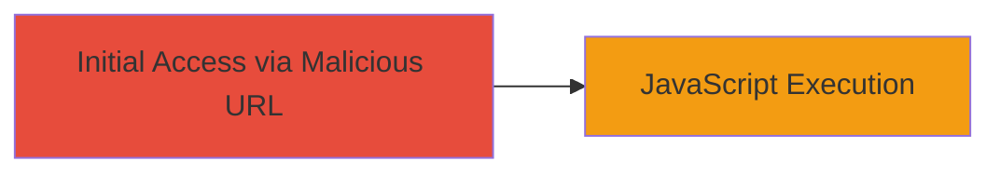

---
tags:
  - xss
  - reflected-xss
  - mdbook
  - kubernetes
  - javascript
type: attack_chain
tools: []
tactics:
  - '[[Initial Access]]'
  - '[[Execution]]'
verified: false
platforms:
  - Web
submitted: true
complexity: medium
created_at: '2023-10-01T00:00:00Z'
procedures:
  - '[[procedures/Exploit-Reflected-XSS-in-mdBook-Search]]'
step_count: 1
techniques:
  - '[[Drive-by Compromise]]'
  - '[[JavaScript]]'
updated_at: '2025-12-14T03:16:36.872Z'
description: >-
  A single-stage attack exploiting a reflected XSS vulnerability in the
  mdBook-based documentation site of kubernetes-csi.github.io, allowing
  arbitrary JavaScript execution via the search parameter.
skill_level: intermediate
impact_level: medium
id: 50df474a-6226-4a81-8d78-92f4189f1d23
validated: true
mitre_tactics:
  - '[[Initial Access]]'
  - '[[Execution]]'
mitre_techniques:
  - '[[Drive-by Compromise]]'
  - '[[JavaScript]]'
---
# Reflected XSS in mdBook Search Parameter for JavaScript Execution

Multi-stage attack chain demonstrating a complete attack workflow.

## Chain Metrics Dashboard

| Metric | Value |
|--------|-------|
| Chain Status | Unverified |
| Total Steps | 1 |
| Execution Time | ~1 minute |
| Skill Level | Intermediate |
| Complexity | Medium |
| Impact Level | Medium |

## Attack Flow Visualization



## Prerequisites & Requirements

### Required Tools

- Web browser (e.g., Chrome, Firefox)

### Target Environment

- Web platform
- mdBook documentation site (version < 0.4.5)
- No specific services/ports required beyond HTTP/HTTPS access

### Initial Access Requirements

- Public internet access to the target site
- No credentials needed
- Victim must visit the crafted URL

## Detailed Attack Procedures

### Step 1: Exploit Reflected XSS
procedure: [[procedures/Exploit-Reflected-XSS-in-mdBook-Search]]

**Objective**: Inject a malicious payload into the search parameter to execute arbitrary JavaScript in the victim's browser, potentially stealing session data or enabling phishing.

**Instructions**: Construct and visit the vulnerable URL with the encoded payload. The payload "x\"->xss" is URL-encoded as "x%22%2D%3Exss%3Cimg%2Fsrc%2Fonerror%3Dalert%281%29%3E" and appended to the search parameter on the /docs/ page.

Access the URL directly in a browser:

```url
https://kubernetes-csi.github.io/docs/?search=x%22%2D%3Exss%3Cimg%2Fsrc%2Fonerror%3Dalert%281%29%3E
```

This triggers the JavaScript alert(1) due to unsanitized input in mdBook's search functionality.

**Expected Output**: A JavaScript alert box pops up displaying "1", confirming execution.

**Success Indicators**:
- Alert dialog appears in the browser
- Browser console shows JavaScript errors or execution logs if inspected
- Potential for further payloads to exfiltrate data (e.g., cookies via img src to attacker server)

## Attack Chain Summary

### Key Achievements

1. Successful injection and execution of arbitrary JavaScript via reflected XSS
2. Demonstration of session data theft potential without authentication
3. Identification of mdBook vulnerability (CVE-2020-26297) in a Kubernetes-related site

## Technique & Tactic Coverage

### MITRE ATT&CK Techniques

- [[Drive-by Compromise]]
- [[JavaScript]]

### MITRE ATT&CK Tactics

- [[Initial Access]]
- [[Execution]]

---

*Last updated: 2023-10-01T00:00:00Z*
