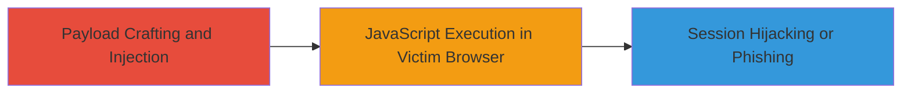

# Reflected XSS in ownCloud Appstore via Malicious PHPSESSID Parameter (IE Only)

Multi-stage attack chain demonstrating a complete attack workflow.

## Chain Metrics Dashboard

| Metric | Value |
|--------|-------|
| Chain Status | Unverified |
| Total Steps | 1 |
| Execution Time | ~1 minute |
| Skill Level | Intermediate |
| Complexity | Medium |
| Impact Level | Medium |

## Attack Flow Visualization



## Prerequisites & Requirements

### Required Tools

- [[tools/curl]]
- [[tools/grep]]

### Target Environment

- Web platform
- PHP-based application (ownCloud appstore)
- Access to public-facing search endpoint at https://apps.owncloud.com/content/search.php
- No authentication required

### Initial Access Requirements

- Public internet access to the target URL
- No credentials needed
- Victim must use Internet Explorer to trigger the payload without auto-encoding

## Detailed Attack Procedures

### Step 1: Payload Injection and Verification
procedure: [[procedures/Exploit-Reflected-XSS-in-ownCloud-Appstore-Search]]

**Objective**: Craft and send a malicious GET request to the search endpoint, injecting JavaScript via the PHPSESSID parameter to verify reflection and potential execution in IE.

**Instructions**: Use [[commands/curl-reflected-xss-test-owncloud]] to send the payload and grep for confirmation:

```bash
curl "https://apps.owncloud.com/content/search.php?PHPSESSID=\"&gt;XSSHERE&lt;script&gt;alert(1)&lt;/script&gt;" | grep XSS
```

**Expected Output**: Response containing the unescaped payload, such as 'XSSHERE<script>alert(1)</script>' in the output, confirming reflection.

**Success Indicators**:
- 'XSS' pattern found in grep output
- Payload visible without escaping in the full response
- In IE, viewing the reflected URL would execute alert(1)

## Attack Chain Summary

### Key Achievements

1. Successful injection of JavaScript payload via PHPSESSID parameter
2. Verification of unescaped reflection in server response
3. Potential for session hijacking or phishing in IE browsers

## Technique & Tactic Coverage

### MITRE ATT&CK Techniques

- [[JavaScript]]

### MITRE ATT&CK Tactics

- [[Execution]]

---

*Last updated: 2023-10-01T12:00:00Z*
