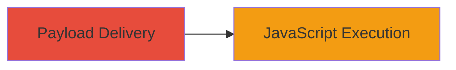

---
tags:
  - xss
  - reflected-xss
  - javascript-injection
  - owncloud
  - web
type: attack_chain
tools: []
tactics:
  - '[[Execution]]'
  - '[[Collection]]'
commands:
  - '[[commands/curl-xss-payload-test]]'
platforms:
  - Web
complexity: low
procedures:
  - '[[procedures/Exploit-Reflected-XSS-in-freecap-wrap-URI]]'
step_count: 1
techniques:
  - '[[JavaScript]]'
description: >-
  A single-stage attack exploiting a reflected XSS vulnerability in the
  freecap_wrap.php script on apps.owncloud.com, allowing arbitrary JavaScript
  execution via unsanitized URI parameter.
skill_level: beginner
impact_level: medium
id: bd6dae0d-ac58-46b4-aed2-0a65fb1f3600
created_at: '2025-12-14T03:15:41.505Z'
updated_at: '2025-12-14T03:15:41.505Z'
verified: false
validated: true
submitted: true
mitre_tactics:
  - '[[Execution]]'
  - '[[Collection]]'
mitre_techniques:
  - '[[JavaScript]]'
---
# Reflected XSS in ownCloud FreeCaptcha URI Parameter

Multi-stage attack chain demonstrating a complete attack workflow.

## Chain Metrics Dashboard

| Metric | Value |
|--------|-------|
| Chain Status | Unverified |
| Total Steps | 1 |
| Execution Time | ~1 minute |
| Skill Level | Beginner |
| Complexity | Low |
| Impact Level | Medium |

## Attack Flow Visualization



## Prerequisites & Requirements

### Required Tools

- Web browser or [[commands/curl-xss-payload-test]]

### Target Environment

- Web platform
- PHP-based application (ownCloud apps.owncloud.com)
- No specific ports required (standard HTTP/HTTPS)

### Initial Access Requirements

- Public internet access to http://apps.owncloud.com
- No credentials needed
- Victim must access the crafted URL

## Detailed Attack Procedures

### Step 1: Payload Delivery and Execution
procedure: [[procedures/Exploit-Reflected-XSS-in-freecap-wrap-URI]]

**Objective**: Inject and execute malicious JavaScript in the victim's browser by crafting a URL that exploits the unsanitized URI parameter in freecap_wrap.php.

**Instructions**: Construct a malicious URL by appending a payload to the endpoint, such as http://apps.owncloud.com/lib/freecaptcha/freecap_wrap.php/"><script>alert(1)</script>. Use a web browser to access it directly for testing, or deliver via phishing/social engineering. For automated testing, execute [[commands/curl-xss-payload-test]] to send the request and observe the response:

```bash
curl -X GET "http://apps.owncloud.com/lib/freecaptcha/freecap_wrap.php/'><script>prompt(1)</script>" -v
```

Verify the payload reflection in the response body, which should include the injected script tag without escaping.

**Expected Output**: HTTP response containing the reflected payload, e.g., unescaped <script> tag in the HTML output. In a browser, this triggers JavaScript execution like an alert or prompt.

**Success Indicators**:
- Payload appears unescaped in the page source
- JavaScript executes (e.g., alert box pops up)
- No sanitization errors or blocks

## Attack Chain Summary

### Key Achievements

1. Successful injection of arbitrary JavaScript via URI parameter
2. Execution of client-side code leading to potential session theft or phishing
3. Demonstration of reflected XSS impact on ownCloud's captcha wrapper

## Technique & Tactic Coverage

### MITRE ATT&CK Techniques

- [[JavaScript]]

### MITRE ATT&CK Tactics

- [[Execution]]
- [[Collection]]

---
*Last updated: 2023-10-01T00:00:00Z*
