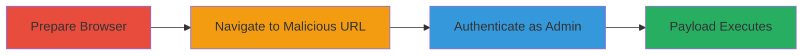

---
tags:
  - xss
  - reflected-xss
  - phplist
  - admin-interface
  - javascript
type: attack_chain
tools:
  - '[[tools/Firefox]]'
tactics:
  - '[[Initial Access]]'
  - '[[Collection]]'
verified: false
platforms:
  - Web
submitted: true
complexity: low
created_at: '2023-10-01T00:00:00Z'
procedures:
  - '[[procedures/Prepare-Browser-for-XSS-Exploitation]]'
  - '[[procedures/Navigate-to-Vulnerable-Template-URL]]'
  - '[[procedures/Authenticate-as-Administrator]]'
  - '[[procedures/Observe-XSS-Payload-Execution]]'
step_count: 4
techniques:
  - '[[Exploit Public-Facing Application]]'
  - '[[JavaScript]]'
updated_at: '2025-12-14T03:15:41.316Z'
description: >-
  A multi-step attack exploiting a reflected XSS vulnerability in the phpList
  3.2.5 administration interface to execute JavaScript in an authenticated admin
  context, enabling potential session hijacking.
skill_level: intermediate
impact_level: high
id: d42a0088-cc15-473a-afe9-2aa1e5087f4d
validated: true
mitre_tactics:
  - '[[Initial Access]]'
  - '[[Collection]]'
mitre_techniques:
  - '[[Exploit Public-Facing Application]]'
  - '[[JavaScript]]'
---
# Reflected XSS in phpList 3.2.5 Admin Interface via Template ID Parameter

Multi-stage attack chain demonstrating exploitation of a reflected Cross-Site Scripting (XSS) vulnerability in the phpList 3.2.5 administration interface hosted on newsletter.nextcloud.com. The attack involves crafting a malicious URL with an injected payload in the 'id' parameter of the viewtemplate page, which lacks proper sanitization. When an administrator accesses the URL and logs in, the payload executes, displaying an alert with the document domain and opening the door to session cookie theft or other client-side attacks.

## Chain Metrics Dashboard

| Metric | Value |
|--------|-------|
| Chain Status | Unverified |
| Total Steps | 4 |
| Execution Time | ~2 minutes |
| Skill Level | Intermediate |
| Complexity | Low |
| Impact Level | High |

## Attack Flow Visualization

## Prerequisites & Requirements

### Required Tools

- [[tools/Firefox]]

### Target Environment

- Web platform with phpList 3.2.5 installed
- Administrative interface accessible at https://newsletter.nextcloud.com/admin/
- No specific ports required beyond standard HTTPS (443)

### Initial Access Requirements

- Valid administrative credentials for the phpList instance
- Network access to the target URL
- Social engineering to lure the admin to click the malicious link (e.g., via email)

## Detailed Attack Procedures

### Step 1: Prepare Browser for XSS Testing
procedure: [[procedures/Prepare-Browser-for-XSS-Exploitation]]

**Objective**: Set up a modern web browser to handle JavaScript execution reliably for demonstrating the XSS payload.

**Instructions**: Launch the latest version of Firefox, ensuring JavaScript is enabled (default setting). No additional configuration is needed beyond standard browser setup.

**Expected Output**: Browser window ready for navigation.

**Success Indicators**:
- Firefox opens without errors
- JavaScript execution is confirmed (e.g., via console)

### Step 2: Navigate to Vulnerable Template URL
procedure: [[procedures/Navigate-to-Vulnerable-Template-URL]]

**Objective**: Access the phpList admin viewtemplate page with the injected XSS payload in the 'id' parameter to trigger reflection.

**Instructions**: Enter the malicious URL directly into the address bar: https://newsletter.nextcloud.com/admin/?page=viewtemplate&id=123%22%3E%3Cscript%3Ealert(document.domain)%3C/script%3E. This encodes the payload '123">' for URL transmission.

**Expected Output**: The page loads, but login may be prompted if not authenticated.

**Success Indicators**:
- Page renders with potential unsanitized 'id' parameter visible in source
- No immediate errors blocking access

### Step 3: Authenticate as Administrator
procedure: [[procedures/Authenticate-as-Administrator]]

**Objective**: Log in to the admin panel to place the session in an authenticated context, allowing the XSS to execute with elevated privileges.

**Instructions**: On the login prompt, enter valid administrative credentials for the phpList instance. Submit the form to authenticate.

**Expected Output**: Successful login redirects to the admin dashboard or template view, rendering the malicious 'id' parameter.

**Success Indicators**:
- Admin dashboard accessible
- Session cookies set for authenticated access

### Step 4: Observe XSS Payload Execution
procedure: [[procedures/Observe-XSS-Payload-Execution]]

**Objective**: Trigger and verify the execution of the injected JavaScript payload, confirming the vulnerability.

**Instructions**: After login, the page fully loads, automatically executing the script due to the reflected input.

**Expected Output**: An alert box pops up displaying 'newsletter.nextcloud.com' (the document domain).

**Success Indicators**:
- JavaScript alert appears
- No blocking by browser security (e.g., CSP absent)

## Attack Chain Summary

### Key Achievements

1. Successful injection and reflection of XSS payload via 'id' parameter
2. Execution of arbitrary JavaScript in admin context
3. Demonstration of potential for session theft or further attacks

## Technique & Tactic Coverage

### MITRE ATT&CK Techniques

- [[Exploit Public-Facing Application]]
- [[JavaScript]]

### MITRE ATT&CK Tactics

- [[Initial Access]]
- [[Collection]]

---
*Last updated: 2023-10-01T00:00:00Z*
