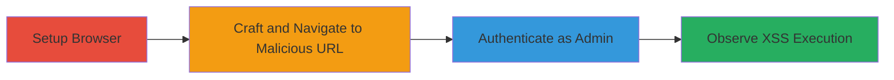

---
tags:
  - xss
  - reflected-xss
  - phplist
  - admin-compromise
  - javascript-injection
type: attack_chain
tools:
  - '[[tools/Firefox-Browser]]'
tactics:
  - '[[Execution]]'
  - '[[Collection]]'
verified: false
platforms:
  - Web
submitted: true
complexity: low
created_at: '2023-10-01T00:00:00Z'
procedures:
  - '[[procedures/Exploit-Reflected-XSS-in-phpList-Viewtemplate]]'
step_count: 4
techniques:
  - '[[JavaScript]]'
updated_at: '2025-12-14T17:28:44.562Z'
description: >-
  A multi-step attack exploiting a reflected XSS vulnerability in the phpList
  3.2.5 admin panel to execute arbitrary JavaScript in an authenticated admin's
  browser context, enabling potential session hijacking or data exfiltration.
skill_level: beginner
impact_level: high
id: 53fdf011-fc24-428d-ab45-fd073d919e3e
validated: true
mitre_tactics:
  - '[[Execution]]'
  - '[[Collection]]'
mitre_techniques:
  - '[[JavaScript]]'
---
# Reflected XSS in phpList 3.2.5 Admin Viewtemplate Leading to Arbitrary JavaScript Execution

Multi-stage attack chain demonstrating exploitation of a reflected Cross-Site Scripting (XSS) vulnerability in the phpList 3.2.5 installation on newsletter.nextcloud.com. The attack targets the 'viewtemplate' admin page where the 'id' parameter lacks proper sanitization, allowing injection of malicious JavaScript that executes in the admin's browser upon accessing the crafted URL after login. This can lead to session hijacking, keystroke logging, or further admin account compromise.

## Chain Metrics Dashboard

| Metric | Value |
|--------|-------|
| Chain Status | Unverified |
| Total Steps | 4 |
| Execution Time | ~2 minutes |
| Skill Level | Beginner |
| Complexity | Low |
| Impact Level | High |

## Attack Flow Visualization

## Prerequisites & Requirements

### Required Tools

- [[tools/Firefox-Browser]]

### Target Environment

- Web platform with phpList 3.2.5 installed
- Accessible admin panel at https://newsletter.nextcloud.com/admin/
- No specific ports or services beyond standard HTTP/HTTPS

### Initial Access Requirements

- Valid admin credentials for the phpList installation
- Network access to the target URL
- No prior access needed beyond ability to reach the web interface

## Detailed Attack Procedures

### Step 1: Setup Browser

procedure: [[procedures/Exploit-Reflected-XSS-in-phpList-Viewtemplate]]

**Objective**: Prepare a compatible browser environment for testing the XSS payload without interference from security extensions.

**Instructions**: Launch the latest version of Firefox to ensure modern JavaScript support and compatibility with the target site's rendering.

**Expected Output**: Firefox browser window open and ready for navigation.

**Success Indicators**:
- Browser launches successfully
- No extensions or settings block JavaScript execution

### Step 2: Craft and Navigate to Malicious URL

procedure: [[procedures/Exploit-Reflected-XSS-in-phpList-Viewtemplate]]

**Objective**: Inject a malicious payload into the 'id' parameter to break out of the HTML attribute and execute JavaScript upon page load.

**Instructions**: In the Firefox address bar, enter the crafted URL: https://newsletter.nextcloud.com/admin/?page=viewtemplate&id=123%22%3E%3Cscript%3Ealert(document.domain)%3C/script%3E. This URL encodes a payload that closes the quoted attribute with %22%3E ("), injects a <script> tag, and executes alert(document.domain) to demonstrate domain access.

**Expected Output**: The page loads with the malicious parameter reflected in the HTML source.

**Success Indicators**:
- URL navigates without errors
- Page source shows the injected script tag

### Step 3: Authenticate as Admin

procedure: [[procedures/Exploit-Reflected-XSS-in-phpList-Viewtemplate]]

**Objective**: Log in to the admin panel to trigger the processing of the vulnerable 'id' parameter in an authenticated context.

**Instructions**: On the login page (if redirected), enter valid admin credentials (username and password) and submit the form. This authenticates the session and loads the viewtemplate page with the injected payload.

**Expected Output**: Successful login redirecting to the admin dashboard or the targeted page.

**Success Indicators**:
- Authentication succeeds
- Session cookie is set for admin access

### Step 4: Observe XSS Execution

procedure: [[procedures/Exploit-Reflected-XSS-in-phpList-Viewtemplate]]

**Objective**: Confirm the vulnerability by verifying JavaScript execution in the admin's browser context.

**Instructions**: After login, the page should automatically process the 'id' parameter, triggering the payload. No additional actions needed beyond observing the result.

**Expected Output**: An alert dialog box appears displaying the domain name (e.g., "newsletter.nextcloud.com"), confirming arbitrary code execution.

**Success Indicators**:
- Alert box pops up
- JavaScript executes without errors, proving context takeover

## Attack Chain Summary

### Key Achievements

1. Successful injection of JavaScript via unsanitized 'id' parameter in phpList 3.2.5
2. Execution of code in authenticated admin browser session
3. Demonstration of potential for session theft or further admin compromise

## Technique & Tactic Coverage

### MITRE ATT&CK Techniques

- [[JavaScript]]

### MITRE ATT&CK Tactics

- [[Execution]]
- [[Collection]]

---

*Last updated: 2023-10-01T00:00:00Z*
