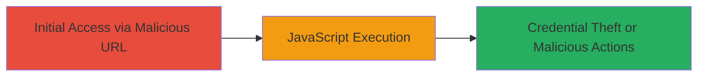

# Reflected XSS on DoD Website Subdomain for Arbitrary JavaScript Execution

Multi-stage attack chain demonstrating a complete attack workflow.

## Chain Metrics Dashboard

| Metric | Value |
|--------|-------|
| Chain Status | Unverified |
| Total Steps | 1 |
| Execution Time | ~1 minute |
| Skill Level | Intermediate |
| Complexity | Low |
| Impact Level | High |

## Attack Flow Visualization



## Prerequisites & Requirements

### Required Tools

- Web browser (e.g., Chrome, Firefox)

### Target Environment

- Web platform
- Access to the DoD website subdomain listed in official DOD Websites resource
- No authentication required

### Initial Access Requirements

- Public internet access
- Ability to craft and share URLs
- No prior credentials or network position needed

## Detailed Attack Procedures

### Step 1: Craft and Visit Malicious URL
procedure: [[procedures/Exploit-Reflected-XSS-via-Unsanitized-GET-Parameter]]

**Objective**: Exploit the reflected XSS vulnerability to execute arbitrary JavaScript in the victim's browser context.

**Instructions**: Construct a URL with a JavaScript payload in the vulnerable GET parameter and access it in a browser. The payload "\" autofocus onfocus=\"alert(document.domain)\" will be reflected unsanitized into the HTML, triggering execution on page load.

Example crafted URL (redacted for security):

```url
https://█████/█████/████████=%22%20autofocus%20onfocus=%22alert(document.domain)%22&Z_MODE=&Z_CALLER_URL=&Z_FORMROW=&Z_LONG_LIST=&Z_ISSUE_WAIT=
```

Visit the URL in a browser to trigger the payload.

**Expected Output**: A JavaScript alert popup displaying the document domain, confirming successful execution.

**Success Indicators**:
- Alert popup appears with the domain name
- Page source shows reflected payload as VALUE="" autofocus onfocus="alert(document.domain)"%">

## Attack Chain Summary

### Key Achievements

1. Successful execution of arbitrary JavaScript without authentication
2. Demonstration of potential for cookie theft or page manipulation
3. Identification of unsanitized input reflection in HTML

## Technique & Tactic Coverage

### MITRE ATT&CK Techniques

- [[JavaScript]]
- [[Drive-by Compromise]]

### MITRE ATT&CK Tactics

- [[Execution]]
- [[Collection]]

---

*Last updated: 2024-10-01T00:00:00Z*
