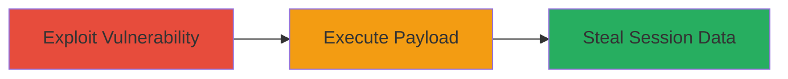

---
tags:
  - xss
  - reflected-xss
  - web
  - session-theft
type: attack_chain
tools: []
tactics:
  - '[[Execution]]'
  - '[[Collection]]'
verified: false
platforms:
  - Web
submitted: true
complexity: low
created_at: '2023-10-01T00:00:00Z'
procedures:
  - '[[procedures/Exploit-Reflected-XSS-via-Malicious-URL]]'
step_count: 1
techniques:
  - '[[JavaScript]]'
  - '[[Exploit Public-Facing Application]]'
updated_at: '2025-12-14T03:16:14.427Z'
description: >-
  A single-stage attack exploiting a reflected XSS vulnerability on a U.S.
  Department of Defense website to inject and execute malicious JavaScript,
  enabling session hijacking or content manipulation.
skill_level: intermediate
impact_level: high
id: f19bc57e-b710-46b1-8bdf-2923f9104bf7
validated: true
mitre_tactics:
  - '[[Execution]]'
  - '[[Collection]]'
mitre_techniques:
  - '[[JavaScript]]'
  - '[[Exploit Public-Facing Application]]'
---
# Reflected XSS on DoD Website for Session Theft

Multi-stage attack chain demonstrating a complete attack workflow.

## Chain Metrics Dashboard

| Metric | Value |
|--------|-------|
| Chain Status | Unverified |
| Total Steps | 1 |
| Execution Time | ~1 minutes |
| Skill Level | Intermediate |
| Complexity | Low |
| Impact Level | High |

## Attack Flow Visualization

## Prerequisites & Requirements

### Required Tools

- Web browser (e.g., Chrome Developer Tools for payload testing)

### Target Environment

- Target OS/Platform: Web application
- Required services/ports: HTTP/HTTPS on port 80/443
- Network access requirements: Public internet access to the DoD website

### Initial Access Requirements

- Credential requirements: None (public-facing site)
- Network position: External attacker
- Prior access needed: None

## Detailed Attack Procedures

### Step 1: Exploit Reflected XSS
procedure: [[procedures/Exploit-Reflected-XSS-via-Malicious-URL]]

**Objective**: Inject a malicious script via a crafted URL parameter to execute JavaScript in the victim's browser, leading to session information theft or content modification.

**Instructions**: Identify a vulnerable URL parameter on the DoD website that reflects user input without sanitization. Craft a payload such as `` and encode it for URL transmission. Append it to the target URL and access it to trigger execution. For testing, use a browser to visit the malicious URL or simulate with developer tools.

**Expected Output**: Alert box or script execution in the browser, confirming the vulnerability. In a real attack, this could capture cookies via `document.cookie`.

**Success Indicators**:
- Malicious script executes (e.g., alert pops up)
- Reflected input appears unsanitized in the page source

## Attack Chain Summary

### Key Achievements

1. Successful injection and reflection of malicious JavaScript on a high-security DoD site
2. Demonstration of potential for session theft and unauthorized content changes
3. Identification of input validation flaws in web parameters

## Technique & Tactic Coverage

### MITRE ATT&CK Techniques

- [[JavaScript]]
- [[Exploit Public-Facing Application]]

### MITRE ATT&CK Tactics

- [[Execution]]
- [[Collection]]

---
*Last updated: 2023-10-01T00:00:00Z*
